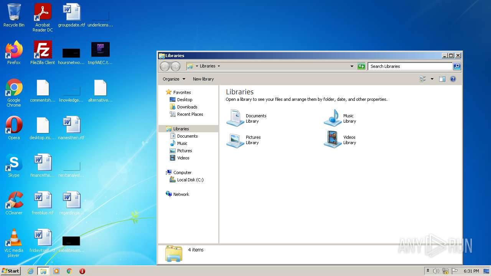
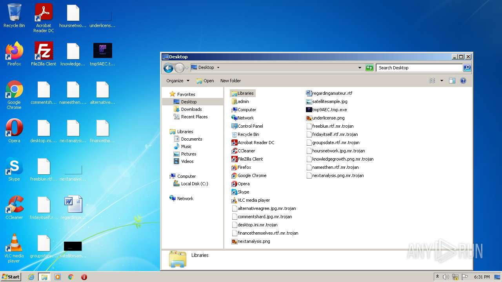
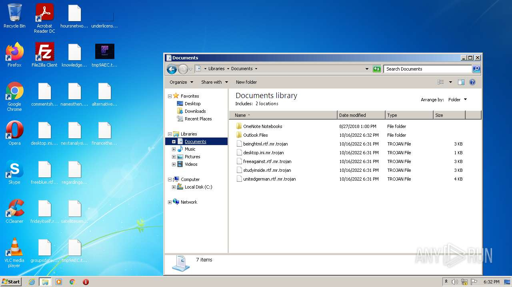
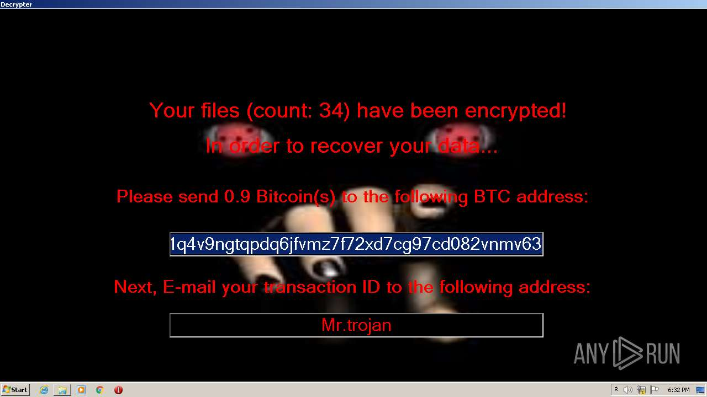

# -d6fc6ebef39b6bf316912de44a7610966f738b4866b117240923d1a65ea6a3f0

- https://any.run/report/d6fc6ebef39b6bf316912de44a7610966f738b4866b117240923d1a65ea6a3f0/b97ee4d8-20e8-4800-8c42-9609421c6e08

```
```







