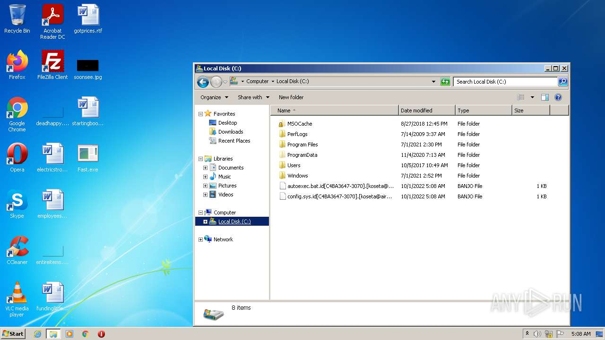
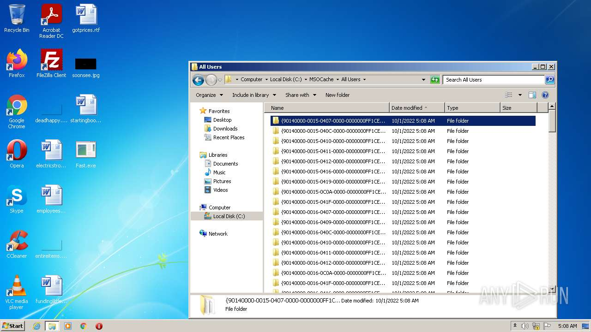
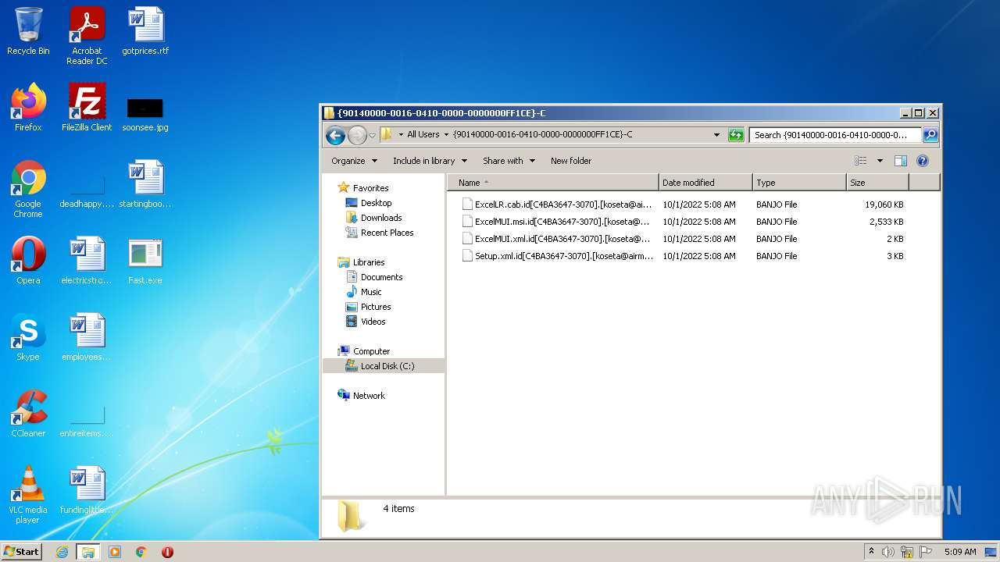

# HEUR-Trojan.Win32.Generic-21afe9cfe38792b14e0fe1ae616a3dd352f108ba5a670b2f25beae5899bbe4f5

```
- _id: "21afe9cfe38792b14e0fe1ae616a3dd352f108ba5a670b2f25beae5899bbe4f5"
  creation_date: 1585664245  # 2020-03-31 16:17:25 +0200 CEST
  first_submission_date: 1609242402  # 2020-12-29 12:46:42 +0100 CET
  last_analysis_date: 1610824539  # 2021-01-16 20:15:39 +0100 CET
  last_analysis_results: 
    Kaspersky: 
      result: "HEUR:Trojan.Win32.Generic"
  magic: "PE32 executable for MS Windows (GUI) Intel 80386 32-bit"
  size: 56832
  trid: 
  - file_type: "Win64 Executable (generic)"
    probability: 30.3
  - file_type: "Win16 NE executable (generic)"
    probability: 20.2
  - file_type: "Win32 Dynamic Link Library (generic)"
    probability: 18.9
  - file_type: "Win32 Executable (generic)"
    probability: 12.9
  - file_type: "OS/2 Executable (generic)"
    probability: 5.8
```











