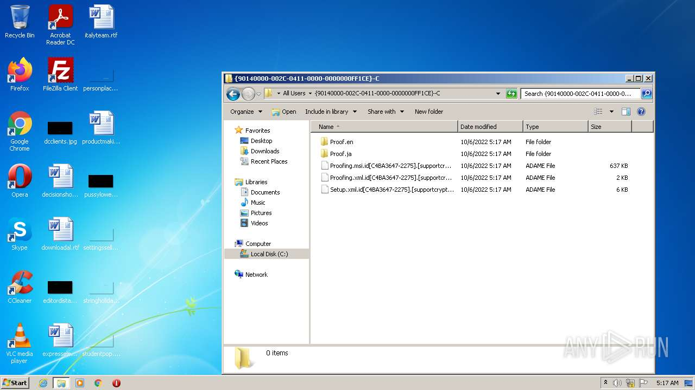
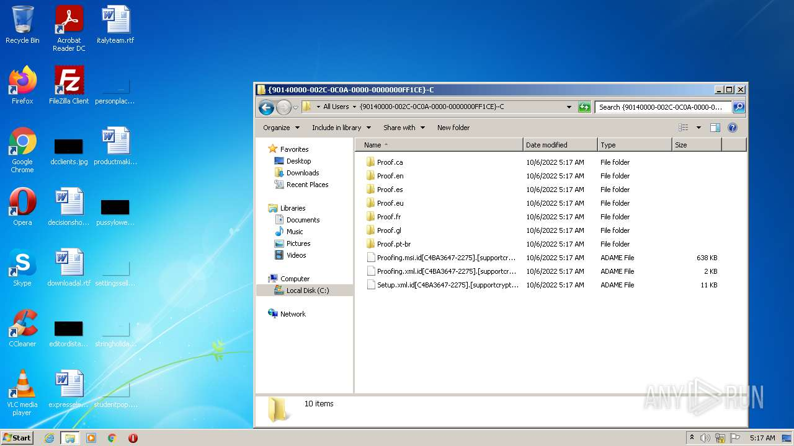
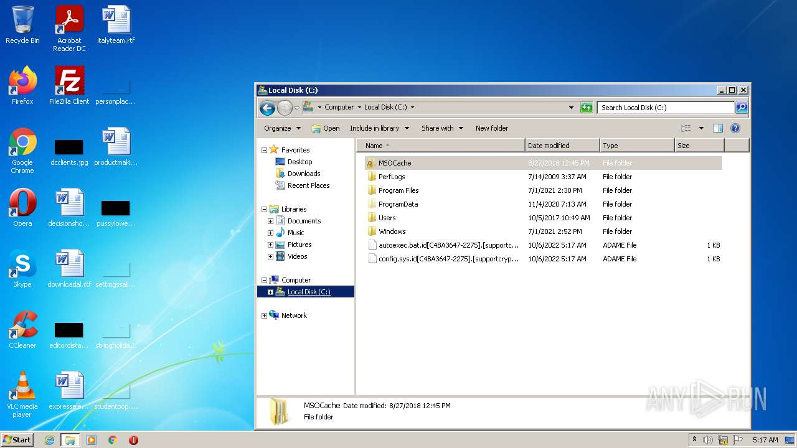
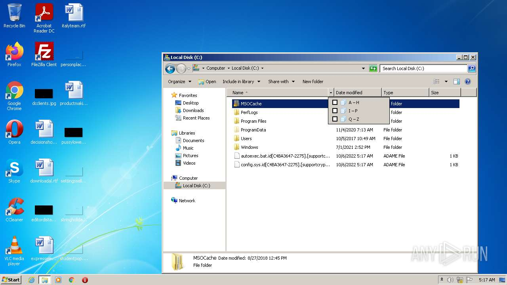
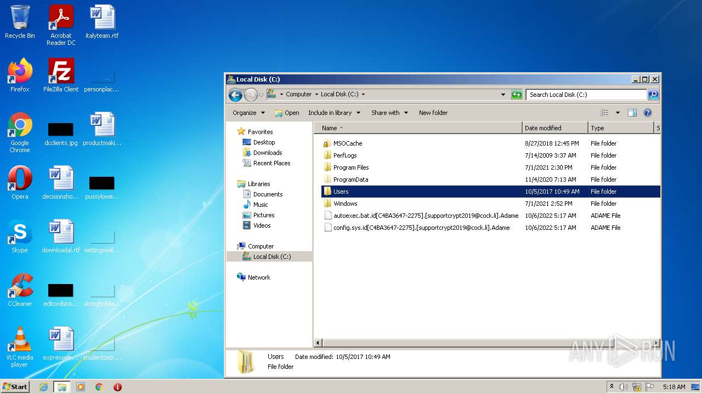

# Backdoor.Win32.Androm.svna-bdca7cf20aa019f374a38409df0421e087c5df7ce2030a69c57af42cb876bd10

- https://any.run/report/bdca7cf20aa019f374a38409df0421e087c5df7ce2030a69c57af42cb876bd10/0899abb5-add3-479a-b84f-0ed4d5dc8888

```
- _id: "bdca7cf20aa019f374a38409df0421e087c5df7ce2030a69c57af42cb876bd10"
  creation_date: 1563542164  # 2019-07-19 15:16:04 +0200 CEST
  first_submission_date: 1563836891  # 2019-07-23 01:08:11 +0200 CEST
  last_analysis_date: 1581225716  # 2020-02-09 06:21:56 +0100 CET
  last_analysis_results: 
    Kaspersky: 
      result: "Backdoor.Win32.Androm.svna"
  magic: "PE32 executable for MS Windows (GUI) Intel 80386 32-bit"
  size: 432640
  trid: 
  - file_type: "Win32 Executable MS Visual C++ (generic)"
    probability: 41.0
  - file_type: "Win64 Executable (generic)"
    probability: 36.3
  - file_type: "Win32 Dynamic Link Library (generic)"
    probability: 8.6
  - file_type: "Win32 Executable (generic)"
    probability: 5.9
  - file_type: "OS/2 Executable (generic)"
    probability: 2.6
```






