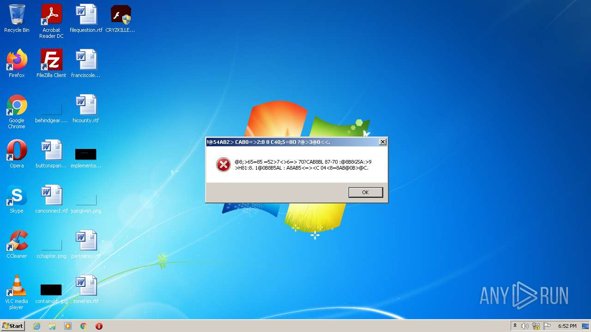
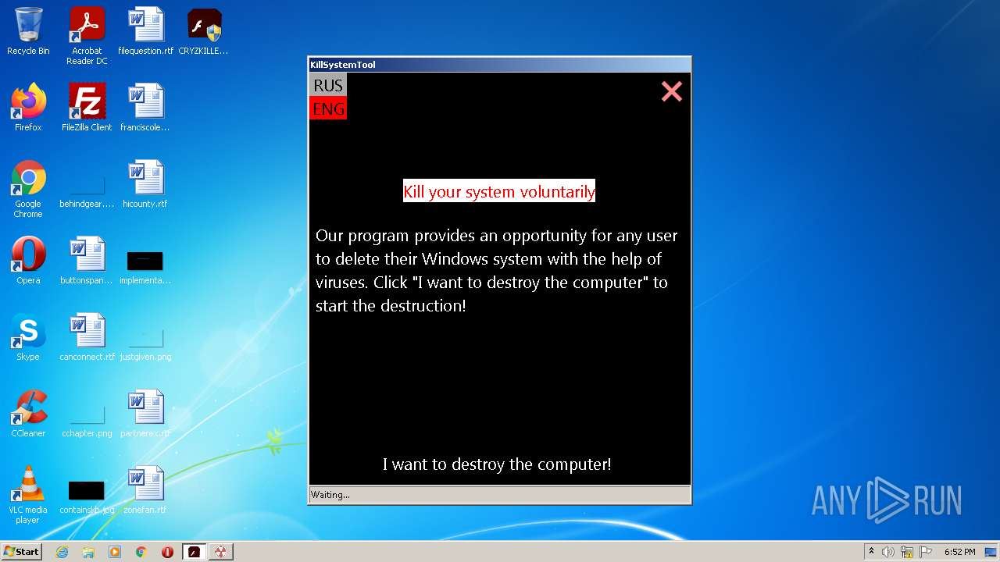
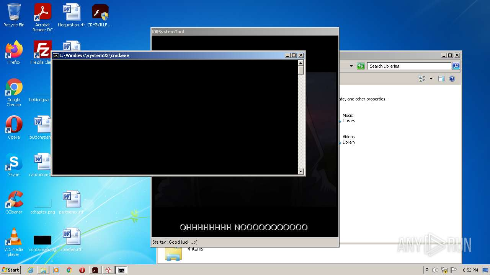
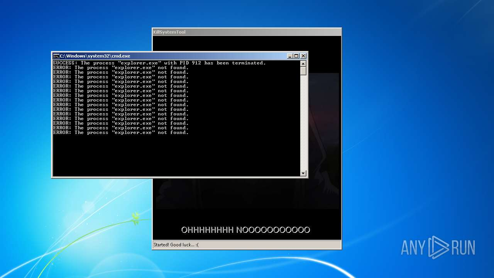
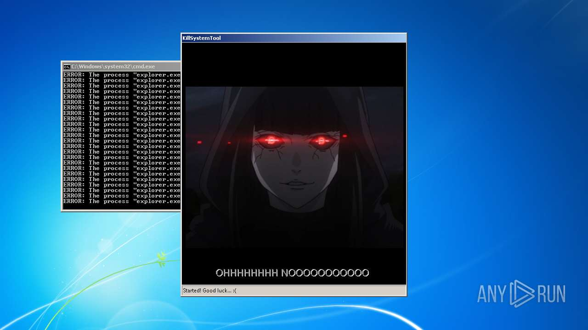
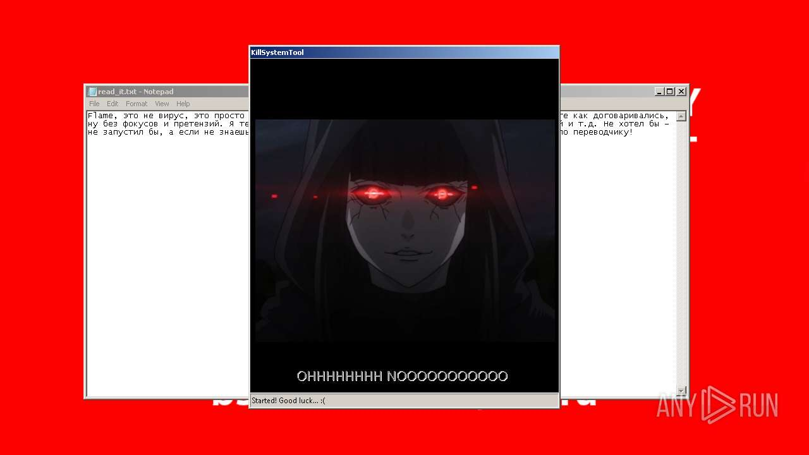
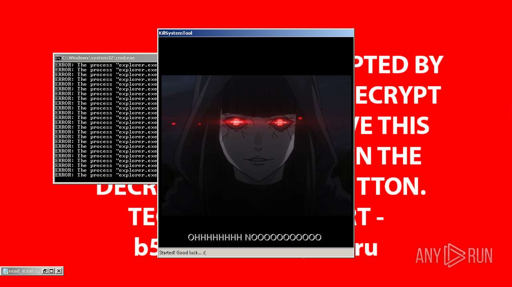
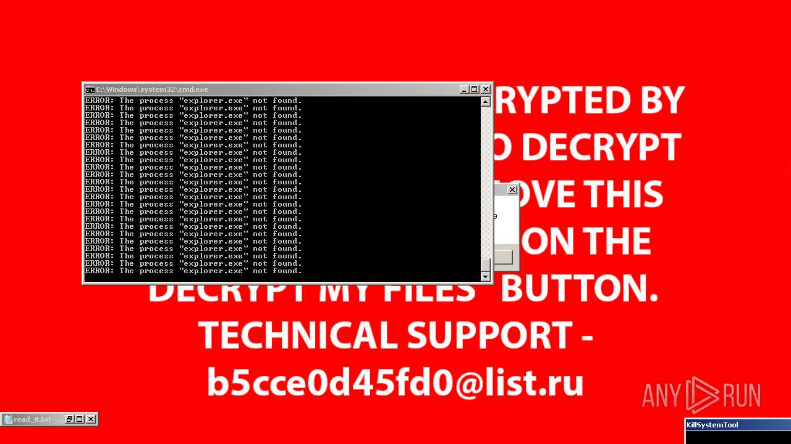
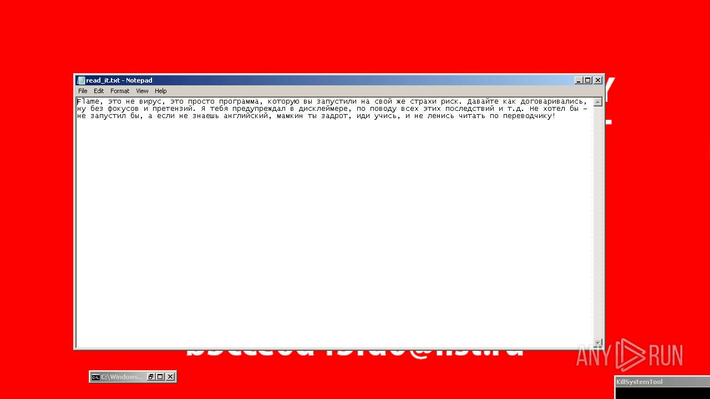
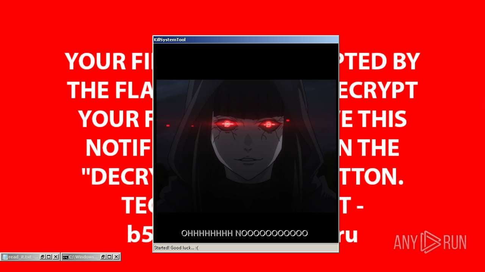

# Backdoor.Win32.Poison.ggrf-43d8b88fd820f25d7c458641c06d92abea29fb963b61a6e72c4befcac9f24075

- https://any.run/report/43d8b88fd820f25d7c458641c06d92abea29fb963b61a6e72c4befcac9f24075/2616bd55-9817-4d27-96da-7bc5e3dc8bb6

```
- _id: "43d8b88fd820f25d7c458641c06d92abea29fb963b61a6e72c4befcac9f24075"
  creation_date: 1371314668  # 2013-06-15 18:44:28 +0200 CEST
  first_submission_date: 1667222245  # 2022-10-31 14:17:25 +0100 CET
  last_analysis_date: 1667233680  # 2022-10-31 17:28:00 +0100 CET
  last_analysis_results: 
    Kaspersky: 
      result: "Backdoor.Win32.Poison.ggrf"
  magic: "PE32 executable for MS Windows (GUI) Intel 80386 32-bit"
  size: 7968256
  trid: 
  - file_type: "Win32 Executable MS Visual C++ 4.x"
    probability: 84.7
  - file_type: "Win32 Dynamic Link Library (generic)"
    probability: 4.1
  - file_type: "Win16 NE executable (generic)"
    probability: 3.1
  - file_type: "Win32 Executable (generic)"
    probability: 2.8
  - file_type: "Win16/32 Executable Delphi generic"
    probability: 1.3
```














