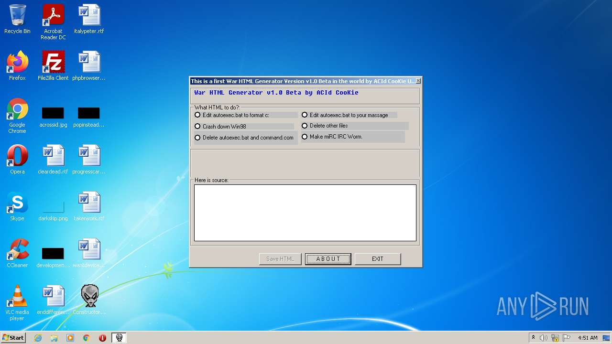
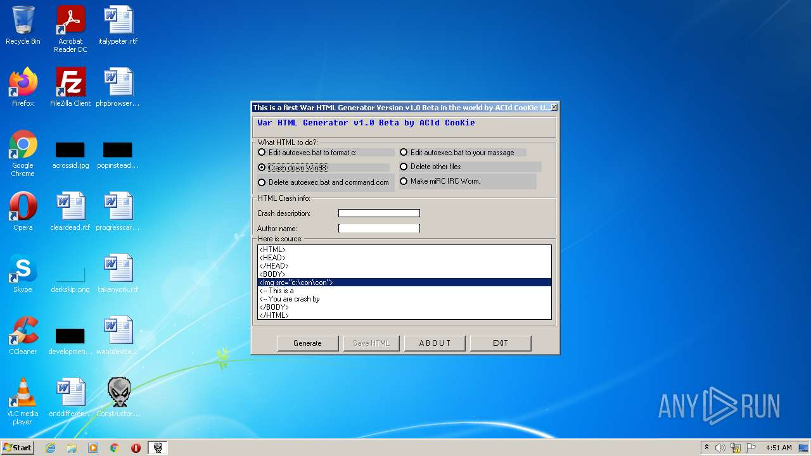
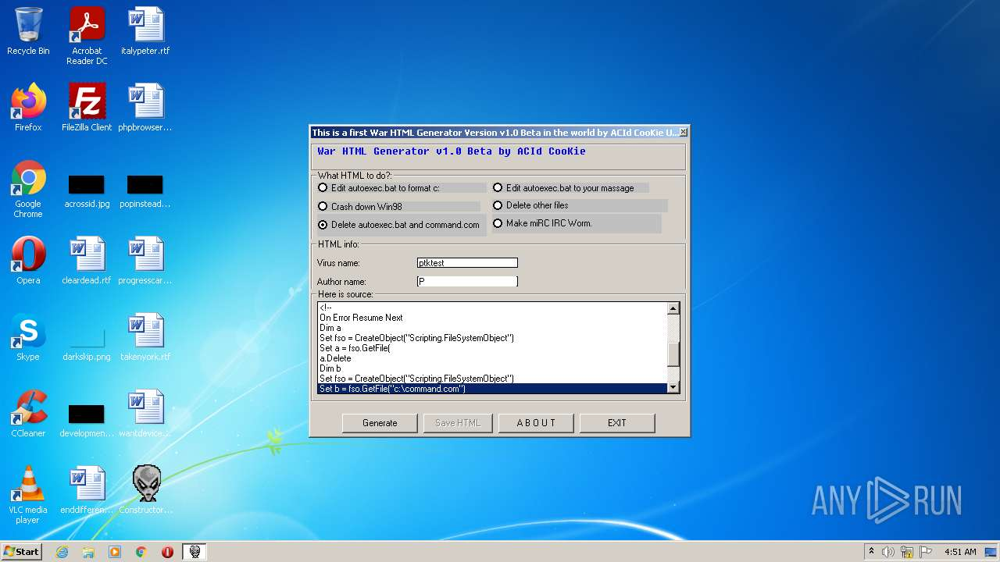
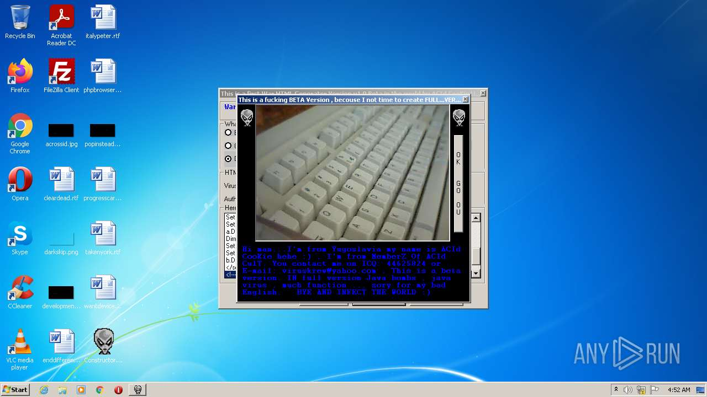
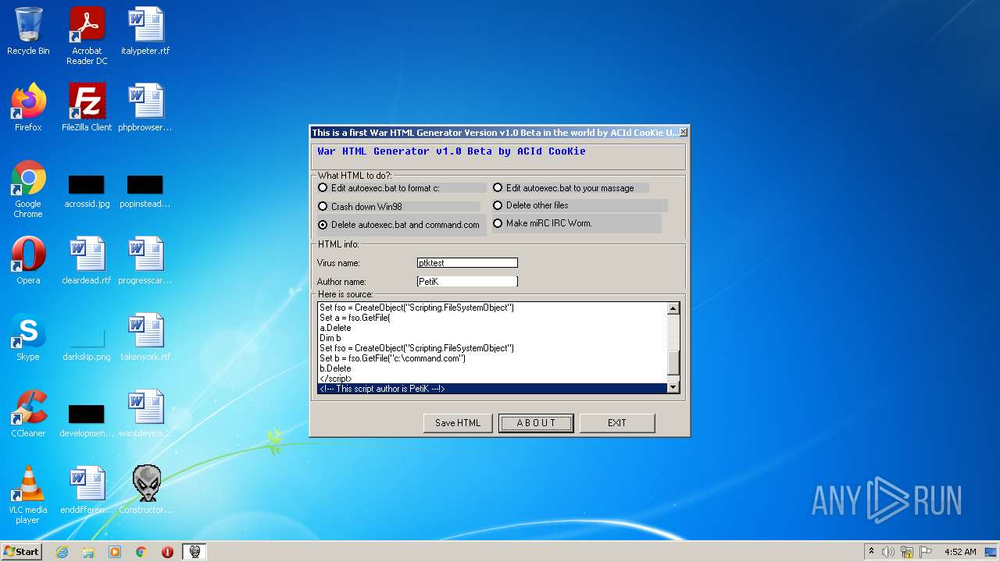
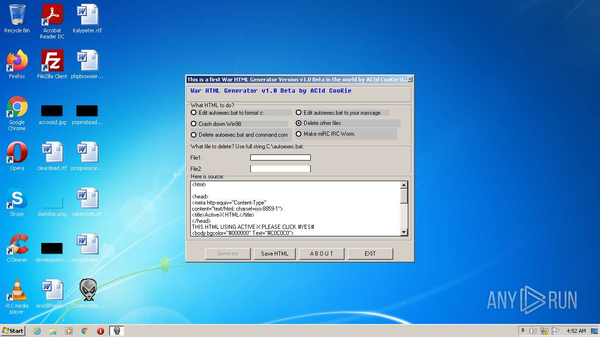
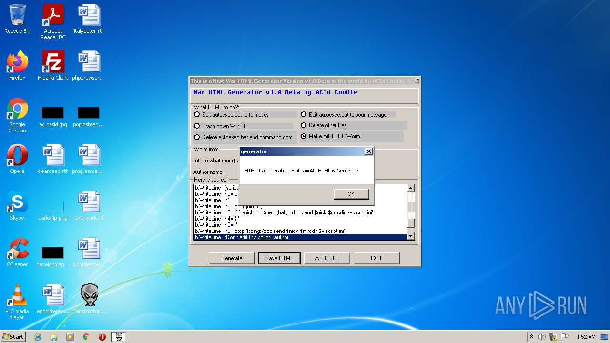
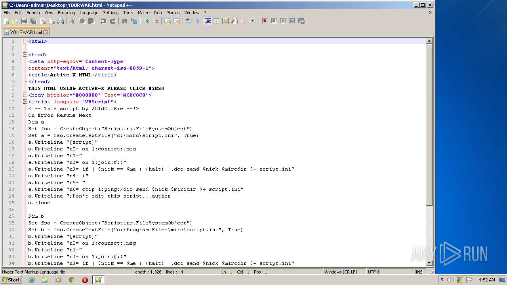
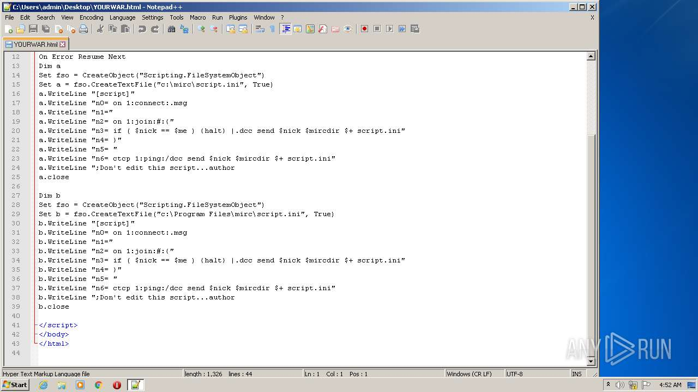

# Constructor.HTML.Acid-da990a109da574c7e6b496f8668ab3547d836f78a8d52bec4a1c68163c425716

- https://any.run/report/da990a109da574c7e6b496f8668ab3547d836f78a8d52bec4a1c68163c425716/dd880e57-2434-4de6-aba5-bc409fc64512

```
- _id: "da990a109da574c7e6b496f8668ab3547d836f78a8d52bec4a1c68163c425716"
  creation_date: 898010561  # 1998-06-16 17:22:41 +0200 CEST
  first_submission_date: 1189773839  # 2007-09-14 14:43:59 +0200 CEST
  last_analysis_date: 1642970935  # 2022-01-23 21:48:55 +0100 CET
  last_analysis_results: 
    Kaspersky: 
      result: "Constructor.HTML.Acid"
  magic: "PE32 executable for MS Windows (GUI) Intel 80386 32-bit"
  packers: 
    PEiD: "Microsoft Visual Basic v5.0/v6.0"
  size: 131072
  trid: 
  - file_type: "Win32 Executable Microsoft Visual Basic 6"
    probability: 82.7
  - file_type: "Win32 Dynamic Link Library (generic)"
    probability: 6.6
  - file_type: "Win32 Executable (generic)"
    probability: 4.5
  - file_type: "OS/2 Executable (generic)"
    probability: 2.0
  - file_type: "Generic Win/DOS Executable"
    probability: 2.0
```















