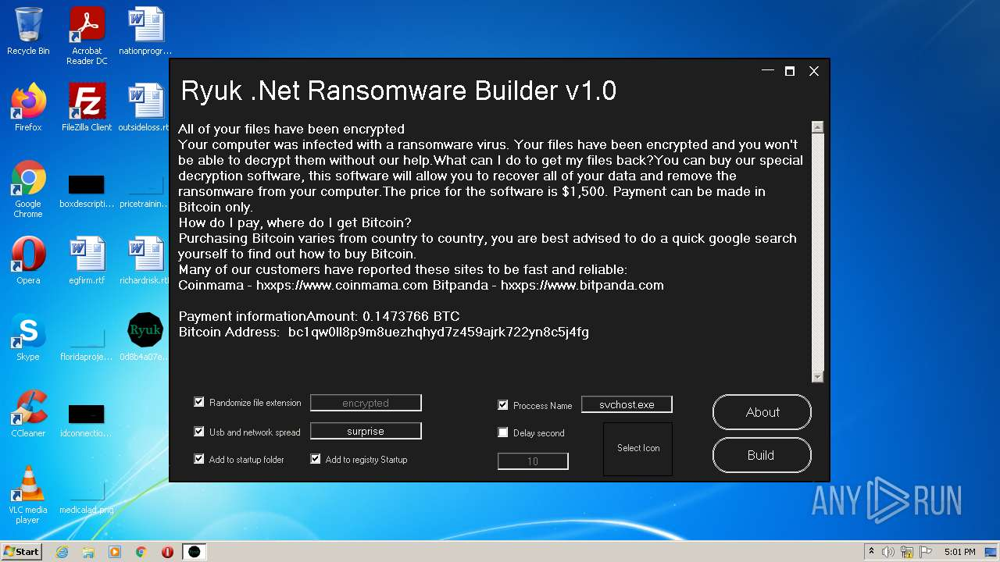
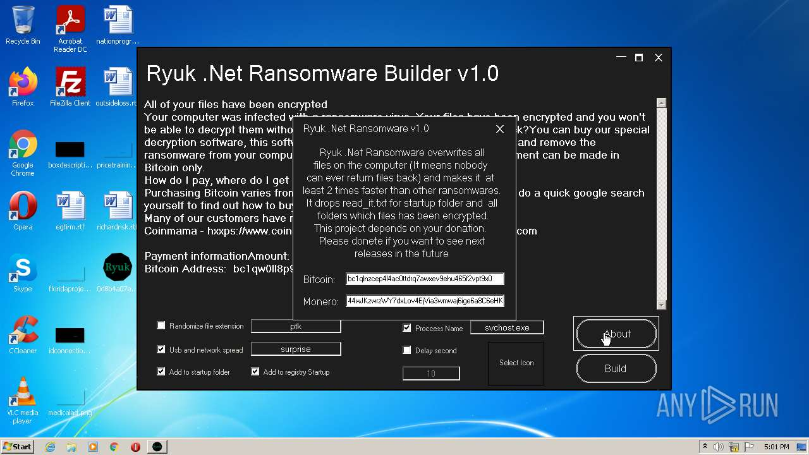
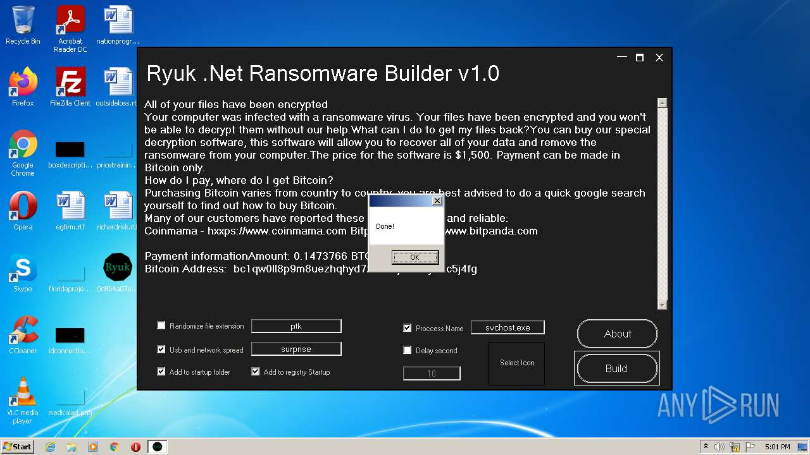
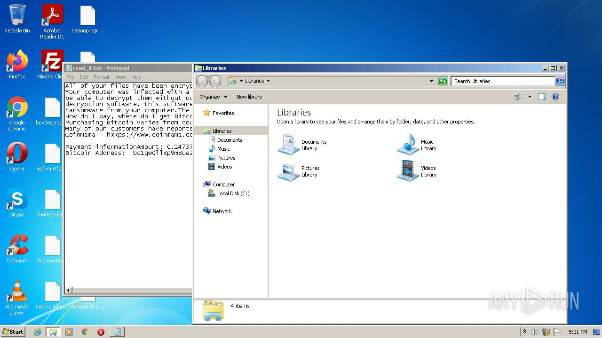
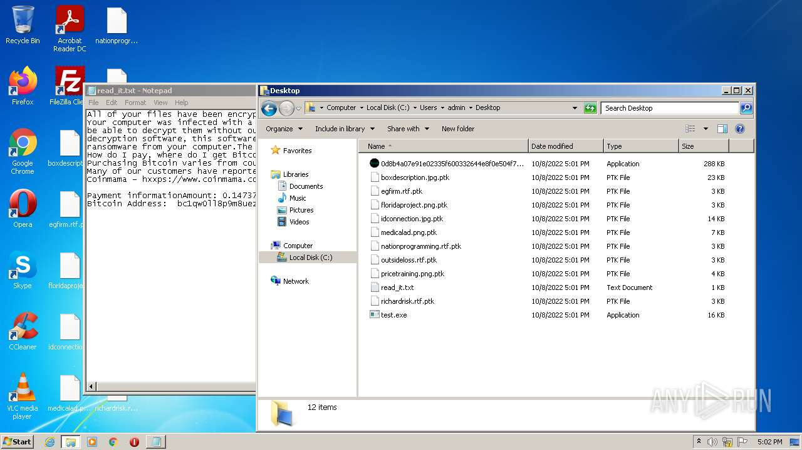
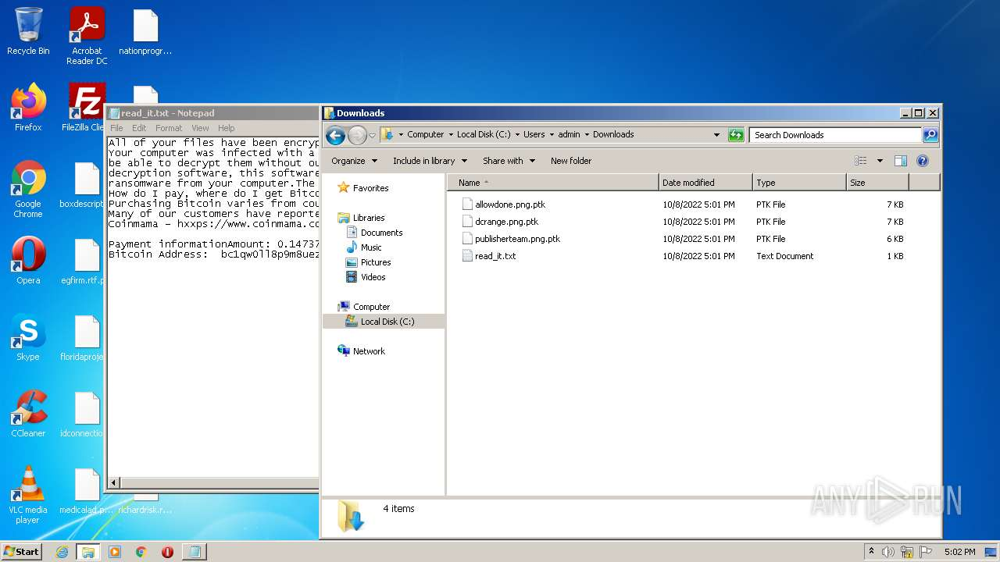
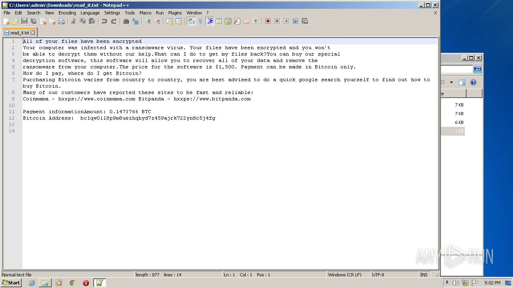
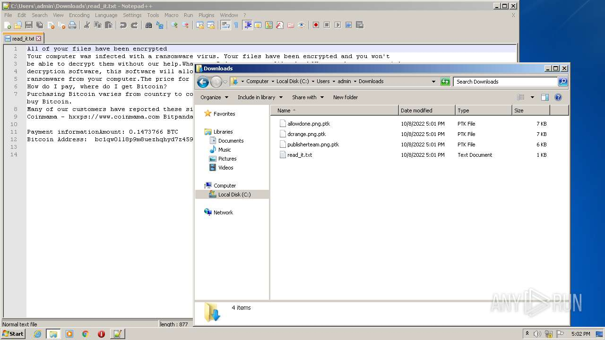

# HEUR-Constructor.MSIL.Agent.gen-0d8b4a07e91e02335f600332644e8f0e504f75ab19899a58b2c85ecb0887c738

- https://any.run/report/0d8b4a07e91e02335f600332644e8f0e504f75ab19899a58b2c85ecb0887c738/c04c59f3-2f4b-4d7d-8ae0-1b81760bea82

```
- _id: "0d8b4a07e91e02335f600332644e8f0e504f75ab19899a58b2c85ecb0887c738"
  creation_date: 1623185500  # 2021-06-08 22:51:40 +0200 CEST
  crowdsourced_yara_results: 
  - author: "ditekShen"
    description: "Detects files referencing identities associated with Chaos ransomware"
    rule_name: "INDICATOR_KB_ID_Ransomware_Chaos"
    ruleset_id: "00cec9e642"
    ruleset_name: "indicator_knownbad_id"
    source: "https://github.com/ditekshen/detection"
  - author: "ditekSHen"
    description: "Detects Chaos ransomware"
    rule_name: "MALWARE_Win_Chaos"
    ruleset_id: "00cc803bdc"
    ruleset_name: "malware"
    source: "https://github.com/ditekshen/detection"
  first_submission_date: 1623223841  # 2021-06-09 09:30:41 +0200 CEST
  last_analysis_date: 1660254449  # 2022-08-11 23:47:29 +0200 CEST
  last_analysis_results: 
    Kaspersky: 
      result: "HEUR:Constructor.MSIL.Agent.gen"
  magic: "PE32 executable for MS Windows (GUI) Intel 80386 32-bit Mono/.Net assembly"
  packers: 
    PEiD: ".NET executable"
  size: 294400
  trid: 
  - file_type: "Generic CIL Executable (.NET, Mono, etc.)"
    probability: 72.5
  - file_type: "Win64 Executable (generic)"
    probability: 10.4
  - file_type: "Win32 Dynamic Link Library (generic)"
    probability: 6.5
  - file_type: "Win32 Executable (generic)"
    probability: 4.4
  - file_type: "OS/2 Executable (generic)"
    probability: 2.0
```











