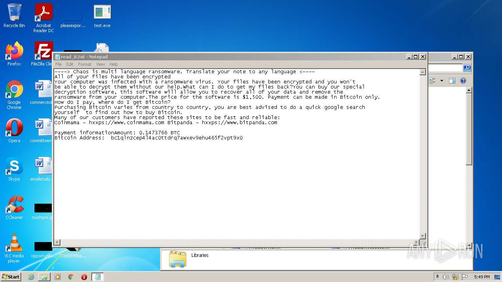

# HEUR-Constructor.MSIL.Ransom.gen-f2665f89ba53abd3deb81988c0d5194992214053e77fc89b98b64a31a7504d77

- https://any.run/report/f2665f89ba53abd3deb81988c0d5194992214053e77fc89b98b64a31a7504d77/9b1dd25c-2da5-4954-b58f-d33bd69cb33b

```
- _id: "f2665f89ba53abd3deb81988c0d5194992214053e77fc89b98b64a31a7504d77"
  creation_date: 1628060902  # 2021-08-04 09:08:22 +0200 CEST
  crowdsourced_yara_results: 
  - author: "ditekShen"
    description: "Detects files referencing identities associated with Chaos ransomware"
    rule_name: "INDICATOR_KB_ID_Ransomware_Chaos"
    ruleset_id: "00cec9e642"
    ruleset_name: "indicator_knownbad_id"
    source: "https://github.com/ditekshen/detection"
  - author: "ditekSHen"
    description: "detects command variations typically used by ransomware"
    rule_name: "INDICATOR_SUSPICIOUS_GENRansomware"
    ruleset_id: "00c3b8eb5d"
    ruleset_name: "indicator_suspicious"
    source: "https://github.com/ditekshen/detection"
  - author: "ditekSHen"
    description: "Detects Chaos ransomware"
    rule_name: "MALWARE_Win_Chaos"
    ruleset_id: "00cc803bdc"
    ruleset_name: "malware"
    source: "https://github.com/ditekshen/detection"
  first_submission_date: 1628067119  # 2021-08-04 10:51:59 +0200 CEST
  last_analysis_date: 1660257674  # 2022-08-12 00:41:14 +0200 CEST
  last_analysis_results: 
    Kaspersky: 
      result: "HEUR:Constructor.MSIL.Ransom.gen"
  magic: "PE32 executable for MS Windows (GUI) Intel 80386 32-bit Mono/.Net assembly"
  packers: 
    PEiD: ".NET executable"
  size: 563712
  trid: 
  - file_type: "Generic CIL Executable (.NET, Mono, etc.)"
    probability: 72.5
  - file_type: "Win64 Executable (generic)"
    probability: 10.4
  - file_type: "Win32 Dynamic Link Library (generic)"
    probability: 6.5
  - file_type: "Win32 Executable (generic)"
    probability: 4.4
  - file_type: "OS/2 Executable (generic)"
    probability: 2.0
```




