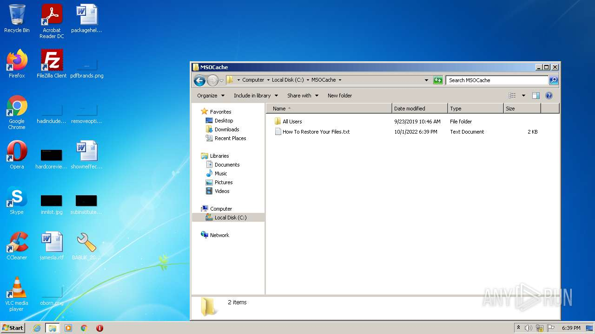
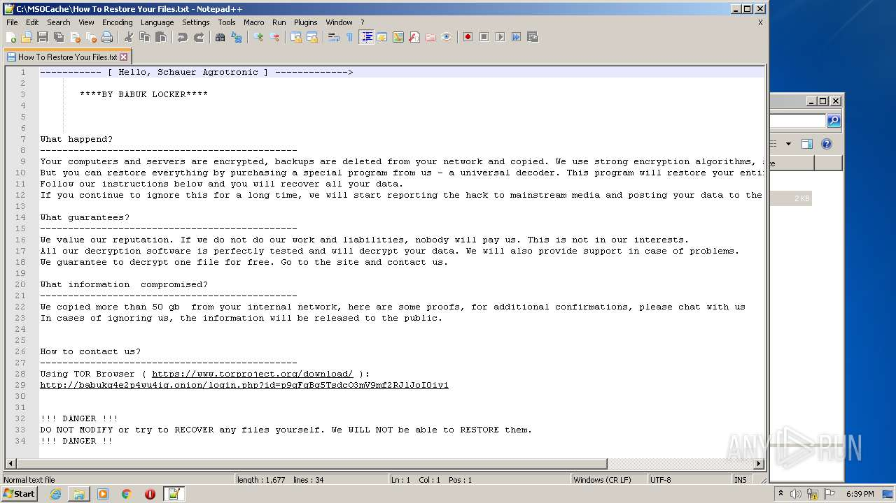
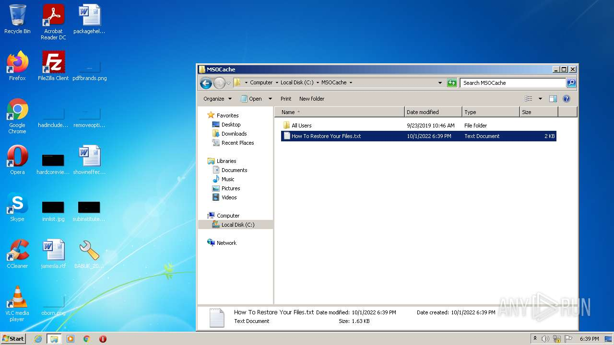
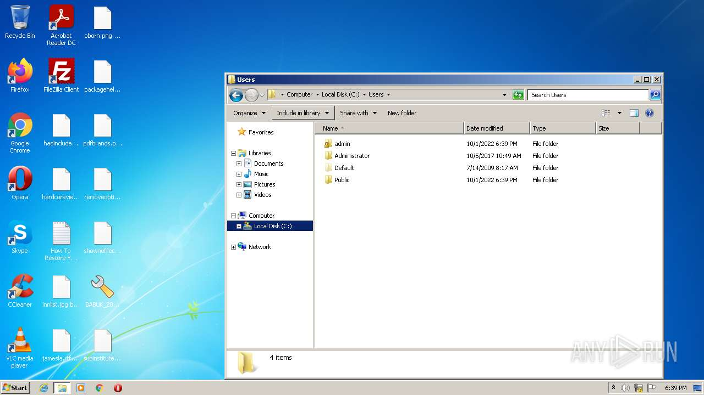
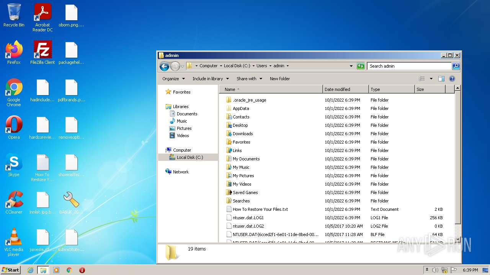
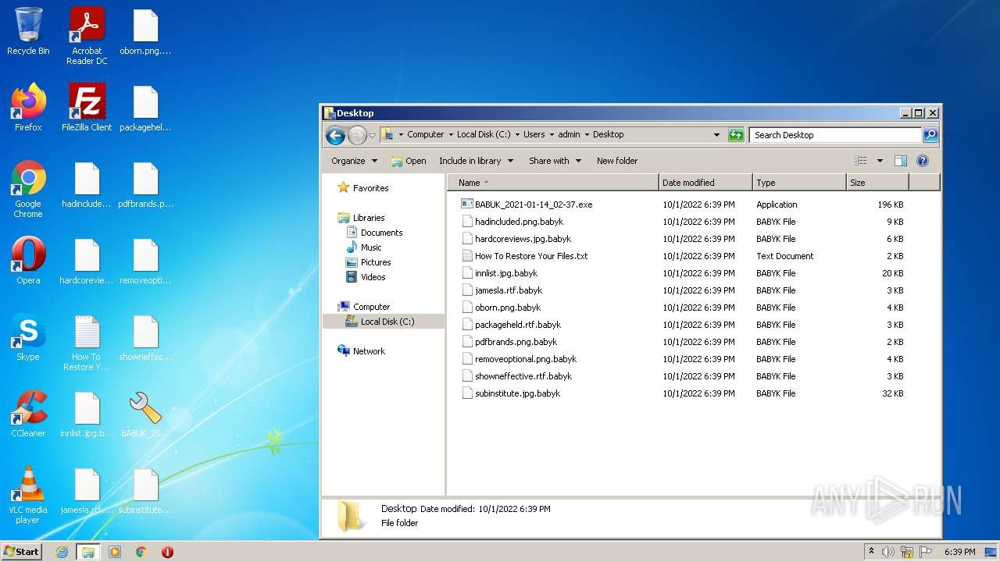
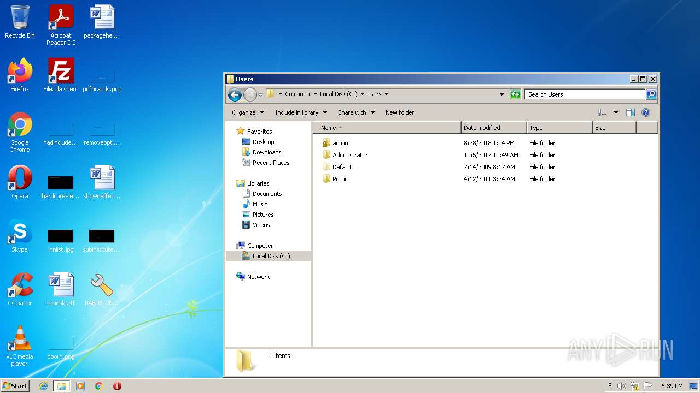

# HEUR-Exploit.Win32.ShellCode.Agent.pef-8140004ff3cf4923c928708505754497e48d26d822a95d63bd2ed54e14f19766

```
- _id: "8140004ff3cf4923c928708505754497e48d26d822a95d63bd2ed54e14f19766"
  creation_date: 1571683934  # 2019-10-21 20:52:14 +0200 CEST
  first_submission_date: 1610956828  # 2021-01-18 09:00:28 +0100 CET
  last_analysis_date: 1627033923  # 2021-07-23 11:52:03 +0200 CEST
  last_analysis_results: 
    Kaspersky: 
      result: "HEUR:Exploit.Win32.ShellCode.Agent.pef"
  magic: "PE32 executable for MS Windows (GUI) Intel 80386 32-bit"
  packers: 
    PEiD: "UPX v0.89.6 - v1.02 / v1.05 -v1.24 -> Markus & Laszlo [overlay]"
  size: 200704
  trid: 
  - file_type: "UPX compressed Win32 Executable"
    probability: 63.4
  - file_type: "Win16 NE executable (generic)"
    probability: 11.8
  - file_type: "Win32 Executable (generic)"
    probability: 10.5
  - file_type: "OS/2 Executable (generic)"
    probability: 4.7
  - file_type: "Generic Win/DOS Executable"
    probability: 4.6
```









