# HEUR-Trojan-Banker.Win32.Emotet.gen-0c10cf1b1640c9c845080f460ee69392bfaac981a4407b607e8e30d2ddf903e8

- https://any.run/report/0c10cf1b1640c9c845080f460ee69392bfaac981a4407b607e8e30d2ddf903e8/0150ea3d-826c-415a-9563-c7d11f34c274

```
- _id: "0c10cf1b1640c9c845080f460ee69392bfaac981a4407b607e8e30d2ddf903e8"
  creation_date: 1651016344  # 2022-04-27 01:39:04 +0200 CEST
  crowdsourced_yara_results: 
  - author: "Florian Roth"
    description: "Detects REvil ransomware"
    rule_name: "MAL_RANSOM_REvil_Oct20_1"
    ruleset_id: "00014065d5"
    ruleset_name: "crime_ransom_revil"
    source: "https://github.com/Neo23x0/signature-base"
  - author: "Felix Bilstein - yara-signator at cocacoding dot com"
    description: "Detects win.revil."
    rule_name: "win_revil_auto"
    ruleset_id: "008278ba59"
    ruleset_name: "win.revil_auto"
    source: "https://malpedia.caad.fkie.fraunhofer.de/"
  first_submission_date: 1651263170  # 2022-04-29 22:12:50 +0200 CEST
  last_analysis_date: 1662121995  # 2022-09-02 14:33:15 +0200 CEST
  last_analysis_results: 
    Kaspersky: 
      result: "HEUR:Trojan-Banker.Win32.Emotet.gen"
  magic: "PE32 executable for MS Windows (GUI) Intel 80386 32-bit"
  size: 83968
  trid: 
  - file_type: "Win32 Executable (generic)"
    probability: 42.7
  - file_type: "OS/2 Executable (generic)"
    probability: 19.2
  - file_type: "Generic Win/DOS Executable"
    probability: 19.0
  - file_type: "DOS Executable Generic"
    probability: 18.9
```


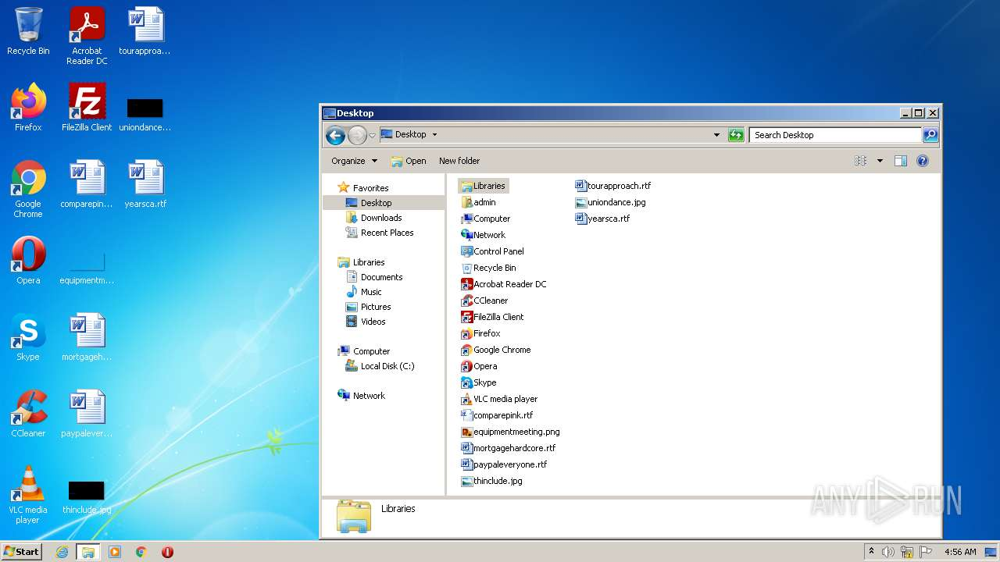

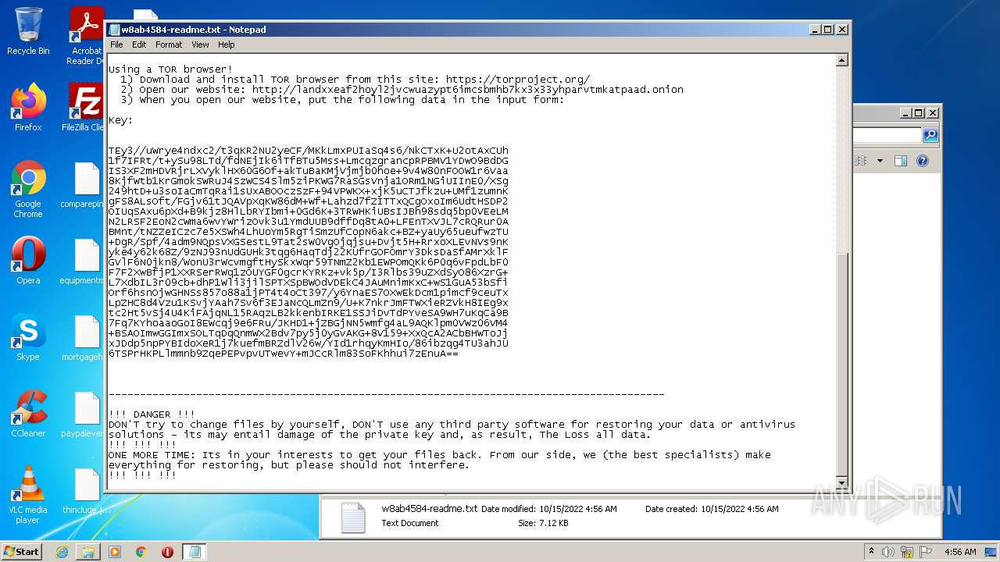
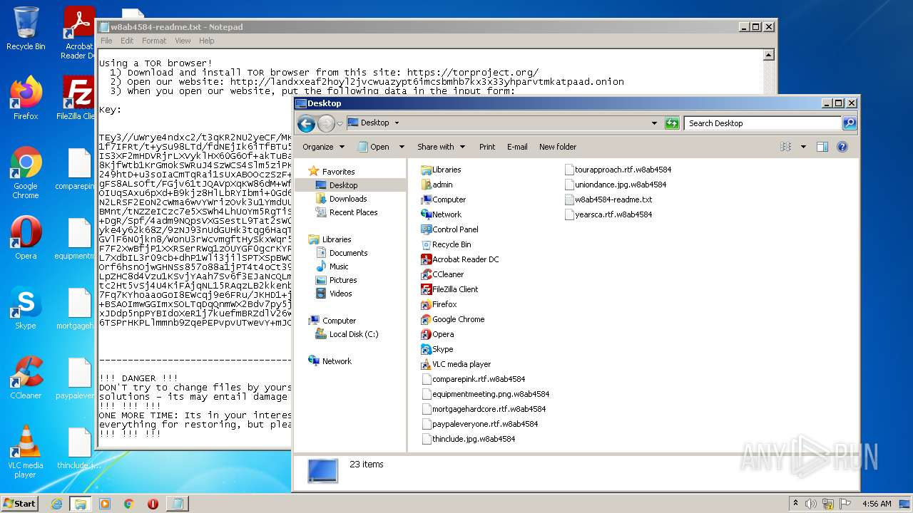
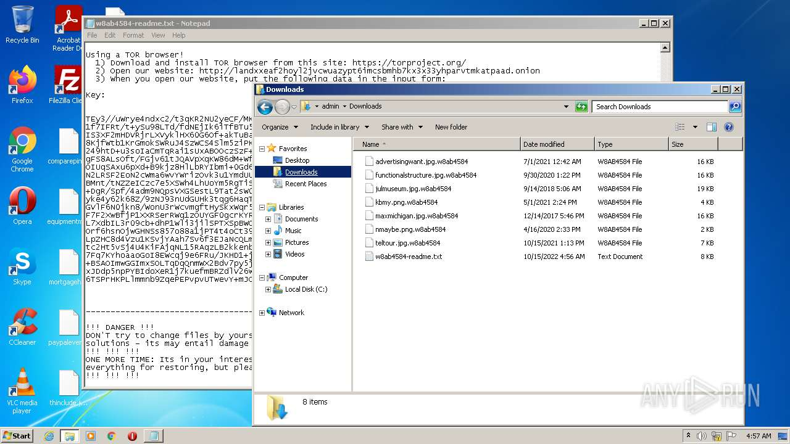
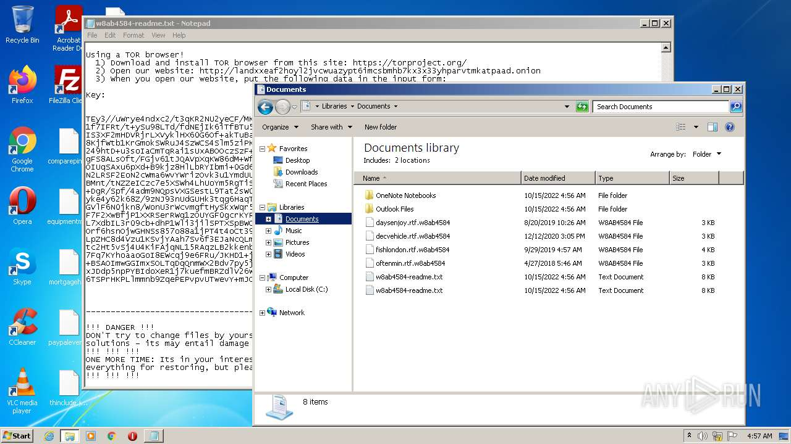

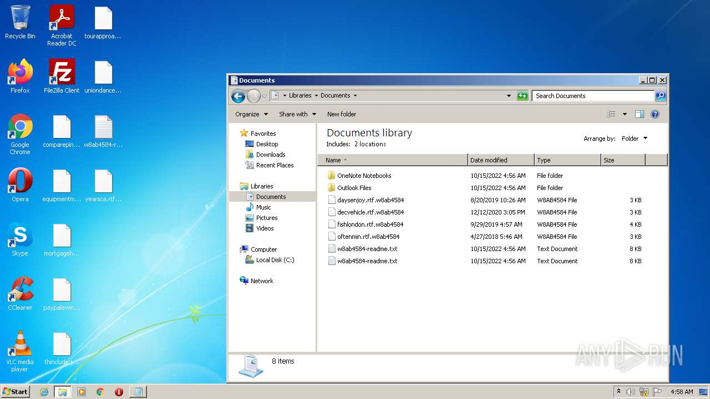
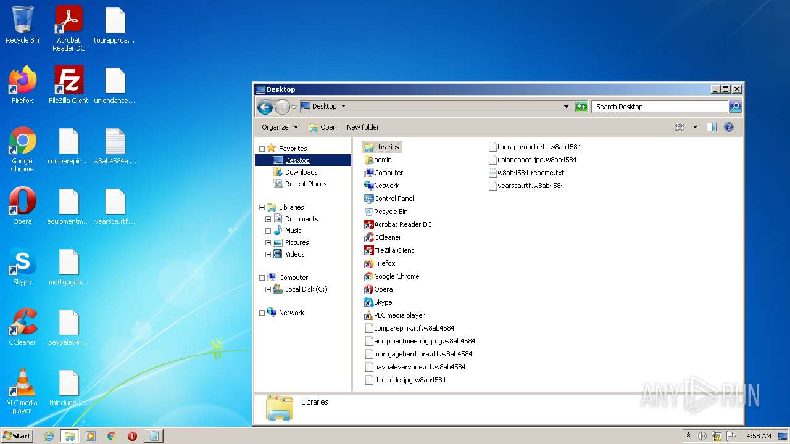
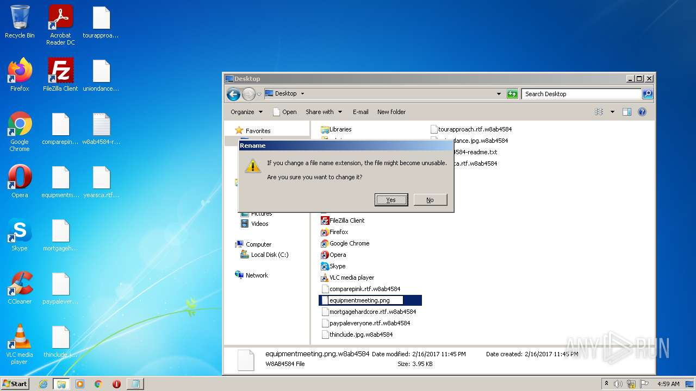

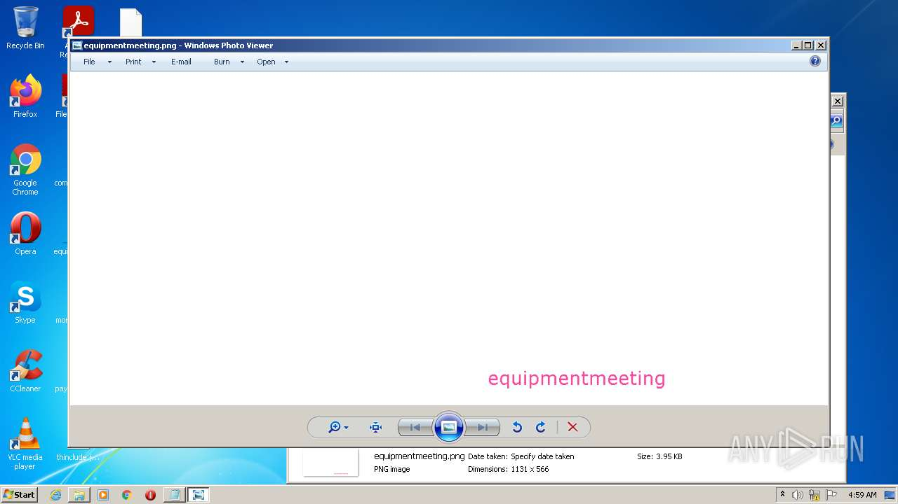
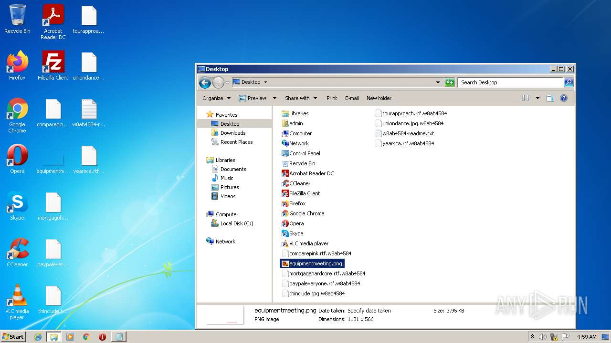
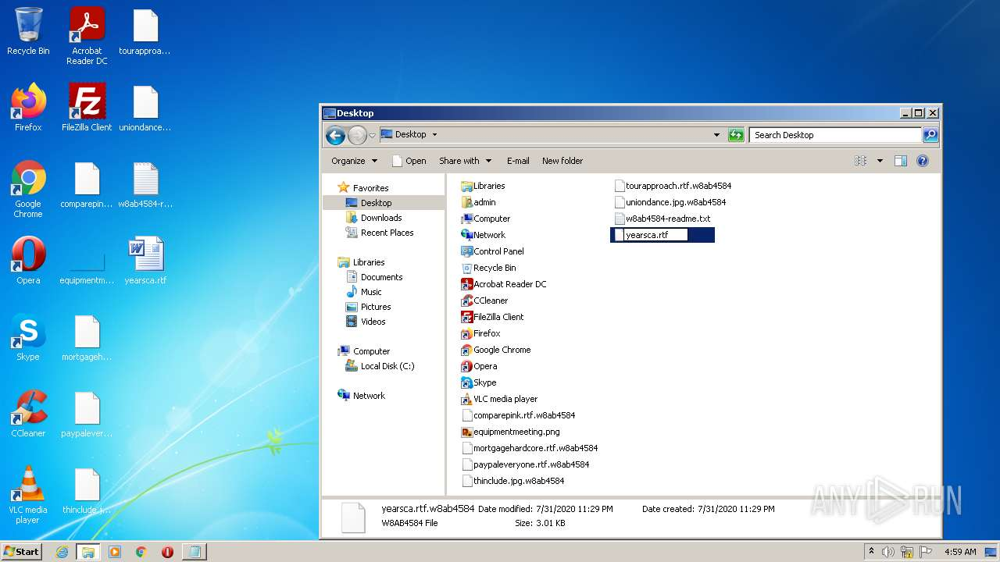
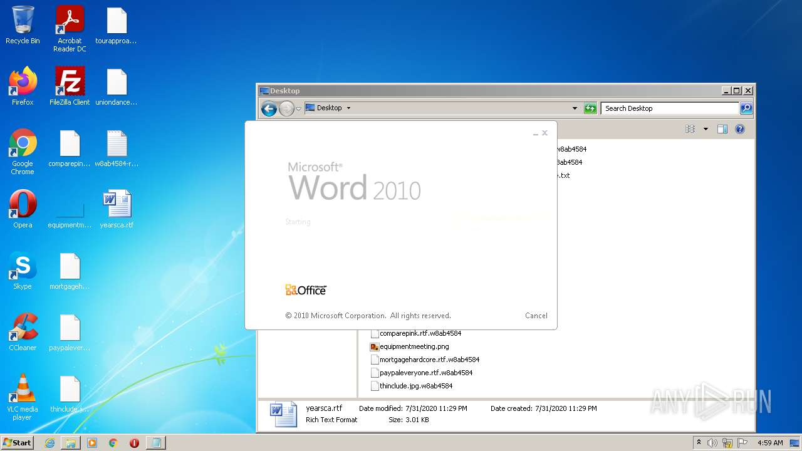
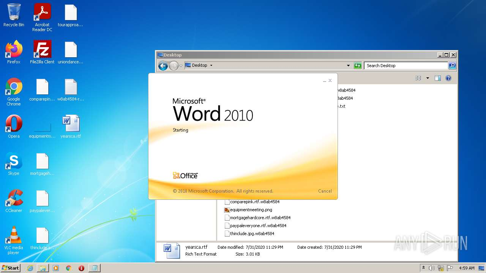
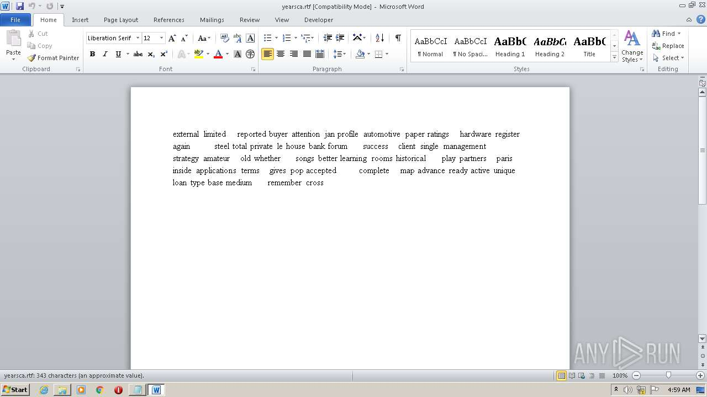
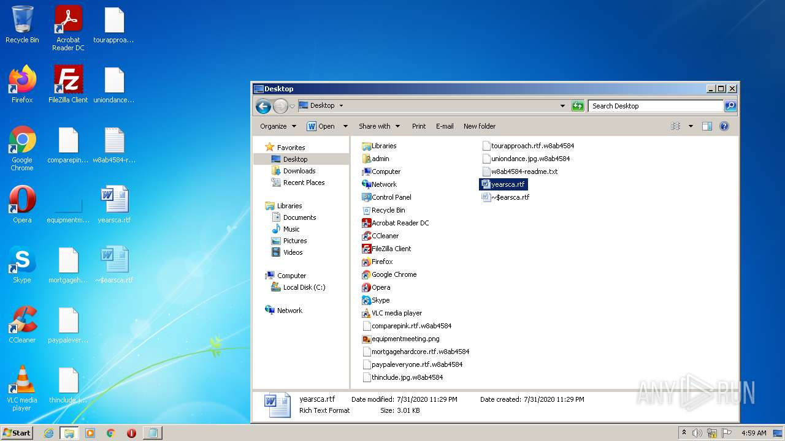
