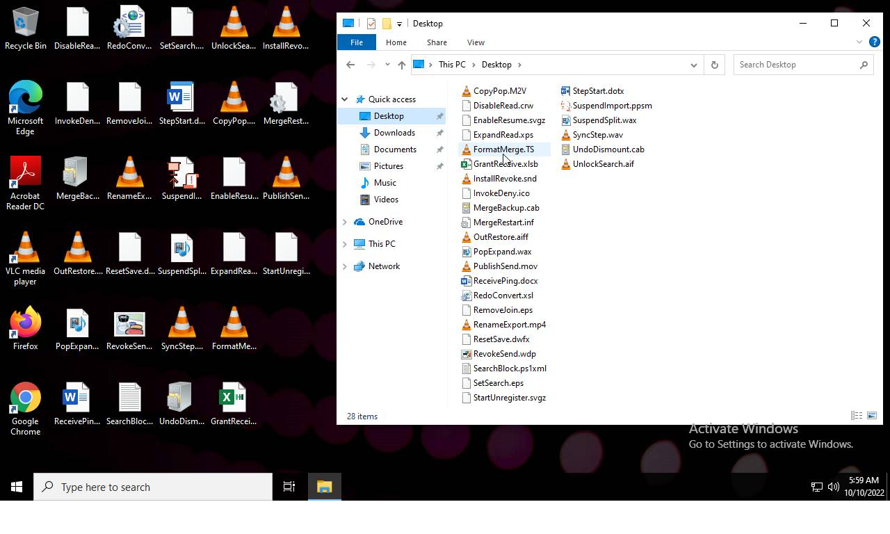

# -32b1315bd48b4f49ccd3303f5fcf7d16b5c66c2523a75b7123b9c0bef2a0a76d

- https://tria.ge/221010-ej2hcaaeb8/behavioral1

```
- _id: "32b1315bd48b4f49ccd3303f5fcf7d16b5c66c2523a75b7123b9c0bef2a0a76d"
  creation_date: 1665332303  # 2022-10-09 18:18:23 +0200 CEST
  crowdsourced_yara_results: 
  - author: "ditekSHen"
    description: "detects command variations typically used by ransomware"
    rule_name: "INDICATOR_SUSPICIOUS_GENRansomware"
    ruleset_id: "00c3b8eb5d"
    ruleset_name: "indicator_suspicious"
    source: "https://github.com/ditekshen/detection"
  - author: "ditekSHen"
    description: "Detects executables containing many references to VEEAM. Observed in ransomware"
    rule_name: "INDICATOR_SUSPICOUS_EXE_References_VEEAM"
    ruleset_id: "00c3b8eb5d"
    ruleset_name: "indicator_suspicious"
    source: "https://github.com/ditekshen/detection"
  - author: "ditekSHen"
    description: "Detects executables embedding registry key / value combination indicative of disabling Windows Defedner features"
    rule_name: "INDICATOR_SUSPICIOUS_EXE_RegKeyComb_DisableWinDefender"
    ruleset_id: "00c3b8eb5d"
    ruleset_name: "indicator_suspicious"
    source: "https://github.com/ditekshen/detection"
  first_submission_date: 1665334298  # 2022-10-09 18:51:38 +0200 CEST
  last_analysis_date: 1665334298  # 2022-10-09 18:51:38 +0200 CEST
  last_analysis_results: 
    Kaspersky: 
      result: "HEUR:Trojan-Downloader.Win32.Cridex.pef"
  magic: "PE32 executable for MS Windows (console) Intel 80386 32-bit Mono/.Net assembly"
  packers: 
    PEiD: ".NET executable"
  size: 1065984
  trid: 
  - file_type: "Generic CIL Executable (.NET, Mono, etc.)"
    probability: 69.1
  - file_type: "Win64 Executable (generic)"
    probability: 9.9
  - file_type: "Win32 Dynamic Link Library (generic)"
    probability: 6.2
  - file_type: "Win16 NE executable (generic)"
    probability: 4.7
  - file_type: "Win32 Executable (generic)"
    probability: 4.2
```




