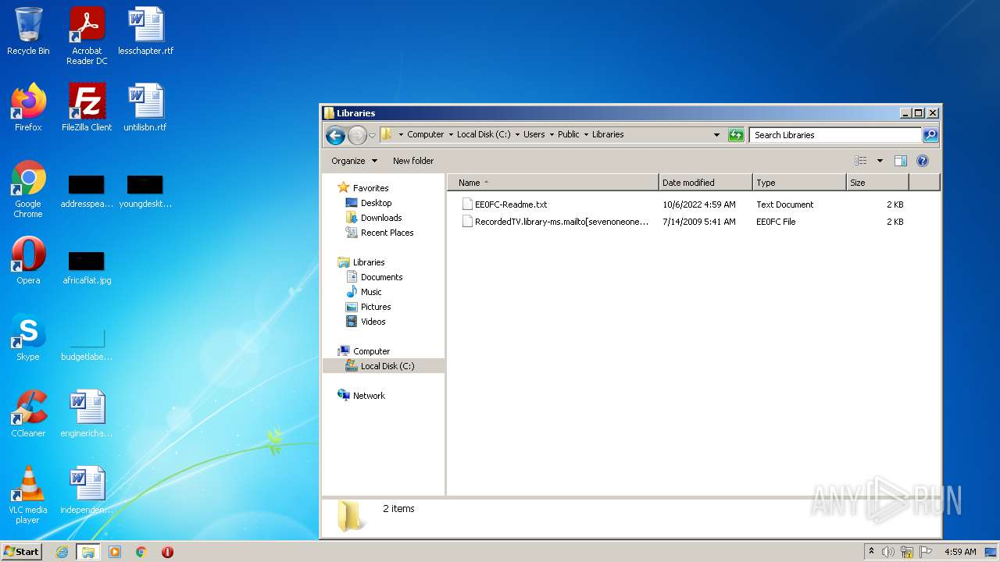

# HEUR-Trojan-Downloader.Win32.Cridex.pef-416556c9f085ae56e13f32d7c8c99f03efc6974b2897070f46ef5f9736443e8e

- https://any.run/report/416556c9f085ae56e13f32d7c8c99f03efc6974b2897070f46ef5f9736443e8e/09ccb69b-f3e7-484b-a800-ec5c98d9c11a

```
- _id: "416556c9f085ae56e13f32d7c8c99f03efc6974b2897070f46ef5f9736443e8e"
  creation_date: 1006112191  # 2001-11-18 20:36:31 +0100 CET
  first_submission_date: 1579785013  # 2020-01-23 14:10:13 +0100 CET
  last_analysis_date: 1642686393  # 2022-01-20 14:46:33 +0100 CET
  last_analysis_results: 
    Kaspersky: 
      result: "HEUR:Trojan-Downloader.Win32.Cridex.pef"
  magic: "PE32 executable for MS Windows (GUI) Intel 80386 32-bit"
  size: 283648
  trid: 
  - file_type: "Win64 Executable (generic)"
    probability: 30.2
  - file_type: "Win32 Dynamic Link Library (generic)"
    probability: 18.9
  - file_type: "Win16 NE executable (generic)"
    probability: 14.4
  - file_type: "Win32 Executable (generic)"
    probability: 12.9
  - file_type: "Win16/32 Executable Delphi generic"
    probability: 5.9
```





