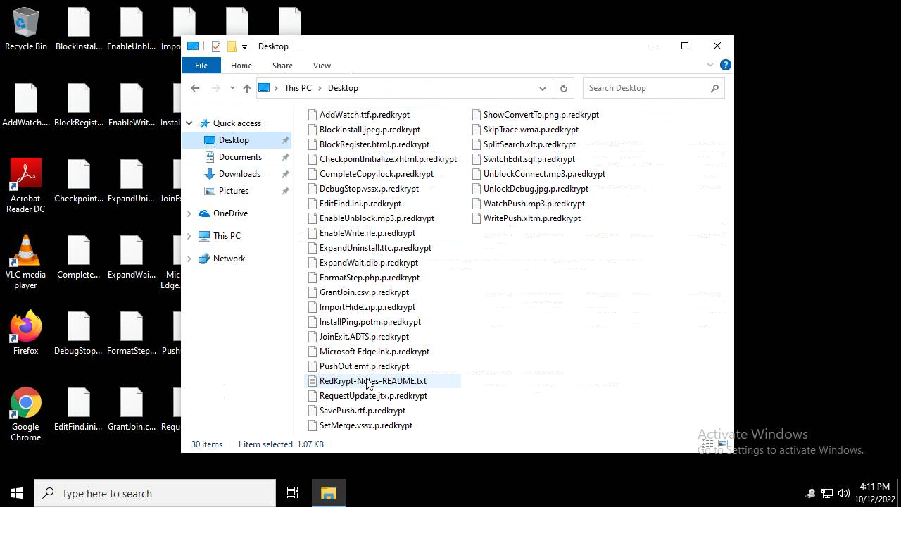
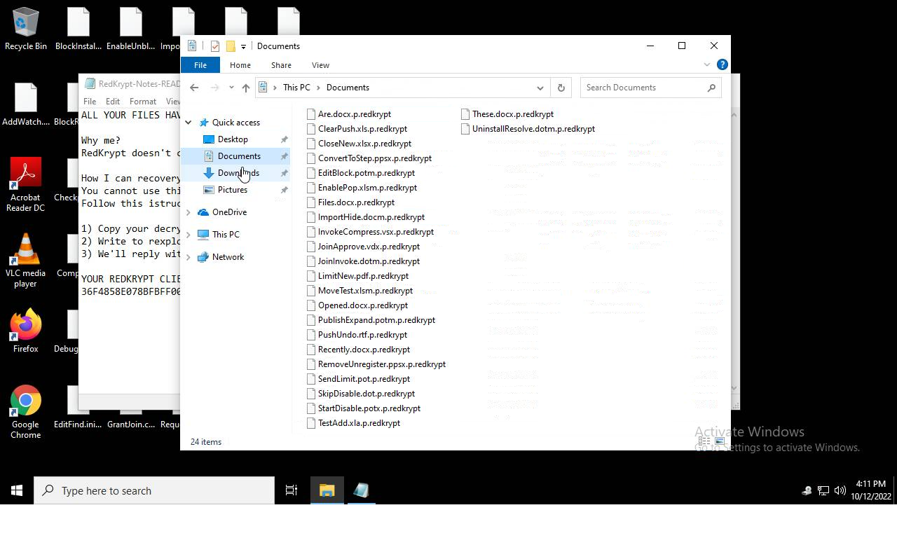
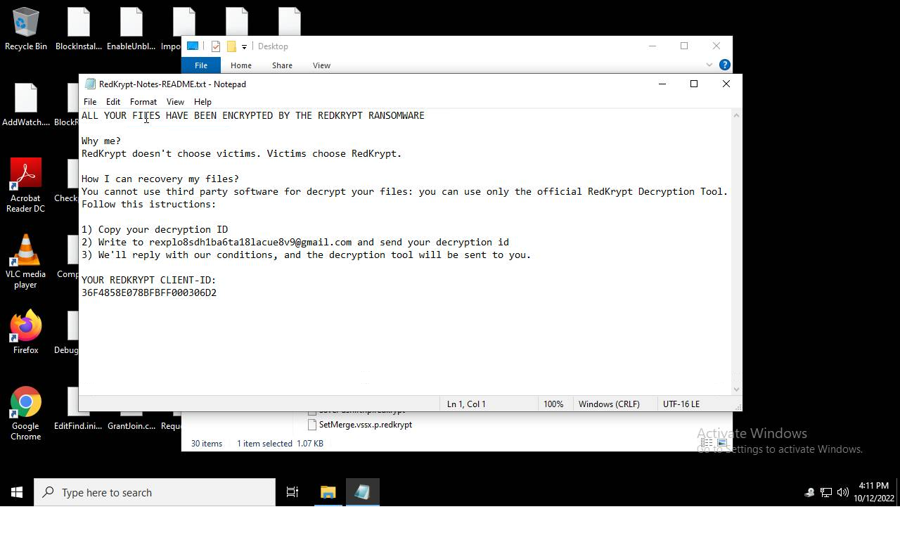
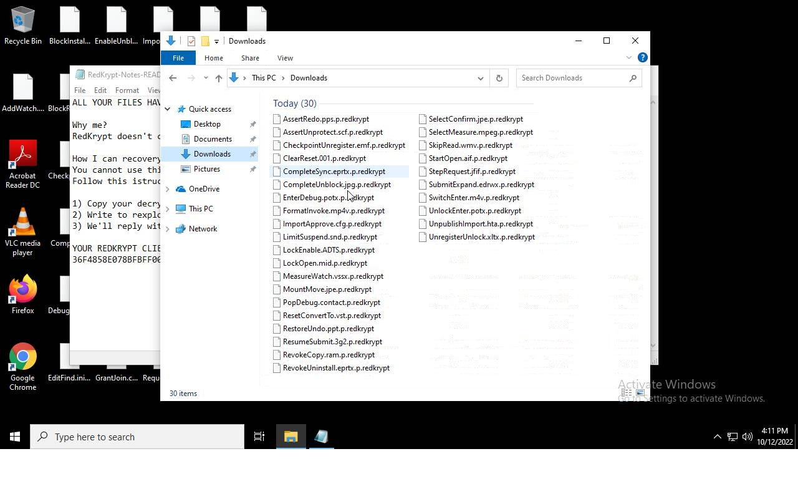

# HEUR-Trojan-PSW.MSIL.Stealer.gen-16764b173314ddeb7341f18a7b33066a319476847ba715c53c4f0f8e9ed43a20

- https://tria.ge/221012-tmlzdsahbm/behavioral2

```
- _id: "16764b173314ddeb7341f18a7b33066a319476847ba715c53c4f0f8e9ed43a20"
  creation_date: 1664737783  # 2022-10-02 21:09:43 +0200 CEST
  crowdsourced_yara_results: 
  - author: "ditekSHen"
    description: "Detects executables using Telegram Chat Bot"
    rule_name: "INDICATOR_SUSPICIOUS_EXE_TelegramChatBot"
    ruleset_id: "00c3b8eb5d"
    ruleset_name: "indicator_suspicious"
    source: "https://github.com/ditekshen/detection"
  first_submission_date: 1664738230  # 2022-10-02 21:17:10 +0200 CEST
  last_analysis_date: 1665554085  # 2022-10-12 07:54:45 +0200 CEST
  last_analysis_results: 
    Kaspersky: 
      result: "HEUR:Trojan-PSW.MSIL.Stealer.gen"
  magic: "PE32 executable for MS Windows (GUI) Intel 80386 Mono/.Net assembly"
  size: 49664
  trid: 
  - file_type: "Generic CIL Executable (.NET, Mono, etc.)"
    probability: 69.1
  - file_type: "Win64 Executable (generic)"
    probability: 9.9
  - file_type: "Win32 Dynamic Link Library (generic)"
    probability: 6.2
  - file_type: "Win16 NE executable (generic)"
    probability: 4.7
  - file_type: "Win32 Executable (generic)"
    probability: 4.2
```





