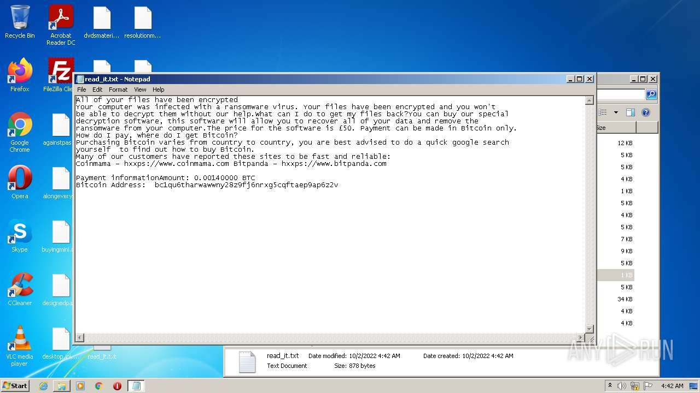
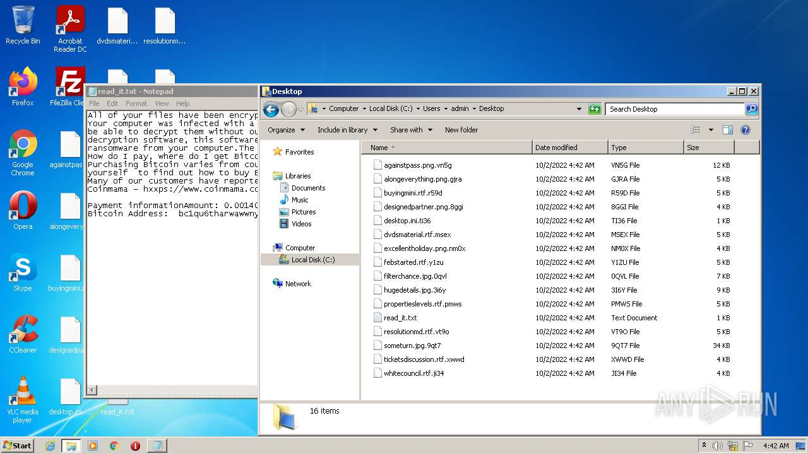
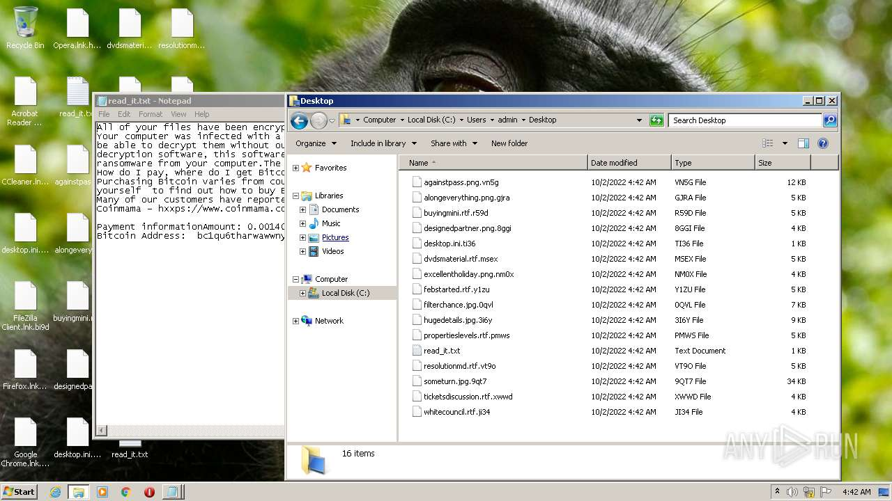
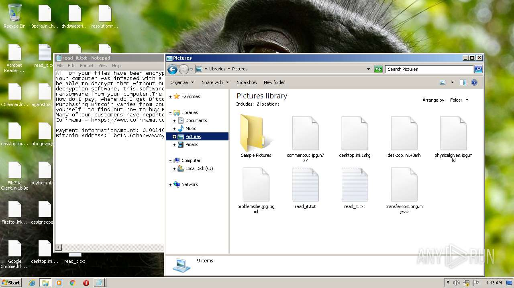
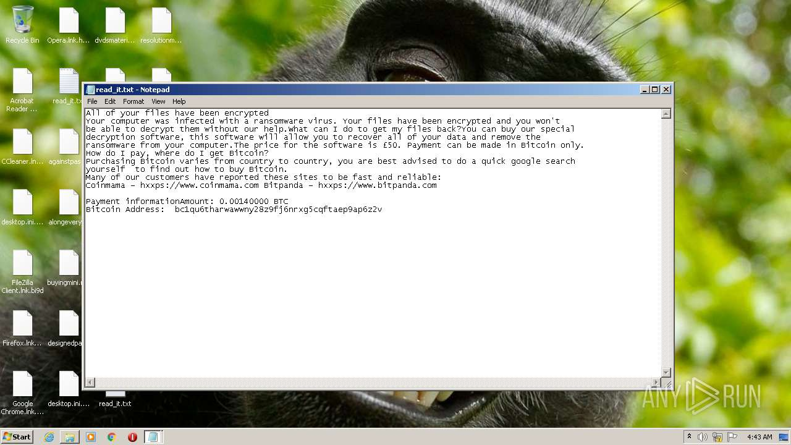

# HEUR-Trojan-Ransom.MSIL.Agent.gen-0a00b6668696bf62e14ea1acaa855397730e24bd66b594d9602bee37c2de2e6e

- https://any.run/report/0a00b6668696bf62e14ea1acaa855397730e24bd66b594d9602bee37c2de2e6e/c5456caa-fe1f-4985-922a-312ad7709fd5

```
- _id: "0a00b6668696bf62e14ea1acaa855397730e24bd66b594d9602bee37c2de2e6e"
  creation_date: 1630163692  # 2021-08-28 17:14:52 +0200 CEST
  crowdsourced_yara_results: 
  - author: "ditekShen"
    description: "Detects files referencing identities associated with Chaos ransomware"
    rule_name: "INDICATOR_KB_ID_Ransomware_Chaos"
    ruleset_id: "00cec9e642"
    ruleset_name: "indicator_knownbad_id"
    source: "https://github.com/ditekshen/detection"
  - author: "ditekSHen"
    description: "detects command variations typically used by ransomware"
    rule_name: "INDICATOR_SUSPICIOUS_GENRansomware"
    ruleset_id: "00c3b8eb5d"
    ruleset_name: "indicator_suspicious"
    source: "https://github.com/ditekshen/detection"
  - author: "ditekSHen"
    description: "Detects Chaos ransomware"
    rule_name: "MALWARE_Win_Chaos"
    ruleset_id: "00cc803bdc"
    ruleset_name: "malware"
    source: "https://github.com/ditekshen/detection"
  first_submission_date: 1630201002  # 2021-08-29 03:36:42 +0200 CEST
  last_analysis_date: 1663821667  # 2022-09-22 06:41:07 +0200 CEST
  last_analysis_results: 
    Kaspersky: 
      result: "HEUR:Trojan-Ransom.MSIL.Agent.gen"
  magic: "PE32 executable for MS Windows (GUI) Intel 80386 32-bit Mono/.Net assembly"
  packers: 
    PEiD: ".NET executable"
  size: 724992
  trid: 
  - file_type: "Generic CIL Executable (.NET, Mono, etc.)"
    probability: 72.5
  - file_type: "Win64 Executable (generic)"
    probability: 10.4
  - file_type: "Win32 Dynamic Link Library (generic)"
    probability: 6.5
  - file_type: "Win32 Executable (generic)"
    probability: 4.4
  - file_type: "OS/2 Executable (generic)"
    probability: 2.0
```









