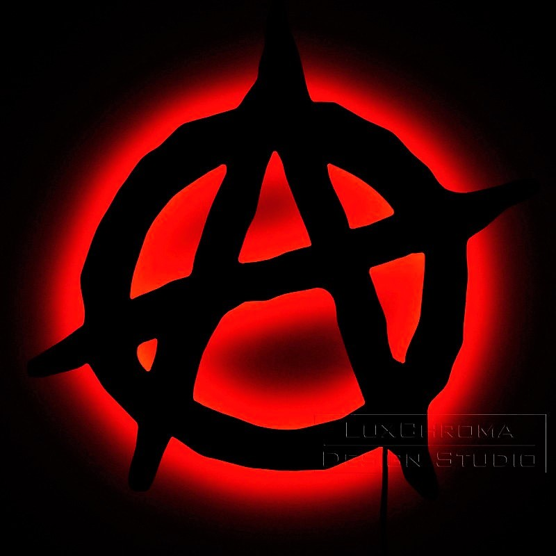
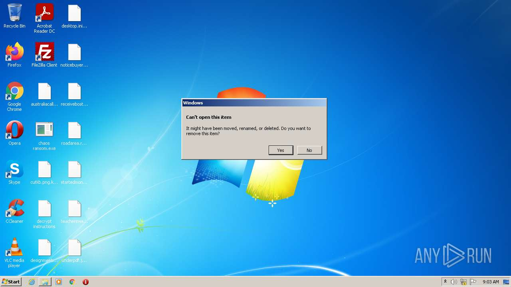
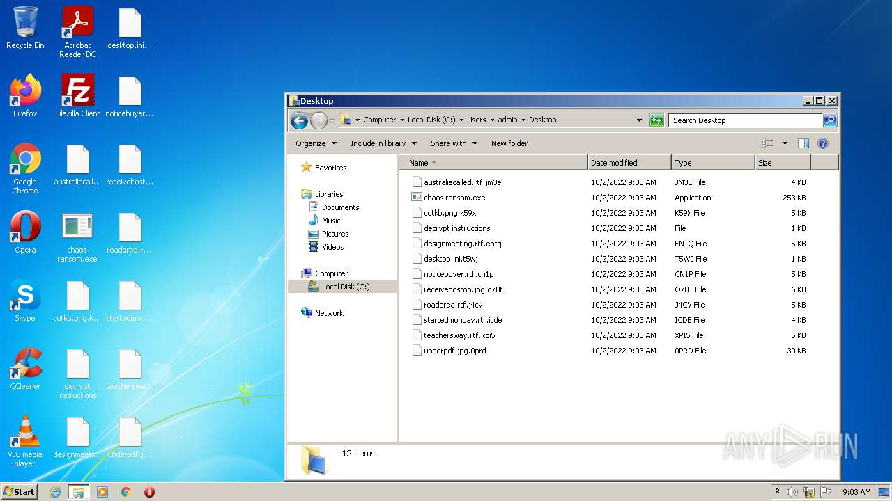
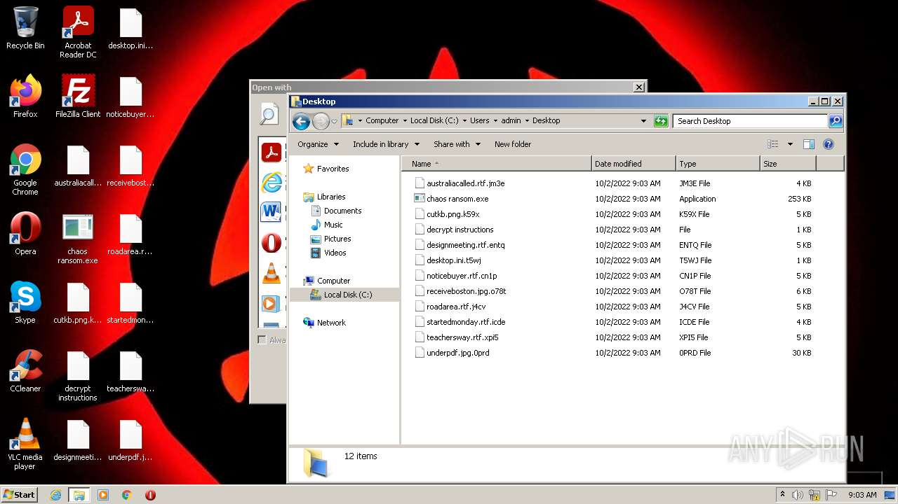
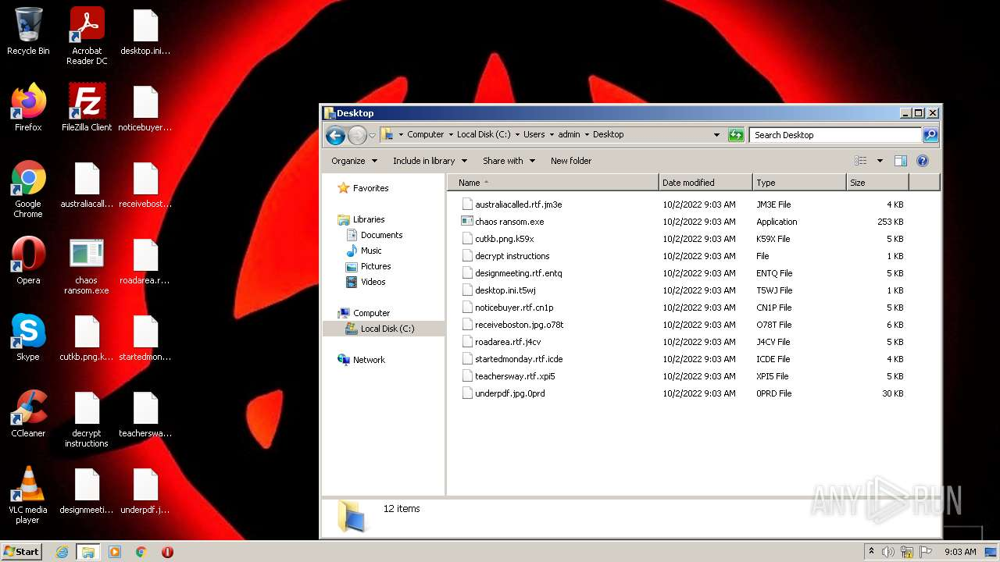

# HEUR-Trojan-Ransom.MSIL.Agent.gen-64ed5d1db50c9c0b3c4aeb46f6e52cb27e3557a05ca98073fb0462509a070b72

- https://any.run/report/64ed5d1db50c9c0b3c4aeb46f6e52cb27e3557a05ca98073fb0462509a070b72/173e8567-c50f-45c0-8586-0564f377d1ac

```
- _id: "64ed5d1db50c9c0b3c4aeb46f6e52cb27e3557a05ca98073fb0462509a070b72"
  creation_date: 1633268032  # 2021-10-03 15:33:52 +0200 CEST
  first_submission_date: 1633269245  # 2021-10-03 15:54:05 +0200 CEST
  last_analysis_date: 1633269245  # 2021-10-03 15:54:05 +0200 CEST
  last_analysis_results: 
    Kaspersky: 
      result: "HEUR:Trojan-Ransom.MSIL.Agent.gen"
  magic: "PE32 executable for MS Windows (GUI) Intel 80386 32-bit Mono/.Net assembly"
  packers: 
    PEiD: ".NET executable"
  size: 258560
  trid: 
  - file_type: "Generic CIL Executable (.NET, Mono, etc.)"
    probability: 72.5
  - file_type: "Win64 Executable (generic)"
    probability: 10.4
  - file_type: "Win32 Dynamic Link Library (generic)"
    probability: 6.5
  - file_type: "Win32 Executable (generic)"
    probability: 4.4
  - file_type: "OS/2 Executable (generic)"
    probability: 2.0
```








