# HEUR-Trojan-Ransom.MSIL.Agent.gen-7c36e28ff8f382596406ee5aa1fe401d7da247d6ded182d2faa945da4680c6dc

- https://any.run/report/7c36e28ff8f382596406ee5aa1fe401d7da247d6ded182d2faa945da4680c6dc/58c147a7-7433-4fab-ba8b-c597127d0822

```
- _id: "7c36e28ff8f382596406ee5aa1fe401d7da247d6ded182d2faa945da4680c6dc"
  creation_date: 1665080199  # 2022-10-06 20:16:39 +0200 CEST
  crowdsourced_yara_results: 
  - author: "ditekSHen"
    description: "detects command variations typically used by ransomware"
    rule_name: "INDICATOR_SUSPICIOUS_GENRansomware"
    ruleset_id: "00c3b8eb5d"
    ruleset_name: "indicator_suspicious"
    source: "https://github.com/ditekshen/detection"
  - author: "ditekSHen"
    description: "Detects Chaos ransomware"
    rule_name: "MALWARE_Win_Chaos"
    ruleset_id: "00cc803bdc"
    ruleset_name: "malware"
    source: "https://github.com/ditekshen/detection"
  first_submission_date: 1665080234  # 2022-10-06 20:17:14 +0200 CEST
  last_analysis_date: 1665104953  # 2022-10-07 03:09:13 +0200 CEST
  last_analysis_results: 
    Kaspersky: 
      result: "HEUR:Trojan-Ransom.MSIL.Agent.gen"
  magic: "PE32 executable for MS Windows (GUI) Intel 80386 32-bit Mono/.Net assembly"
  packers: 
    PEiD: ".NET executable"
  size: 198656
  trid: 
  - file_type: "Generic CIL Executable (.NET, Mono, etc.)"
    probability: 72.5
  - file_type: "Win64 Executable (generic)"
    probability: 10.4
  - file_type: "Win32 Dynamic Link Library (generic)"
    probability: 6.5
  - file_type: "Win32 Executable (generic)"
    probability: 4.4
  - file_type: "OS/2 Executable (generic)"
    probability: 2.0
```


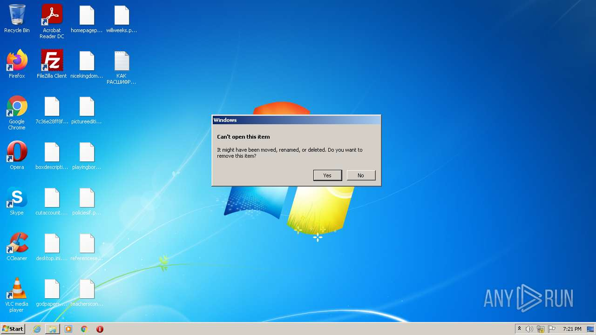
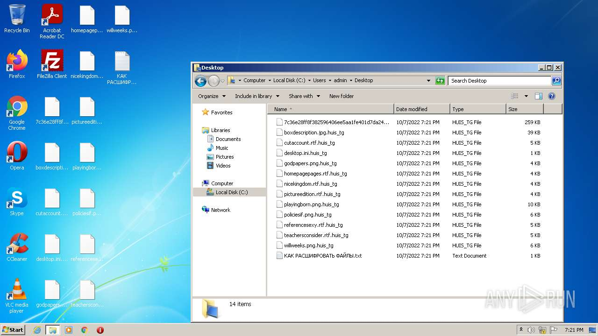
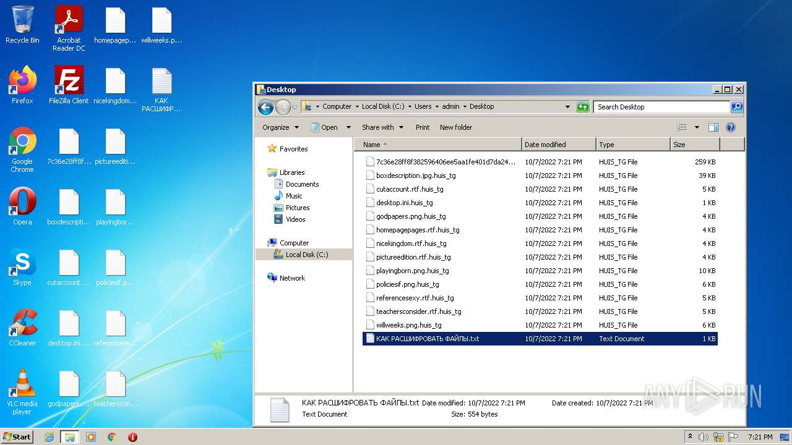
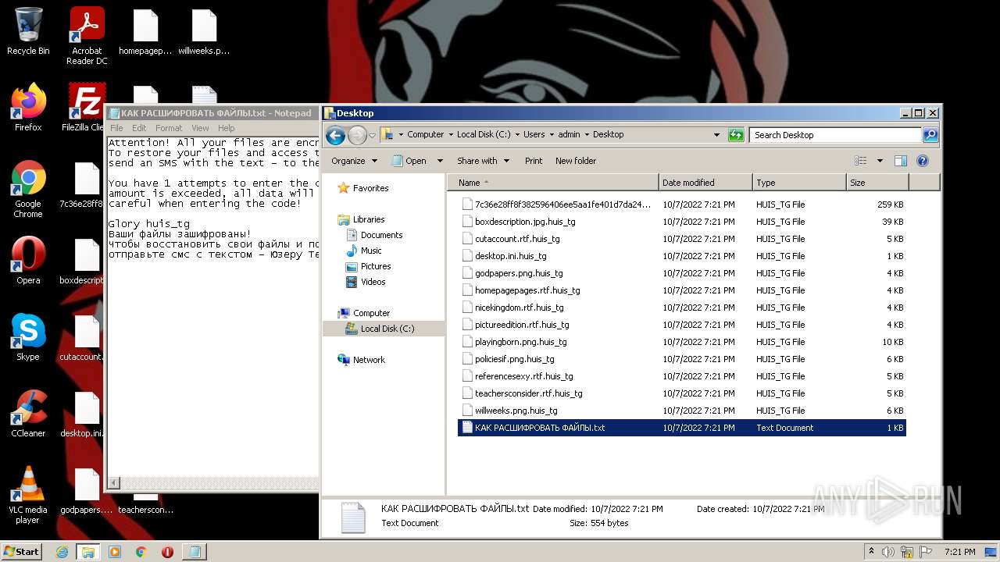
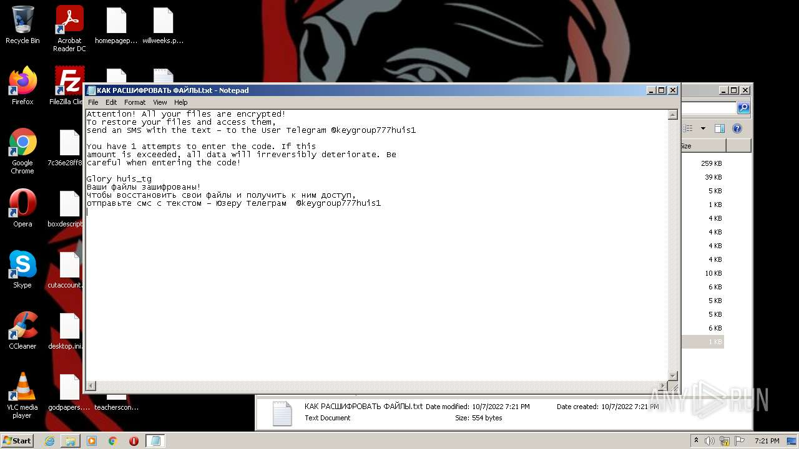
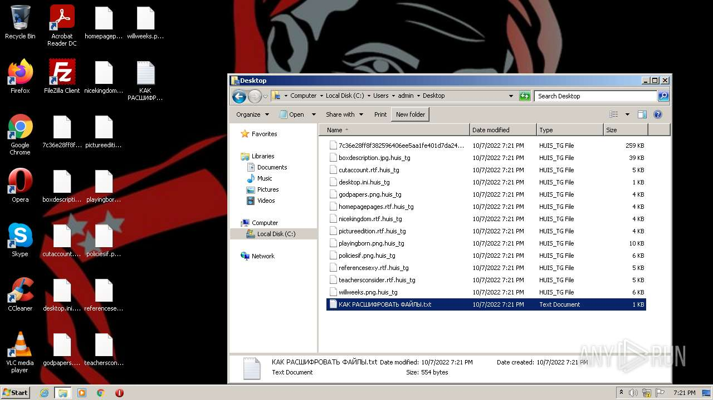
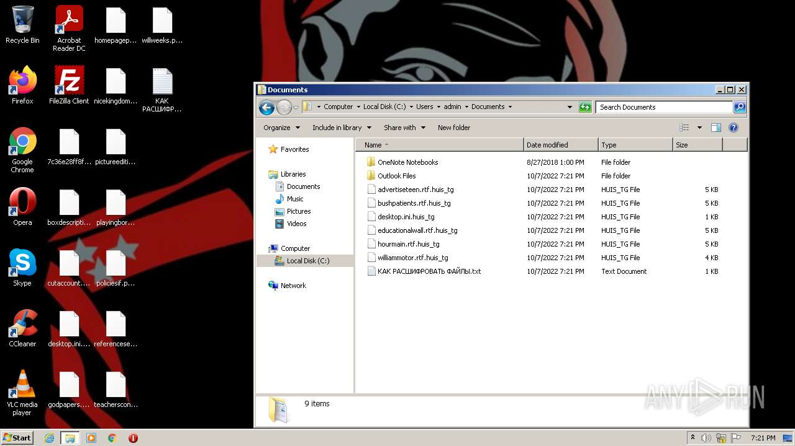
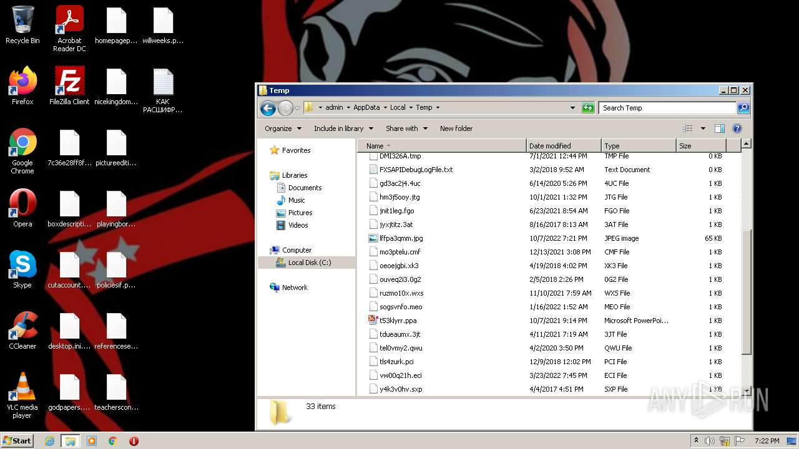
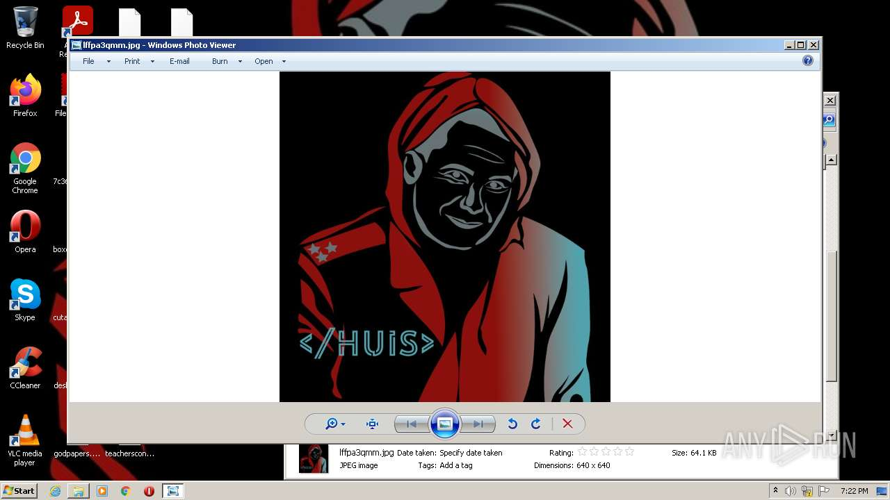
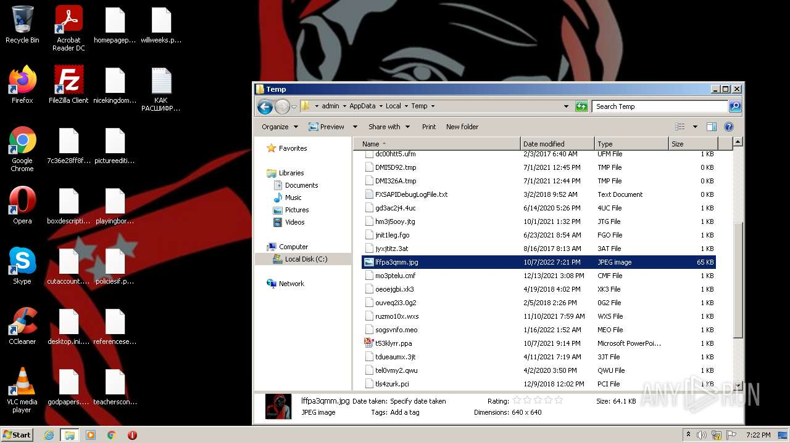
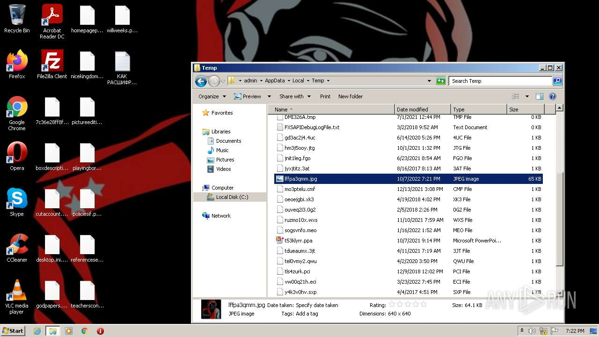
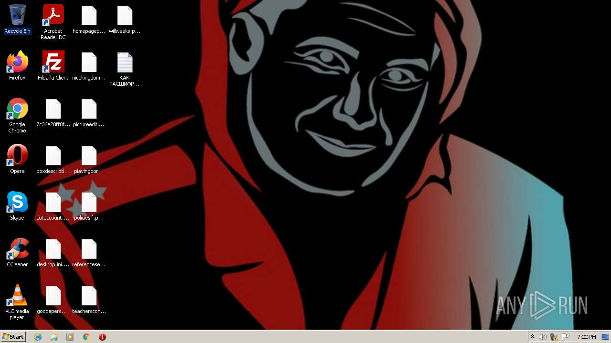
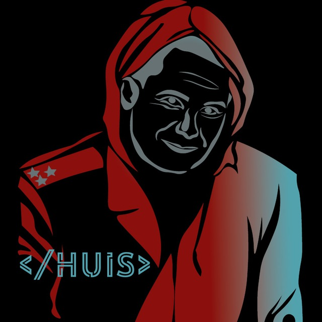
