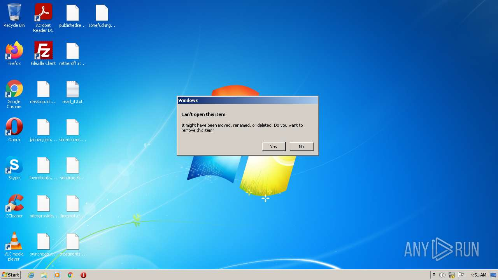
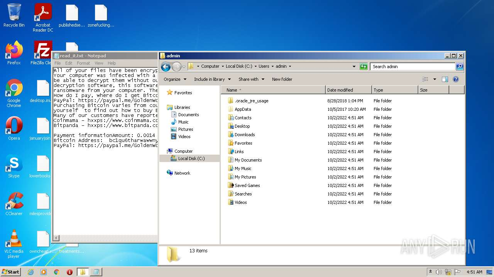
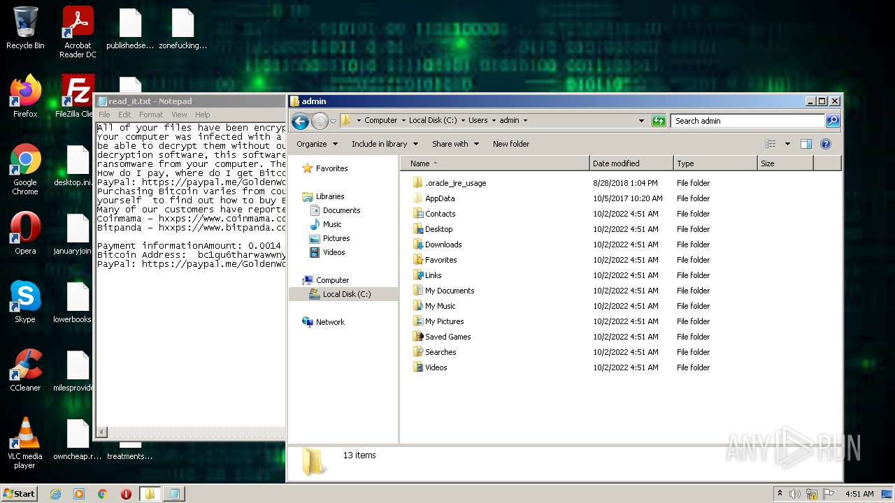
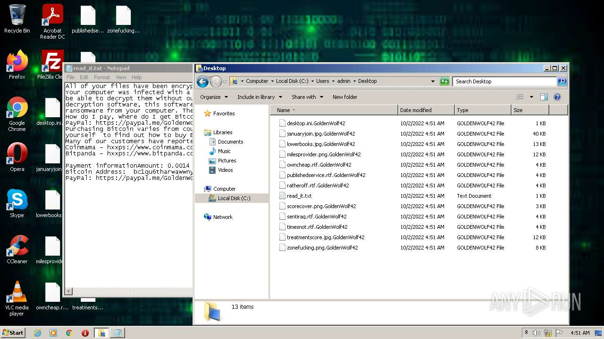
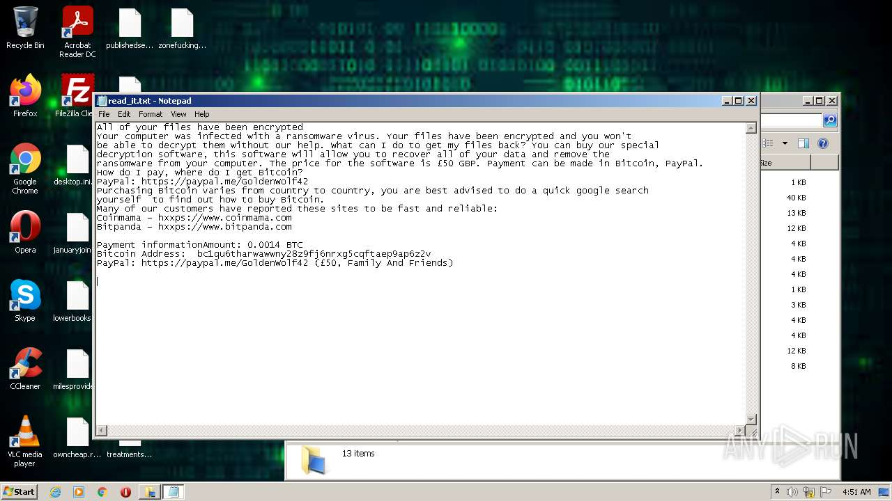
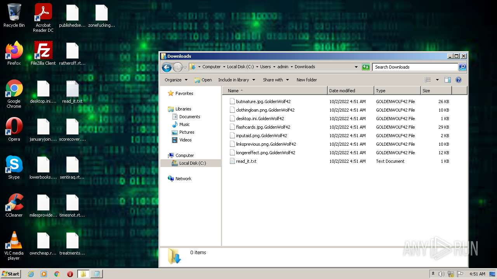

# HEUR-Trojan-Ransom.MSIL.Agent.gen-b103fc649787eb1f6121df8174d0f16aaac736fb53f5f078d312871189285956

- https://any.run/report/b103fc649787eb1f6121df8174d0f16aaac736fb53f5f078d312871189285956/0a98b98f-b3fa-4a4b-9b7c-7db183ca5891

```
- _id: "b103fc649787eb1f6121df8174d0f16aaac736fb53f5f078d312871189285956"
  creation_date: 1630609737  # 2021-09-02 21:08:57 +0200 CEST
  crowdsourced_yara_results: 
  - author: "Florian Roth"
    description: "Detects destructive malware"
    rule_name: "Destructive_Ransomware_Gen1"
    ruleset_id: "0002573660"
    ruleset_name: "apt_olympic_destroyer"
    source: "https://github.com/Neo23x0/signature-base"
  - author: "ditekShen"
    description: "Detects files referencing identities associated with Chaos ransomware"
    rule_name: "INDICATOR_KB_ID_Ransomware_Chaos"
    ruleset_id: "00cec9e642"
    ruleset_name: "indicator_knownbad_id"
    source: "https://github.com/ditekshen/detection"
  - author: "ditekSHen"
    description: "detects command variations typically used by ransomware"
    rule_name: "INDICATOR_SUSPICIOUS_GENRansomware"
    ruleset_id: "00c3b8eb5d"
    ruleset_name: "indicator_suspicious"
    source: "https://github.com/ditekshen/detection"
  - author: "ditekSHen"
    description: "Detects Chaos ransomware"
    rule_name: "MALWARE_Win_Chaos"
    ruleset_id: "00cc803bdc"
    ruleset_name: "malware"
    source: "https://github.com/ditekshen/detection"
  first_submission_date: 1630613302  # 2021-09-02 22:08:22 +0200 CEST
  last_analysis_date: 1658205426  # 2022-07-19 06:37:06 +0200 CEST
  last_analysis_results: 
    Kaspersky: 
      result: "HEUR:Trojan-Ransom.MSIL.Agent.gen"
  magic: "PE32 executable for MS Windows (GUI) Intel 80386 32-bit Mono/.Net assembly"
  packers: 
    PEiD: ".NET executable"
  size: 62464
  trid: 
  - file_type: "Generic CIL Executable (.NET, Mono, etc.)"
    probability: 72.5
  - file_type: "Win64 Executable (generic)"
    probability: 10.4
  - file_type: "Win32 Dynamic Link Library (generic)"
    probability: 6.5
  - file_type: "Win32 Executable (generic)"
    probability: 4.4
  - file_type: "OS/2 Executable (generic)"
    probability: 2.0
```











