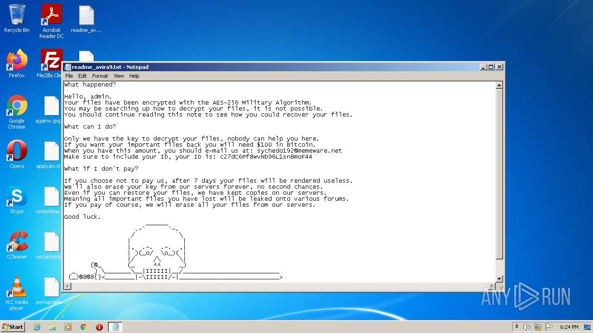
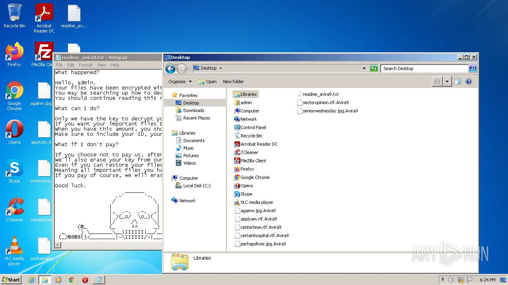
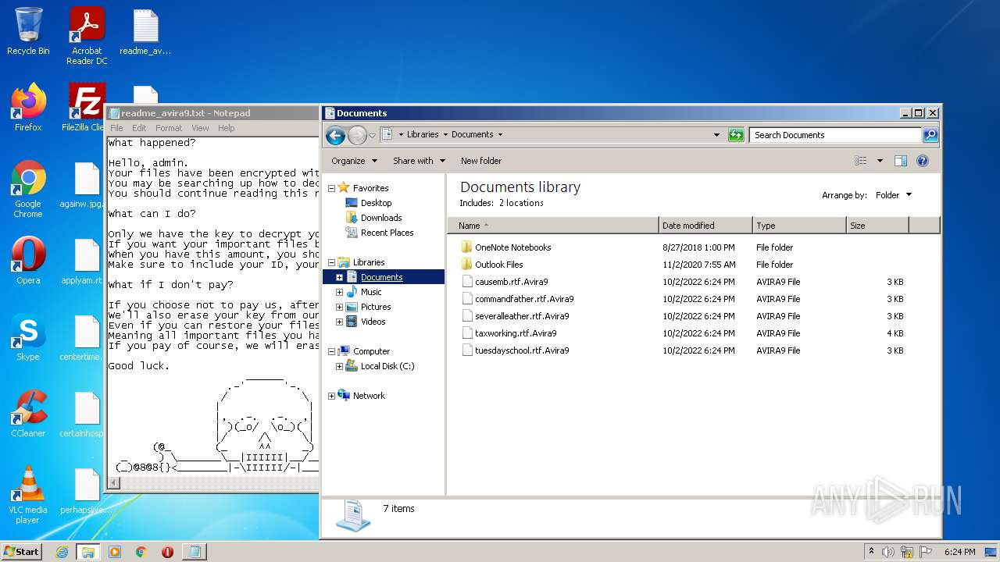

# HEUR-Trojan-Ransom.MSIL.Agent.gen-b14a9c2da96afff8fff645922e6bf4f1ee60e7eefd4b59985d83785f83572203

- https://any.run/report/b14a9c2da96afff8fff645922e6bf4f1ee60e7eefd4b59985d83785f83572203/d391b16a-fc0d-478d-95f0-c06b1383535b

```
- _id: "b14a9c2da96afff8fff645922e6bf4f1ee60e7eefd4b59985d83785f83572203"
  creation_date: 1663692677  # 2022-09-20 18:51:17 +0200 CEST
  crowdsourced_yara_results: 
  - author: "Arnim Rupp"
    description: "Detects ConfuserEx packed file"
    rule_name: "SUSP_NET_NAME_ConfuserEx"
    ruleset_id: "0003987e76"
    ruleset_name: "gen_github_net_redteam_tools_names"
    source: "https://github.com/Neo23x0/signature-base"
  - author: "ditekSHen"
    description: "Detects executables packed with ConfuserEx Mod"
    rule_name: "INDICATOR_EXE_Packed_ConfuserEx"
    ruleset_id: "00c291ca7f"
    ruleset_name: "indicator_packed"
    source: "https://github.com/ditekshen/detection"
  - author: "Arnim Rupp"
    description: "Detects ConfuserEx packed file"
    match_in_subfile: true
    rule_name: "SUSP_NET_NAME_ConfuserEx"
    ruleset_id: "0003987e76"
    ruleset_name: "gen_github_net_redteam_tools_names"
    source: "https://github.com/Neo23x0/signature-base"
  - author: "ditekSHen"
    description: "Detects executables packed with ConfuserEx Mod"
    match_in_subfile: true
    rule_name: "INDICATOR_EXE_Packed_ConfuserEx"
    ruleset_id: "00c291ca7f"
    ruleset_name: "indicator_packed"
    source: "https://github.com/ditekshen/detection"
  - author: "Lucas Acha (http://www.lukeacha.com)"
    description: "Generic Detection for multiple RAT families, PUPs, Packers and suspicious executables"
    match_in_subfile: true
    rule_name: "Multifamily_RAT_Detection"
    ruleset_id: "00f69a1b91"
    ruleset_name: "rat_detection"
    source: "https://github.com/securitymagic/yara"
  first_submission_date: 1663716037  # 2022-09-21 01:20:37 +0200 CEST
  last_analysis_date: 1664559800  # 2022-09-30 19:43:20 +0200 CEST
  last_analysis_results: 
    Kaspersky: 
      result: "HEUR:Trojan-Ransom.MSIL.Agent.gen"
  magic: "PE32 executable for MS Windows (GUI) Intel 80386 32-bit Mono/.Net assembly"
  packers: 
    PEiD: ".NET executable"
  size: 102400
  trid: 
  - file_type: "Generic CIL Executable (.NET, Mono, etc.)"
    probability: 72.5
  - file_type: "Win64 Executable (generic)"
    probability: 10.4
  - file_type: "Win32 Dynamic Link Library (generic)"
    probability: 6.5
  - file_type: "Win32 Executable (generic)"
    probability: 4.4
  - file_type: "OS/2 Executable (generic)"
    probability: 2.0
```





