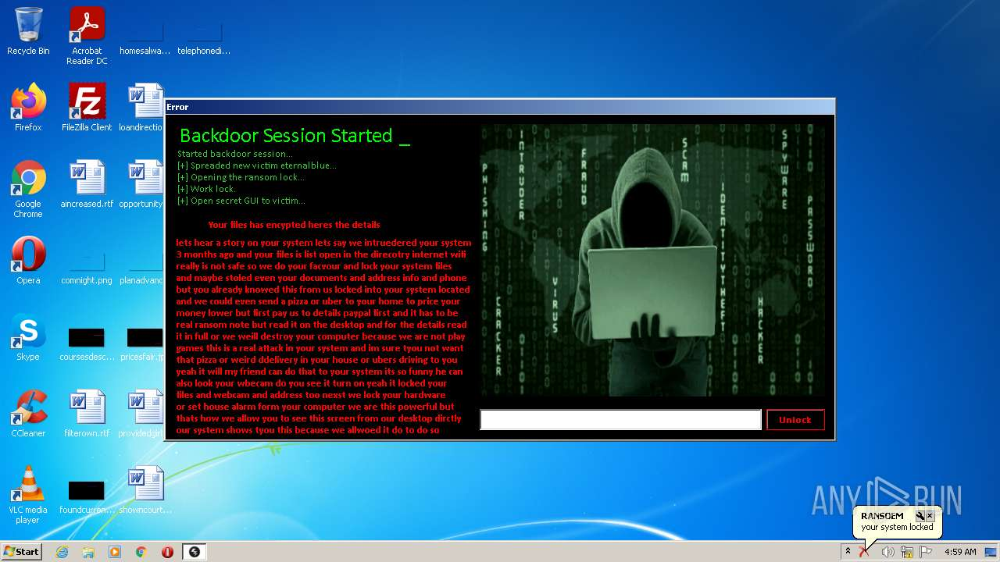
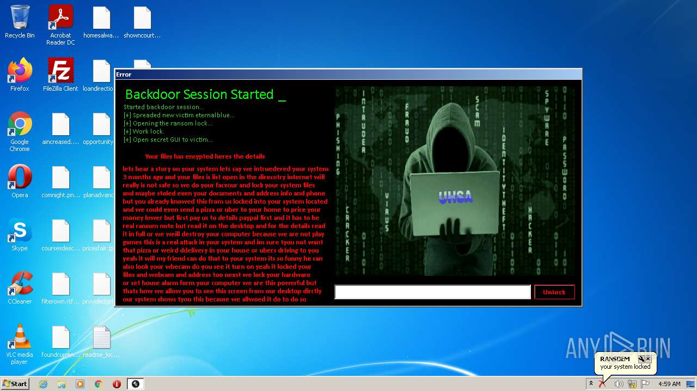
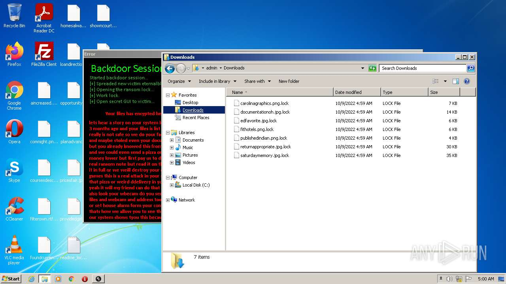
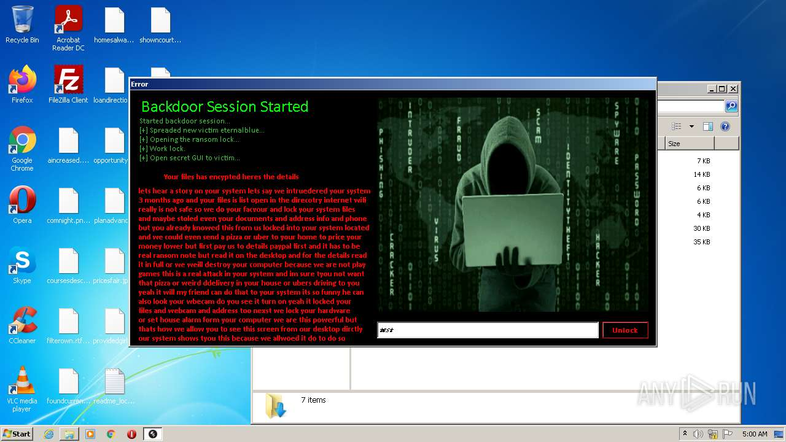

# HEUR-Trojan-Ransom.MSIL.Agent.gen-b547b29e2f188c3a4102c8b5bd36ae09df01ade4e24fad3ae00cec2699b92f91

- https://any.run/report/b547b29e2f188c3a4102c8b5bd36ae09df01ade4e24fad3ae00cec2699b92f91/f304d010-6b46-44ca-a91d-e9aee8a3f8a5

```
- _id: "b547b29e2f188c3a4102c8b5bd36ae09df01ade4e24fad3ae00cec2699b92f91"
  creation_date: 1665234888  # 2022-10-08 15:14:48 +0200 CEST
  first_submission_date: 1665264204  # 2022-10-08 23:23:24 +0200 CEST
  last_analysis_date: 1665264204  # 2022-10-08 23:23:24 +0200 CEST
  last_analysis_results: 
    Kaspersky: 
      result: "HEUR:Trojan-Ransom.MSIL.Agent.gen"
  magic: "PE32 executable for MS Windows (GUI) Intel 80386 Mono/.Net assembly"
  size: 432128
  trid: 
  - file_type: "Generic CIL Executable (.NET, Mono, etc.)"
    probability: 72.5
  - file_type: "Win64 Executable (generic)"
    probability: 10.4
  - file_type: "Win32 Dynamic Link Library (generic)"
    probability: 6.5
  - file_type: "Win32 Executable (generic)"
    probability: 4.4
  - file_type: "OS/2 Executable (generic)"
    probability: 2.0
```






