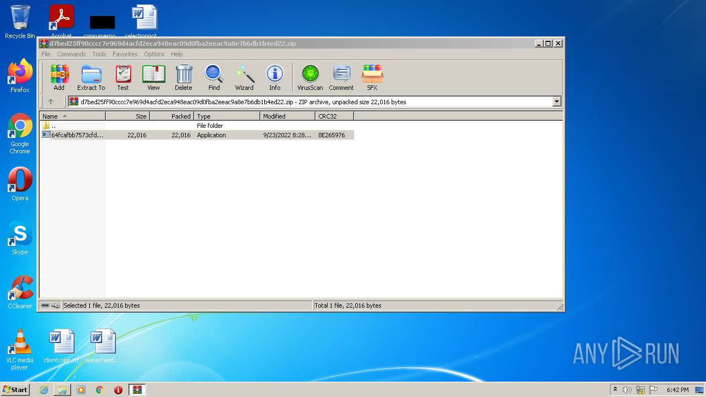
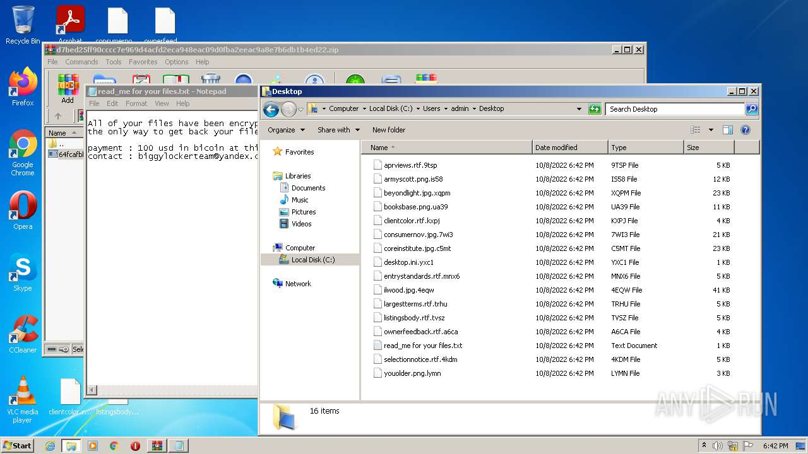
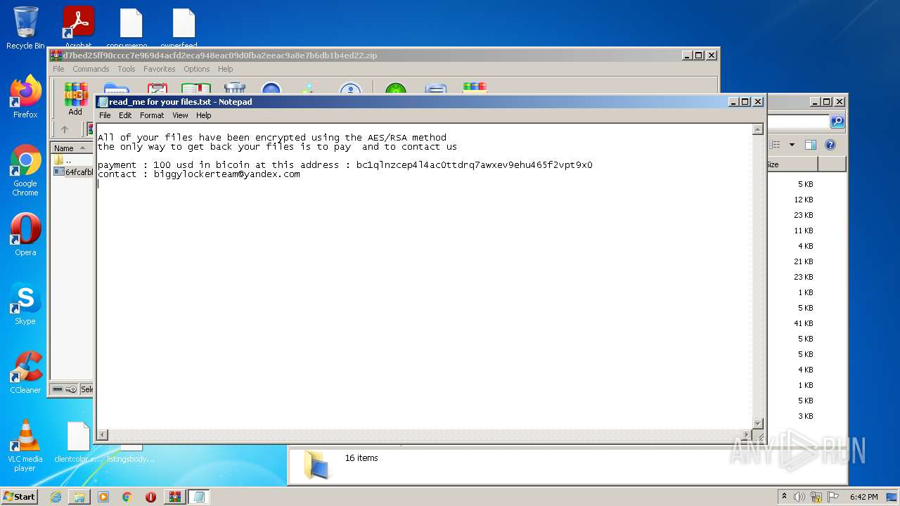
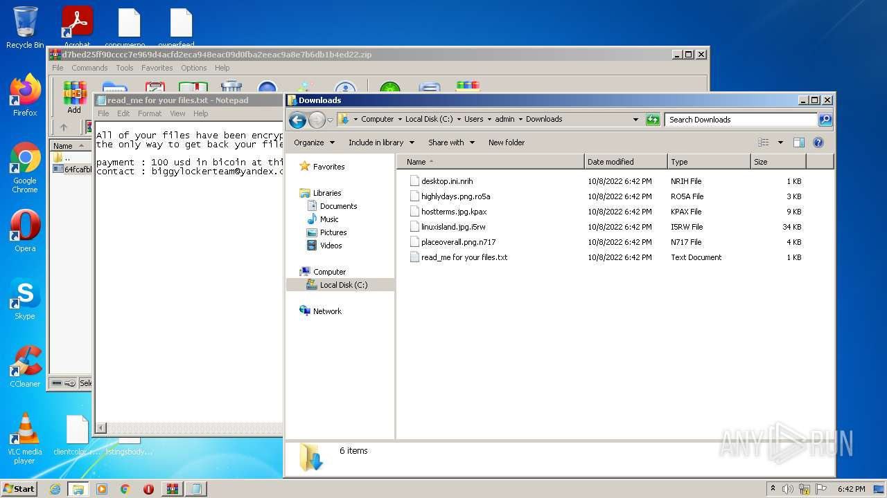

# HEUR-Trojan-Ransom.MSIL.Agent.gen-d7bed25ff90cccc7e969d4acfd2eca948eac09d0fba2eeac9a8e7b6db1b4ed22

- https://any.run/report/d7bed25ff90cccc7e969d4acfd2eca948eac09d0fba2eeac9a8e7b6db1b4ed22/022e3eed-8a14-428d-a35d-1aecfad99061

```
- _id: "d7bed25ff90cccc7e969d4acfd2eca948eac09d0fba2eeac9a8e7b6db1b4ed22"
  crowdsourced_yara_results: 
  - author: "InQuest Labs"
    description: "This signature detects the presence of a number of Windows API functionality often seen within embedded executables. When this signature alerts on an executable, it is not an indication of malicious behavior. However, if seen firing in other file types, deeper investigation may be warranted."
    rule_name: "Windows_API_Function"
    ruleset_id: "0122a7f913"
    ruleset_name: "Windows_API_Function"
    source: "https://github.com/InQuest/yara-rules-vt"
  - author: "ditekShen"
    description: "Detects files referencing identities associated with Chaos ransomware"
    rule_name: "INDICATOR_KB_ID_Ransomware_Chaos"
    ruleset_id: "00cec9e642"
    ruleset_name: "indicator_knownbad_id"
    source: "https://github.com/ditekshen/detection"
  - author: "ditekSHen"
    description: "detects command variations typically used by ransomware"
    rule_name: "INDICATOR_SUSPICIOUS_GENRansomware"
    ruleset_id: "00c3b8eb5d"
    ruleset_name: "indicator_suspicious"
    source: "https://github.com/ditekshen/detection"
  first_submission_date: 1663914504  # 2022-09-23 08:28:24 +0200 CEST
  last_analysis_date: 1663914504  # 2022-09-23 08:28:24 +0200 CEST
  last_analysis_results: 
    Kaspersky: 
      result: "HEUR:Trojan-Ransom.MSIL.Agent.gen"
  magic: "Zip archive data, at least v2.0 to extract"
  size: 22250
  trid: 
  - file_type: "ZIP compressed archive"
    probability: 80.0
  - file_type: "PrintFox/Pagefox bitmap (640x800)"
    probability: 20.0
```





