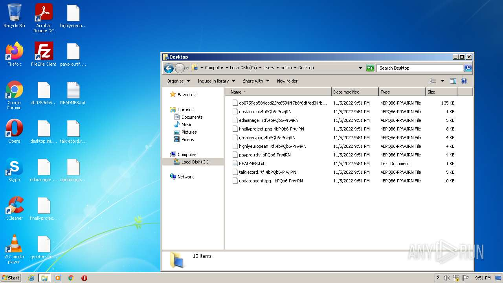
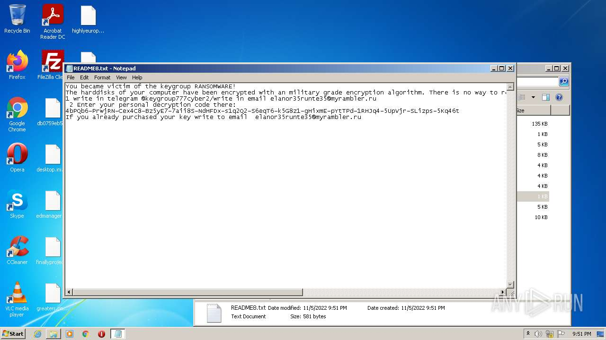
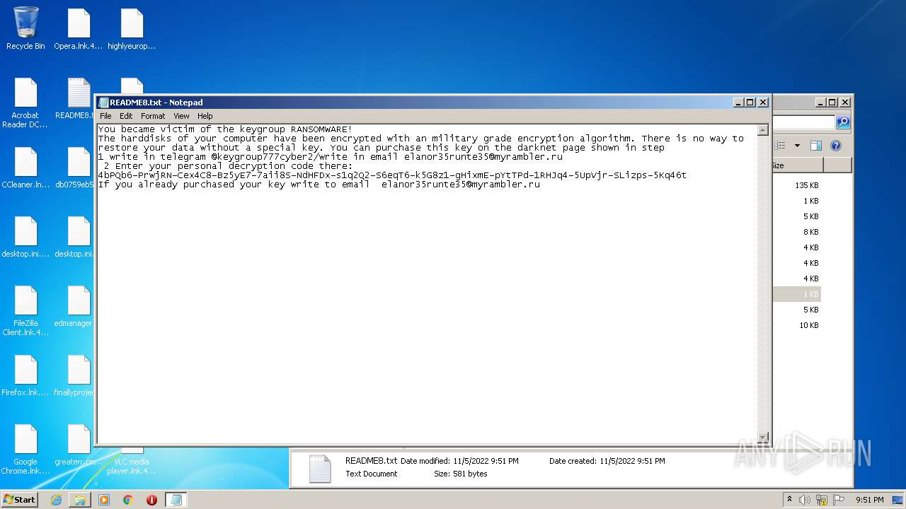
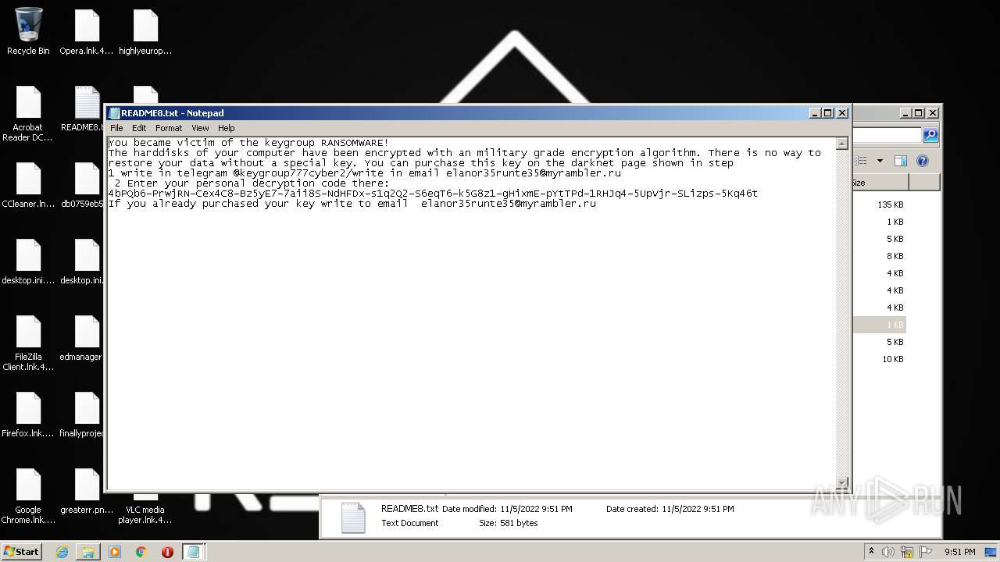
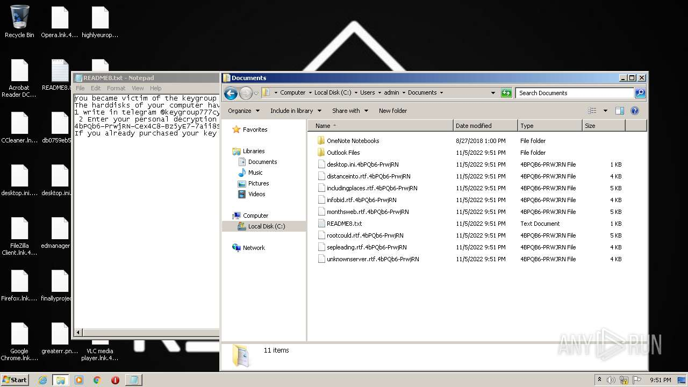
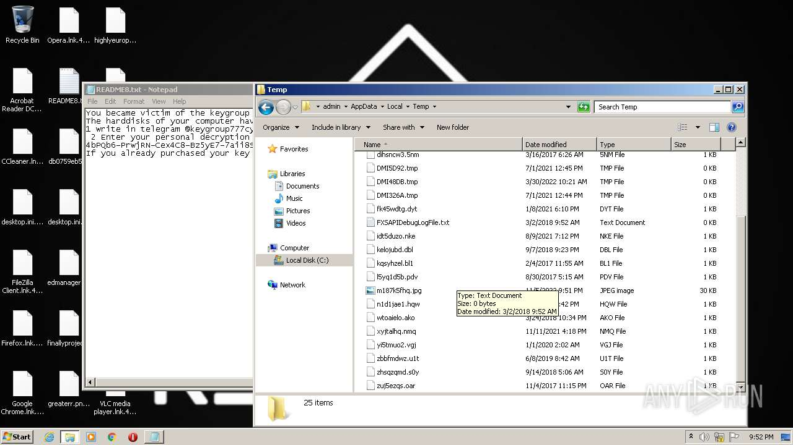
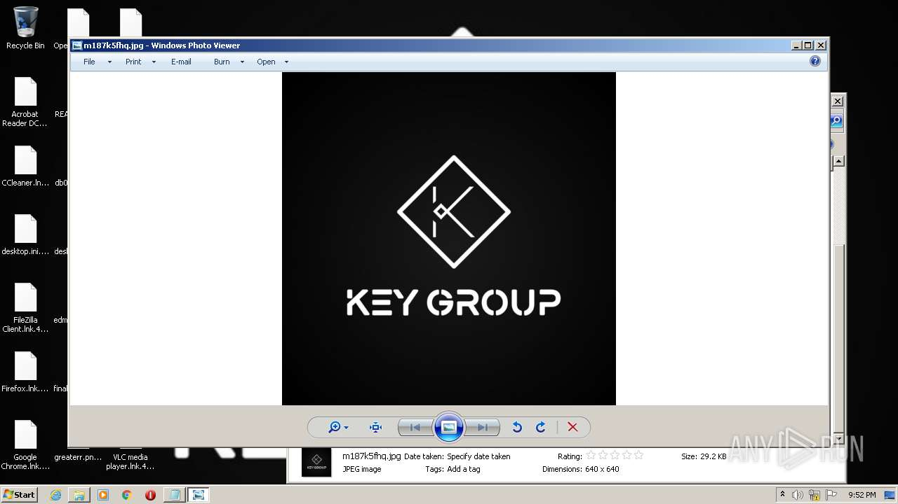
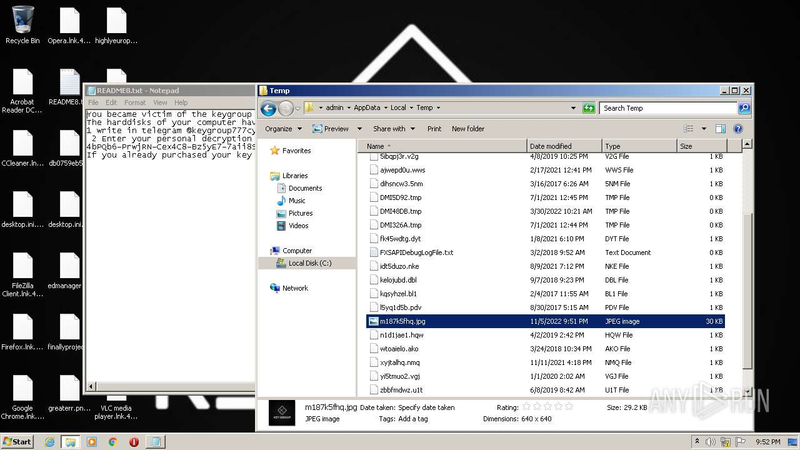
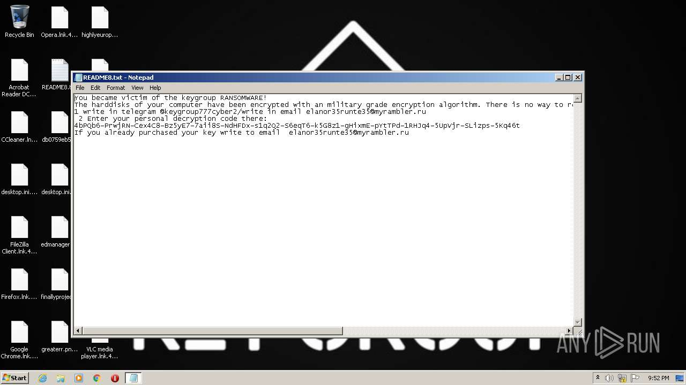
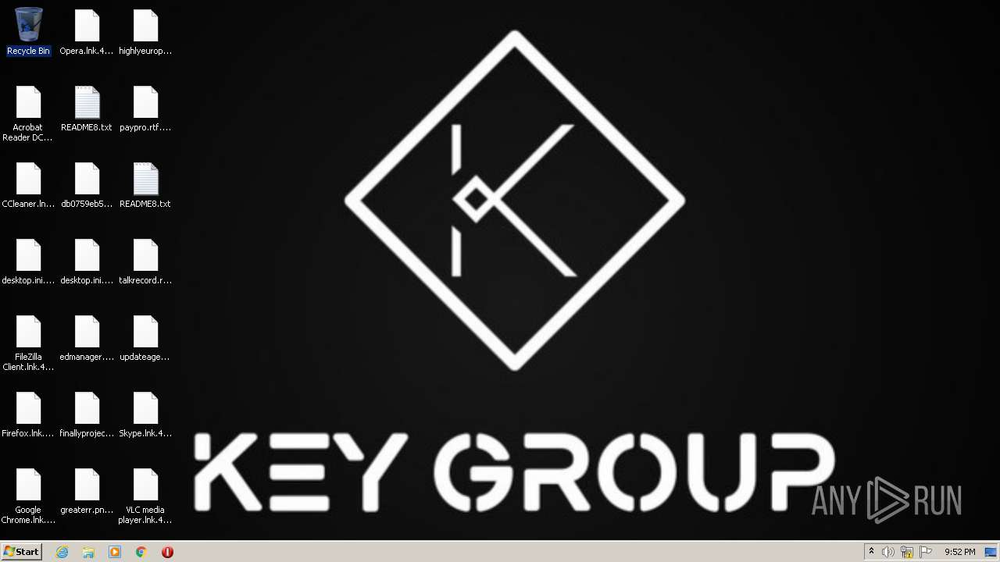

# HEUR-Trojan-Ransom.MSIL.Agent.gen-db0759eb584acd22fc6594ff7b8f6dffed34fb9e3dc427d22ba94bac9808f63a

- https://any.run/report/db0759eb584acd22fc6594ff7b8f6dffed34fb9e3dc427d22ba94bac9808f63a/7e8ecc17-1787-4a8f-a39b-b5b9b6336b2d

```
- _id: "db0759eb584acd22fc6594ff7b8f6dffed34fb9e3dc427d22ba94bac9808f63a"
  creation_date: 1667663451  # 2022-11-05 16:50:51 +0100 CET
  crowdsourced_yara_results: 
  - author: "ditekSHen"
    description: "detects command variations typically used by ransomware"
    rule_name: "INDICATOR_SUSPICIOUS_GENRansomware"
    ruleset_id: "00c3b8eb5d"
    ruleset_name: "indicator_suspicious"
    source: "https://github.com/ditekshen/detection"
  - author: "ditekSHen"
    description: "Detects Chaos ransomware"
    rule_name: "MALWARE_Win_Chaos"
    ruleset_id: "00cc803bdc"
    ruleset_name: "malware"
    source: "https://github.com/ditekshen/detection"
  first_submission_date: 1667663479  # 2022-11-05 16:51:19 +0100 CET
  last_analysis_date: 1667663661  # 2022-11-05 16:54:21 +0100 CET
  last_analysis_results: 
    Kaspersky: 
      result: "HEUR:Trojan-Ransom.MSIL.Agent.gen"
  magic: "PE32 executable for MS Windows (GUI) Intel 80386 32-bit Mono/.Net assembly"
  packers: 
    PEiD: ".NET executable"
  size: 103424
  trid: 
  - file_type: "Generic CIL Executable (.NET, Mono, etc.)"
    probability: 72.5
  - file_type: "Win64 Executable (generic)"
    probability: 10.4
  - file_type: "Win32 Dynamic Link Library (generic)"
    probability: 6.5
  - file_type: "Win32 Executable (generic)"
    probability: 4.4
  - file_type: "OS/2 Executable (generic)"
    probability: 2.0
```













