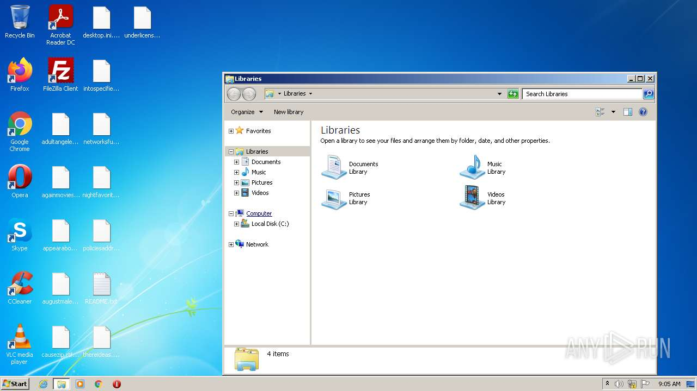
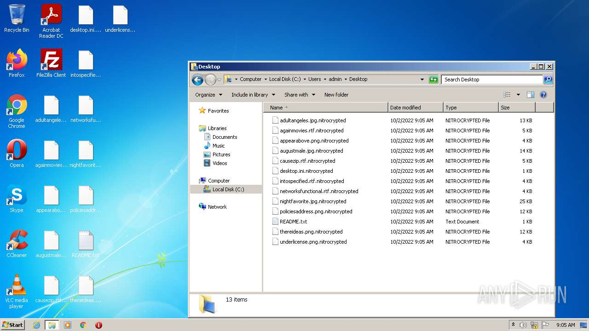
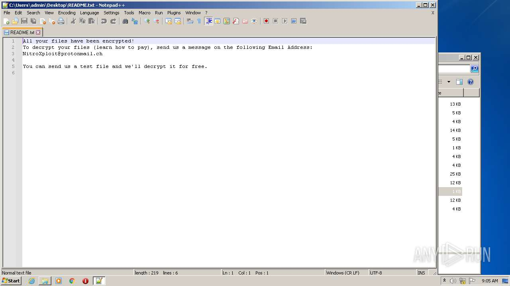
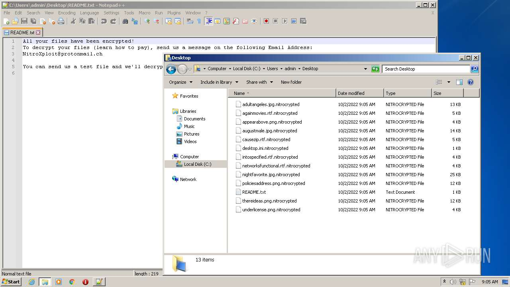
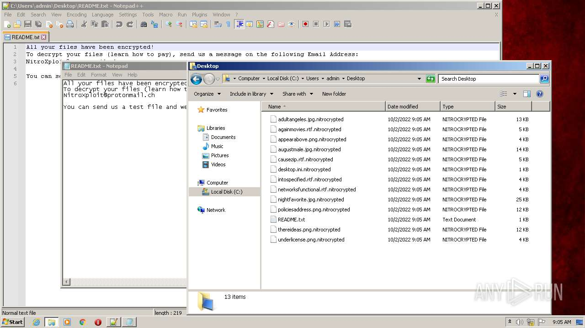
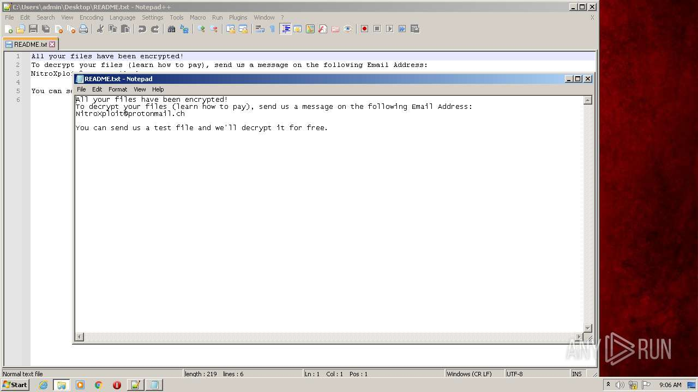
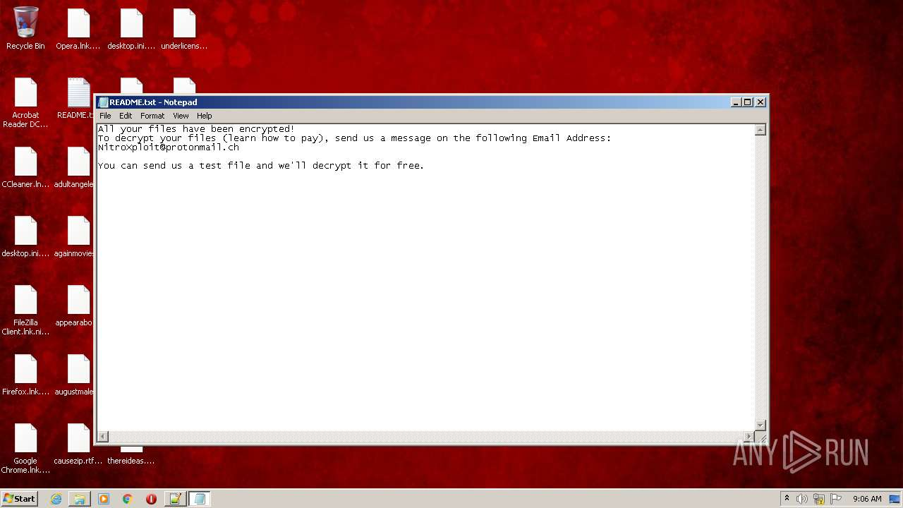
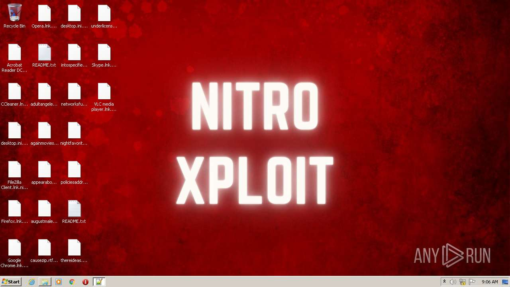
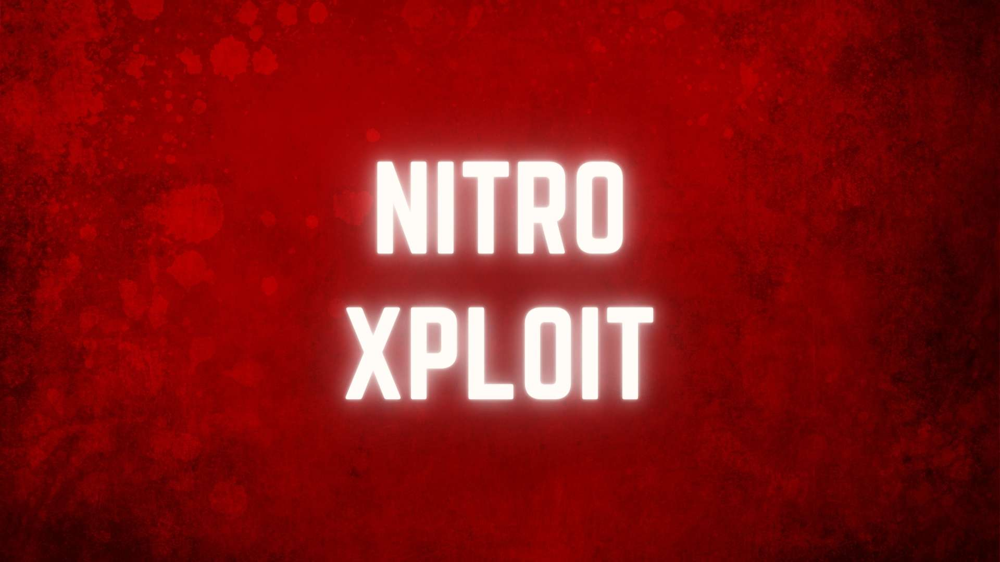

# HEUR-Trojan-Ransom.MSIL.Agent.gen-dbcd518faff9d4b7603a7413956eca2195354b639a65f9d61f1930c8e19d3f66

- https://any.run/report/dbcd518faff9d4b7603a7413956eca2195354b639a65f9d61f1930c8e19d3f66/74350daf-e3e2-4293-be2c-13f99044fb8c

```
- _id: "dbcd518faff9d4b7603a7413956eca2195354b639a65f9d61f1930c8e19d3f66"
  creation_date: 1633345770  # 2021-10-04 13:09:30 +0200 CEST
  first_submission_date: 1633346609  # 2021-10-04 13:23:29 +0200 CEST
  last_analysis_date: 1633862646  # 2021-10-10 12:44:06 +0200 CEST
  last_analysis_results: 
    Kaspersky: 
      result: "HEUR:Trojan-Ransom.MSIL.Agent.gen"
  magic: "PE32 executable for MS Windows (GUI) Intel 80386 32-bit Mono/.Net assembly"
  packers: 
    PEiD: ".NET executable"
  size: 367104
  trid: 
  - file_type: "Generic CIL Executable (.NET, Mono, etc.)"
    probability: 72.5
  - file_type: "Win64 Executable (generic)"
    probability: 10.4
  - file_type: "Win32 Dynamic Link Library (generic)"
    probability: 6.5
  - file_type: "Win32 Executable (generic)"
    probability: 4.4
  - file_type: "OS/2 Executable (generic)"
    probability: 2.0
```











