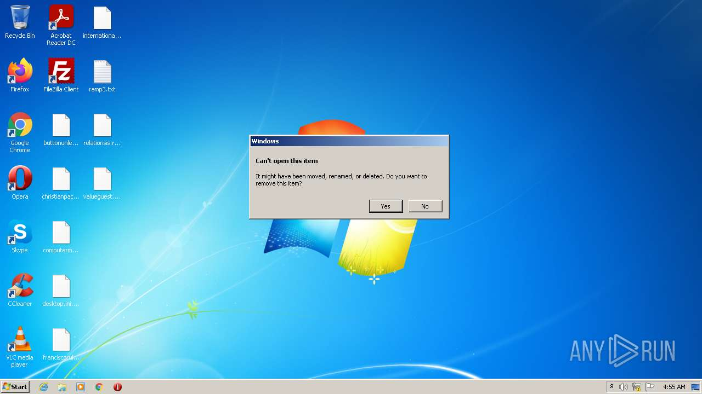
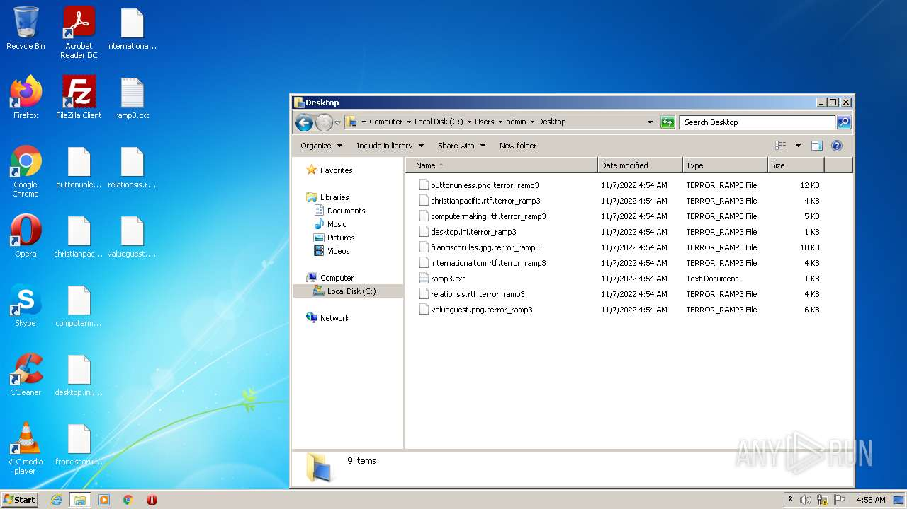
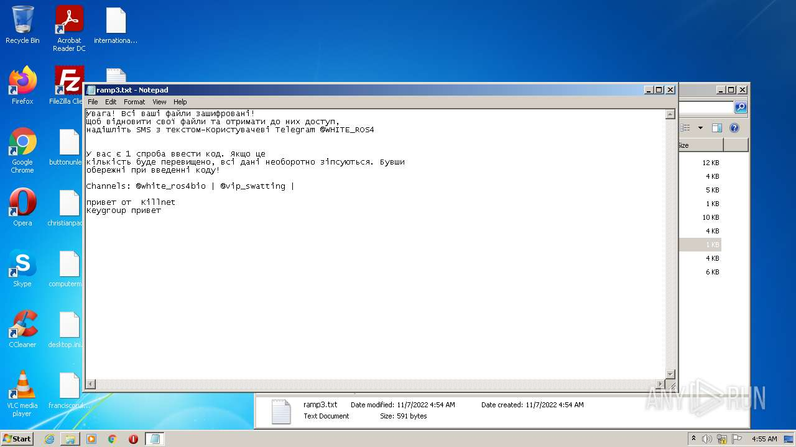
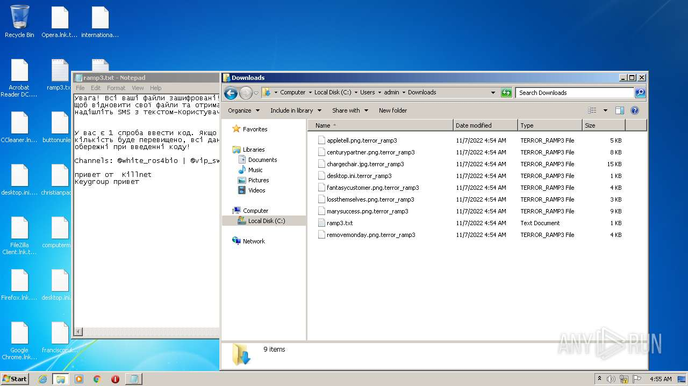
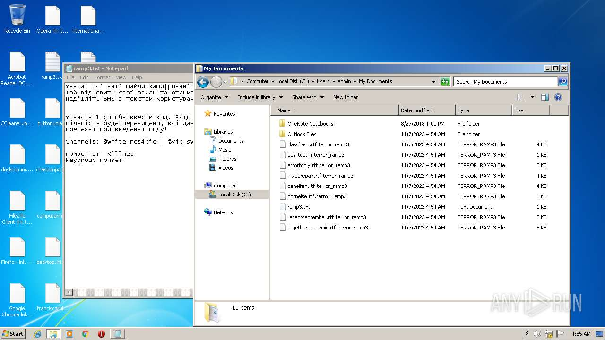
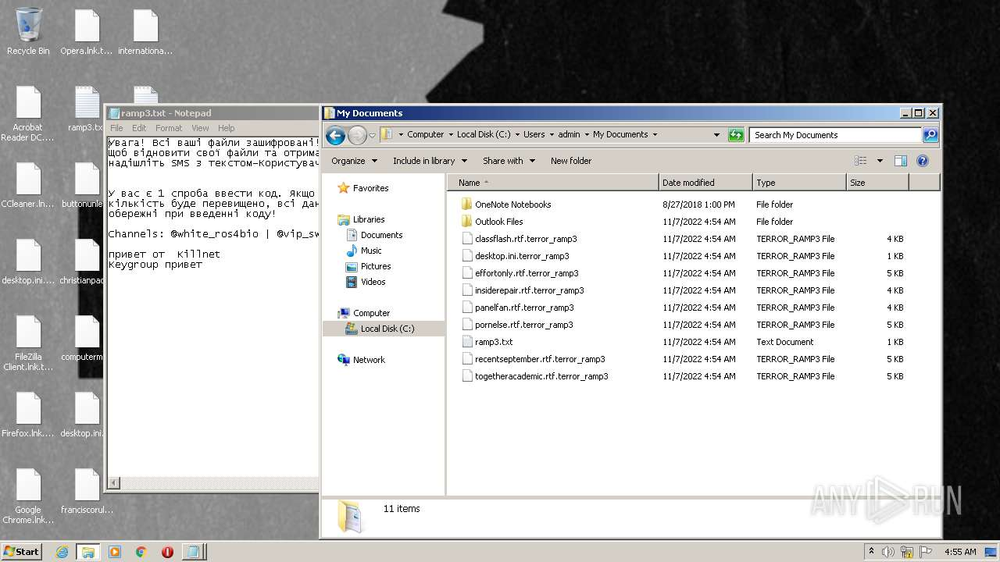
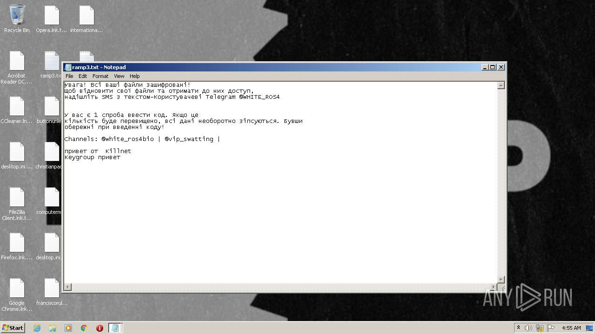

# HEUR-Trojan-Ransom.MSIL.Agent.gen-f871efc0cdf5446908e436de9ed821ff0ec5e217c50c16e69e3d0e83f6257f0f

- https://any.run/report/f871efc0cdf5446908e436de9ed821ff0ec5e217c50c16e69e3d0e83f6257f0f/98aea27d-6adb-45bf-8e01-32f510acbadb

```
- _id: "f871efc0cdf5446908e436de9ed821ff0ec5e217c50c16e69e3d0e83f6257f0f"
  creation_date: 1667759043  # 2022-11-06 19:24:03 +0100 CET
  crowdsourced_yara_results: 
  - author: "ditekSHen"
    description: "detects command variations typically used by ransomware"
    rule_name: "INDICATOR_SUSPICIOUS_GENRansomware"
    ruleset_id: "00c3b8eb5d"
    ruleset_name: "indicator_suspicious"
    source: "https://github.com/ditekshen/detection"
  - author: "ditekSHen"
    description: "Detects Chaos ransomware"
    rule_name: "MALWARE_Win_Chaos"
    ruleset_id: "00cc803bdc"
    ruleset_name: "malware"
    source: "https://github.com/ditekshen/detection"
  first_submission_date: 1667759061  # 2022-11-06 19:24:21 +0100 CET
  last_analysis_date: 1667759244  # 2022-11-06 19:27:24 +0100 CET
  last_analysis_results: 
    Kaspersky: 
      result: "HEUR:Trojan-Ransom.MSIL.Agent.gen"
  magic: "PE32 executable for MS Windows (GUI) Intel 80386 32-bit Mono/.Net assembly"
  packers: 
    PEiD: ".NET executable"
  size: 269312
  trid: 
  - file_type: "Generic CIL Executable (.NET, Mono, etc.)"
    probability: 72.5
  - file_type: "Win64 Executable (generic)"
    probability: 10.4
  - file_type: "Win32 Dynamic Link Library (generic)"
    probability: 6.5
  - file_type: "Win32 Executable (generic)"
    probability: 4.4
  - file_type: "OS/2 Executable (generic)"
    probability: 2.0
```










