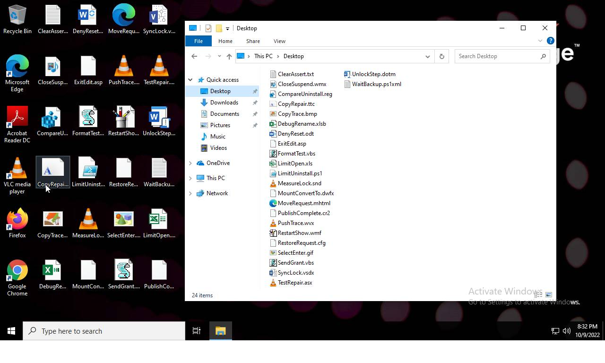

# HEUR-Trojan-Ransom.MSIL.Crypmodng.gen-38ccc368bf474e923dae79501b03b4c5cc62bf57890a99bd4b0a8b3867630e42

- https://tria.ge/221009-w57d6ahdg4/behavioral2

```
- _id: "38ccc368bf474e923dae79501b03b4c5cc62bf57890a99bd4b0a8b3867630e42"
  creation_date: 4125584704  # 2100-09-25 21:45:04 +0200 CEST
  first_submission_date: 1662475184  # 2022-09-06 16:39:44 +0200 CEST
  last_analysis_date: 1663303866  # 2022-09-16 06:51:06 +0200 CEST
  last_analysis_results: 
    Kaspersky: 
      result: "HEUR:Trojan-Ransom.MSIL.Crypmodng.gen"
  magic: "PE32 executable for MS Windows (GUI) Intel 80386 Mono/.Net assembly"
  packers: 
    PEiD: ".NET executable"
  size: 18432
  trid: 
  - file_type: "Generic CIL Executable (.NET, Mono, etc.)"
    probability: 61.5
  - file_type: "Windows screen saver"
    probability: 11.0
  - file_type: "Win64 Executable (generic)"
    probability: 8.8
  - file_type: "Win32 Dynamic Link Library (generic)"
    probability: 5.5
  - file_type: "Win16 NE executable (generic)"
    probability: 4.2
```




