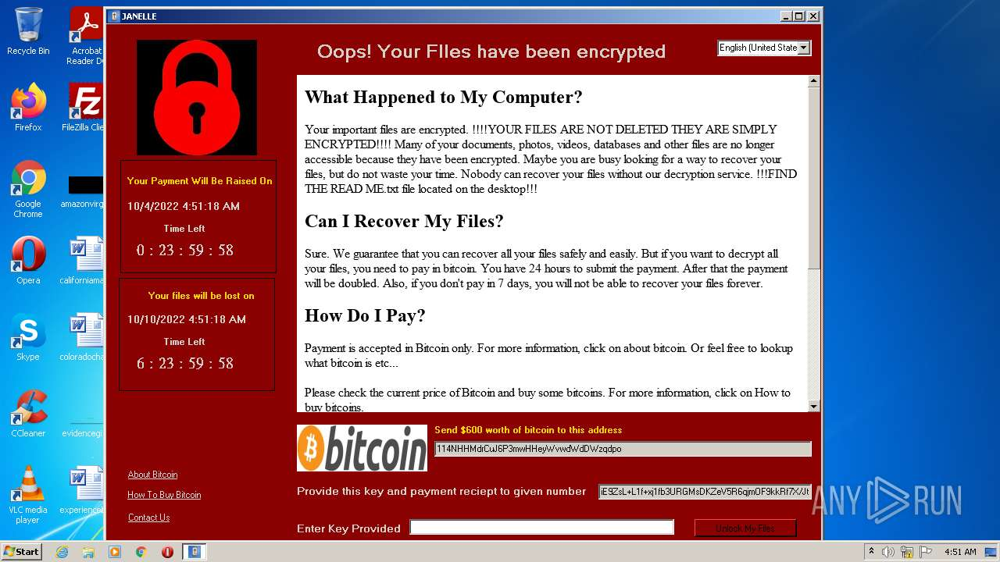
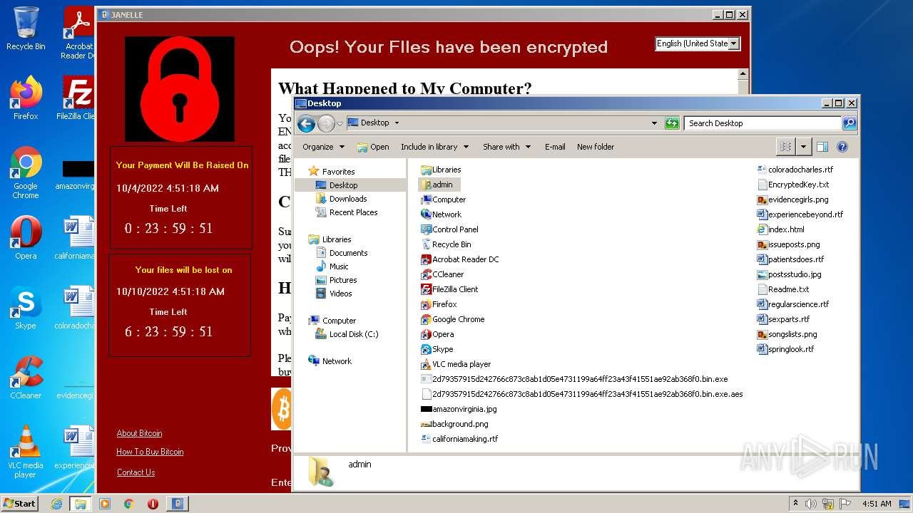
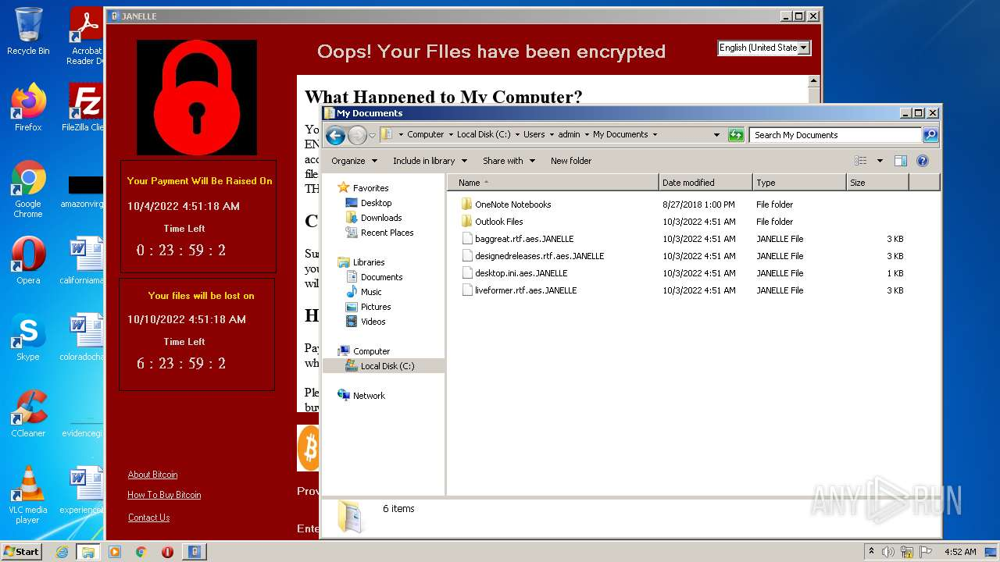
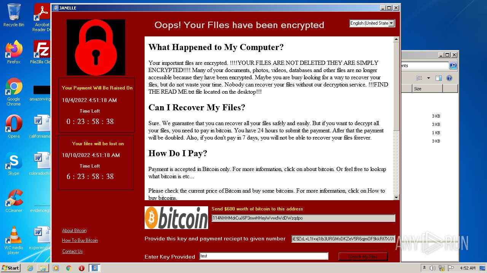
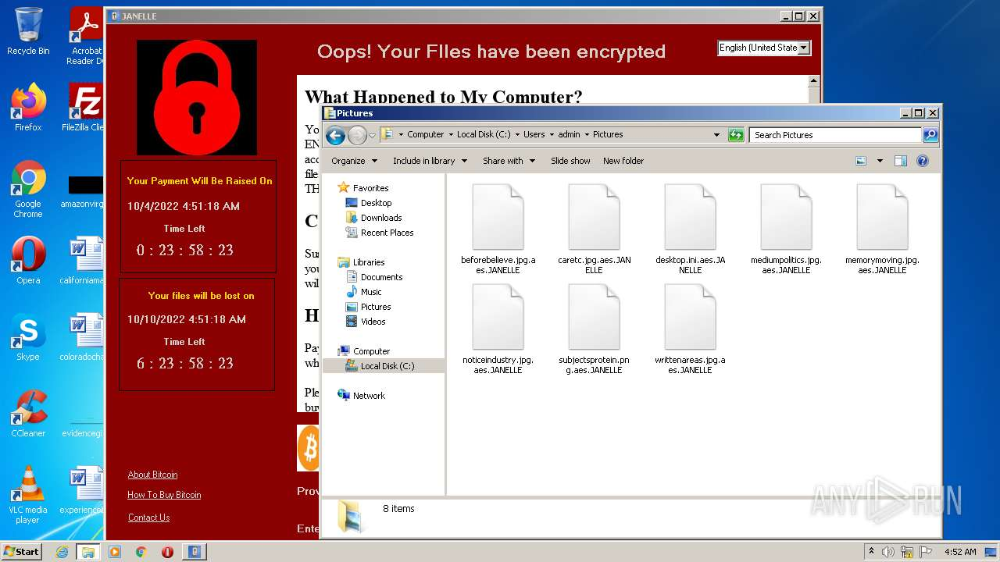
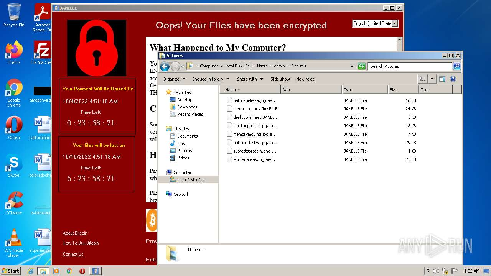

# HEUR-Trojan-Ransom.MSIL.Crypren.gen-2d79357915d242766c873c8ab1d05e4731199a64ff23a43f41551ae92ab368f0

- https://any.run/report/2d79357915d242766c873c8ab1d05e4731199a64ff23a43f41551ae92ab368f0/c9ec9c55-6385-4a60-955b-8f05d2ebac70

```
- _id: "2d79357915d242766c873c8ab1d05e4731199a64ff23a43f41551ae92ab368f0"
  creation_date: 3514705623  # 2081-05-17 13:07:03 +0200 CEST
  crowdsourced_yara_results: 
  - author: "Florian Roth"
    description: "Detects new NotPetya Ransomware variant from June 2017"
    rule_name: "NotPetya_Ransomware_Jun17"
    ruleset_id: "0003d87a2f"
    ruleset_name: "crime_nopetya_jun17"
    source: "https://github.com/Neo23x0/signature-base"
  - author: "ReversingLabs"
    description: "Yara rule that detects Janelle ransomware."
    rule_name: "ByteCode_MSIL_Ransomware_Janelle"
    ruleset_id: "005d0b3b56"
    ruleset_name: "ByteCode.MSIL.Ransomware.Janelle"
    source: "https://github.com/reversinglabs/reversinglabs-yara-rules"
  first_submission_date: 1630776097  # 2021-09-04 19:21:37 +0200 CEST
  last_analysis_date: 1663651737  # 2022-09-20 07:28:57 +0200 CEST
  last_analysis_results: 
    Kaspersky: 
      result: "HEUR:Trojan-Ransom.MSIL.Crypren.gen"
  magic: "PE32 executable for MS Windows (GUI) Intel 80386 Mono/.Net assembly"
  packers: 
    PEiD: ".NET executable"
  size: 145920
  trid: 
  - file_type: "Generic CIL Executable (.NET, Mono, etc.)"
    probability: 64.2
  - file_type: "Windows screen saver"
    probability: 11.5
  - file_type: "Win64 Executable (generic)"
    probability: 9.2
  - file_type: "Win32 Dynamic Link Library (generic)"
    probability: 5.7
  - file_type: "Win32 Executable (generic)"
    probability: 3.9
```








