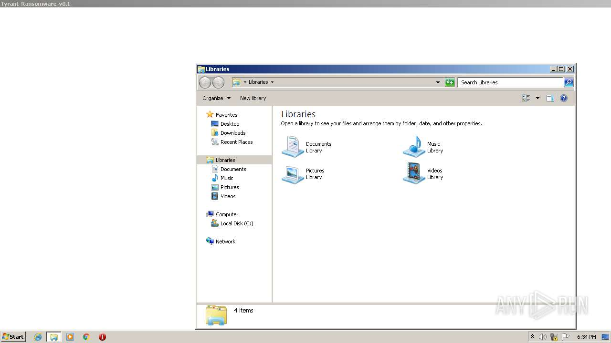
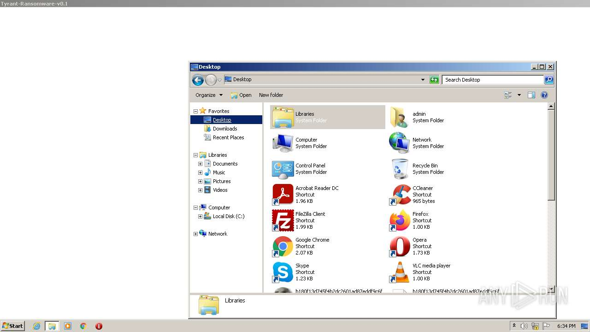
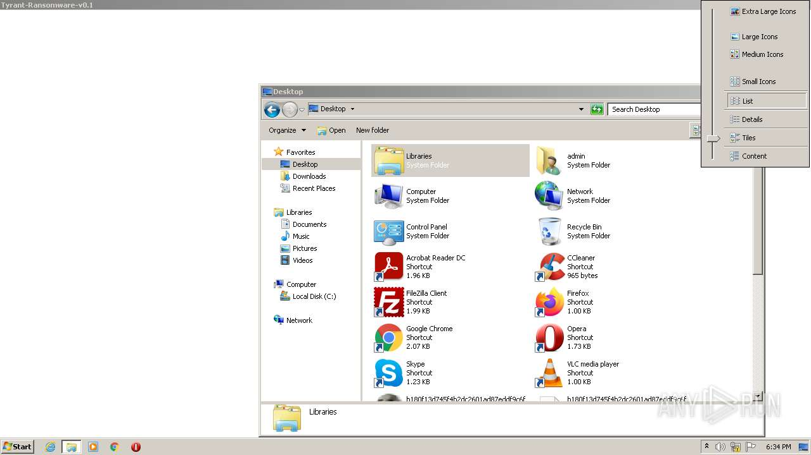
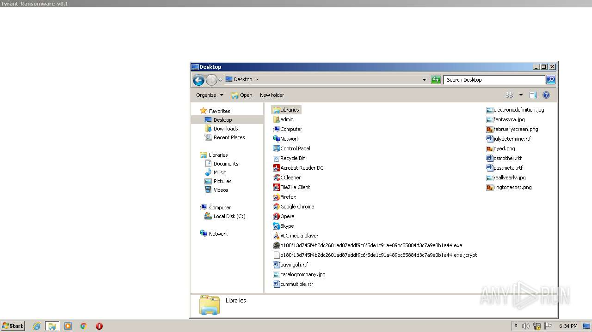
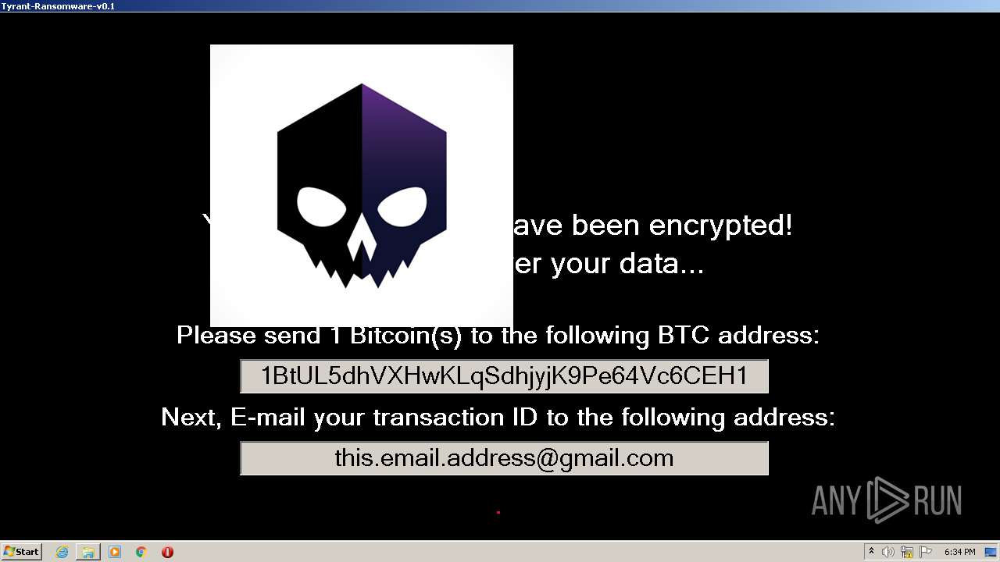
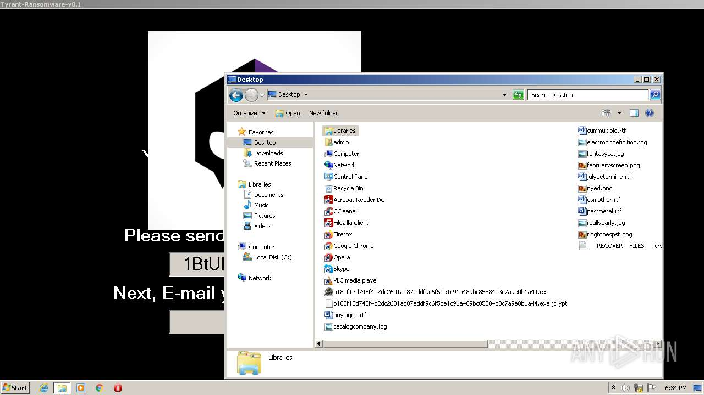
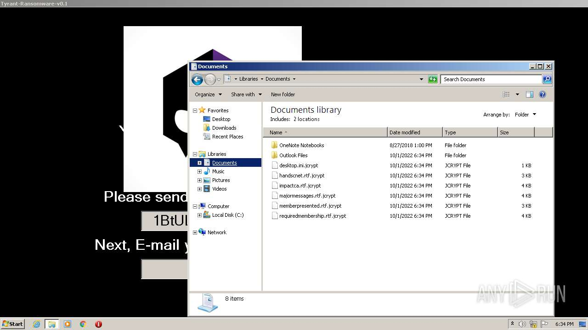

# HEUR-Trojan-Ransom.MSIL.Crypren.gen-b180f13d745f4b2dc2601ad87eddf9c6f5de1c91a489bc85884d3c7a9e0b1a44

```
- _id: "b180f13d745f4b2dc2601ad87eddf9c6f5de1c91a489bc85884d3c7a9e0b1a44"
  creation_date: 2559552607  # 2051-02-09 11:50:07 +0100 CET
  first_submission_date: 1663573993  # 2022-09-19 09:53:13 +0200 CEST
  last_analysis_date: 1664203863  # 2022-09-26 16:51:03 +0200 CEST
  last_analysis_results: 
    Kaspersky: 
      result: "HEUR:Trojan-Ransom.MSIL.Crypren.gen"
  magic: "PE32 executable for MS Windows (GUI) Intel 80386 32-bit Mono/.Net assembly"
  packers: 
    PEiD: ".NET executable"
  size: 355328
  trid: 
  - file_type: "Generic CIL Executable (.NET, Mono, etc.)"
    probability: 69.1
  - file_type: "Win64 Executable (generic)"
    probability: 9.9
  - file_type: "Win32 Dynamic Link Library (generic)"
    probability: 6.2
  - file_type: "Win16 NE executable (generic)"
    probability: 4.7
  - file_type: "Win32 Executable (generic)"
    probability: 4.2
```










