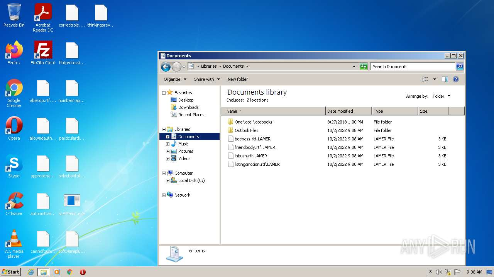
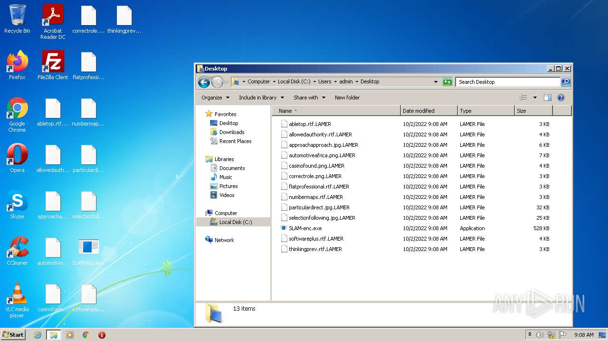
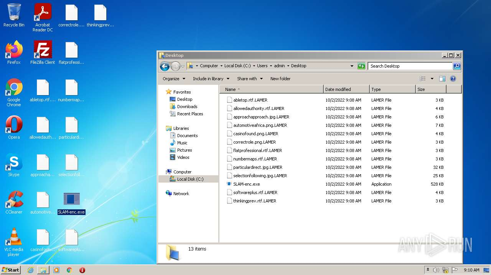
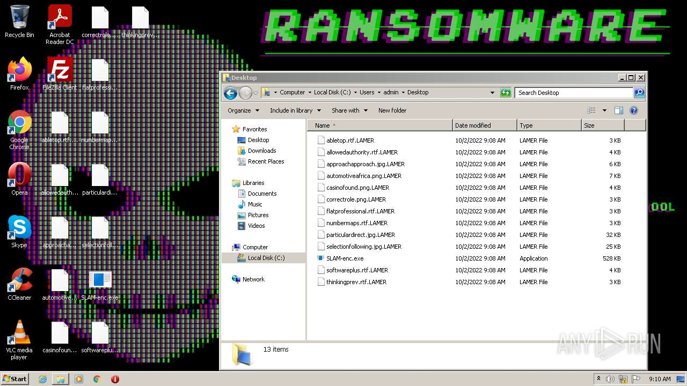
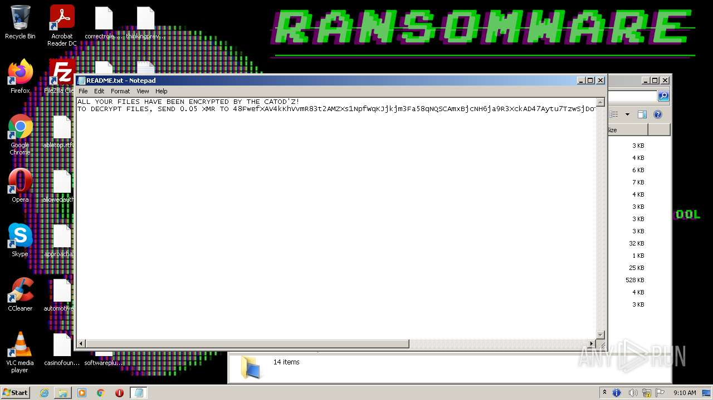
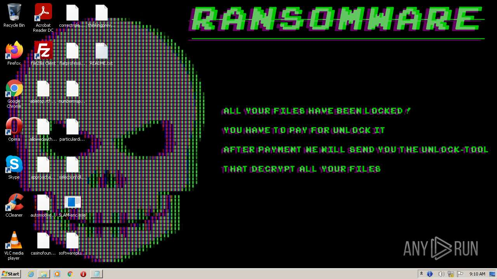

# HEUR-Trojan-Ransom.MSIL.Encoder.gen-6a81708640c25ae30f4a65a961c05adb7fdec630ef0f7d343211c89890cceee9

- https://any.run/report/6a81708640c25ae30f4a65a961c05adb7fdec630ef0f7d343211c89890cceee9/d08fe755-5787-44d6-ac9d-cafeaaed6d8e

```
- _id: "6a81708640c25ae30f4a65a961c05adb7fdec630ef0f7d343211c89890cceee9"
  creation_date: 1663182994  # 2022-09-14 21:16:34 +0200 CEST
  crowdsourced_yara_results: 
  - author: "ditekSHen"
    description: "detects command variations typically used by ransomware"
    rule_name: "INDICATOR_SUSPICIOUS_GENRansomware"
    ruleset_id: "00c3b8eb5d"
    ruleset_name: "indicator_suspicious"
    source: "https://github.com/ditekshen/detection"
  first_submission_date: 1663320662  # 2022-09-16 11:31:02 +0200 CEST
  last_analysis_date: 1663320840  # 2022-09-16 11:34:00 +0200 CEST
  last_analysis_results: 
    Kaspersky: 
      result: "HEUR:Trojan-Ransom.MSIL.Encoder.gen"
  magic: "PE32 executable for MS Windows (console) Intel 80386 32-bit Mono/.Net assembly"
  packers: 
    PEiD: ".NET executable"
  size: 540160
  trid: 
  - file_type: "Generic CIL Executable (.NET, Mono, etc.)"
    probability: 72.5
  - file_type: "Win64 Executable (generic)"
    probability: 10.4
  - file_type: "Win32 Dynamic Link Library (generic)"
    probability: 6.5
  - file_type: "Win32 Executable (generic)"
    probability: 4.4
  - file_type: "OS/2 Executable (generic)"
    probability: 2.0
```









