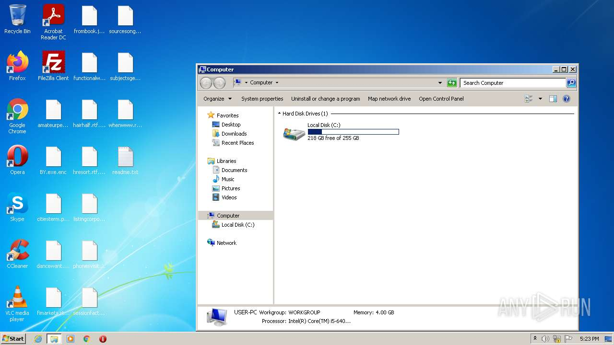
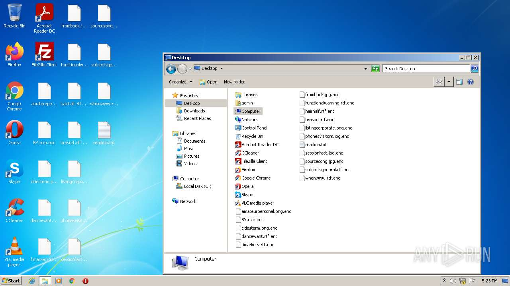
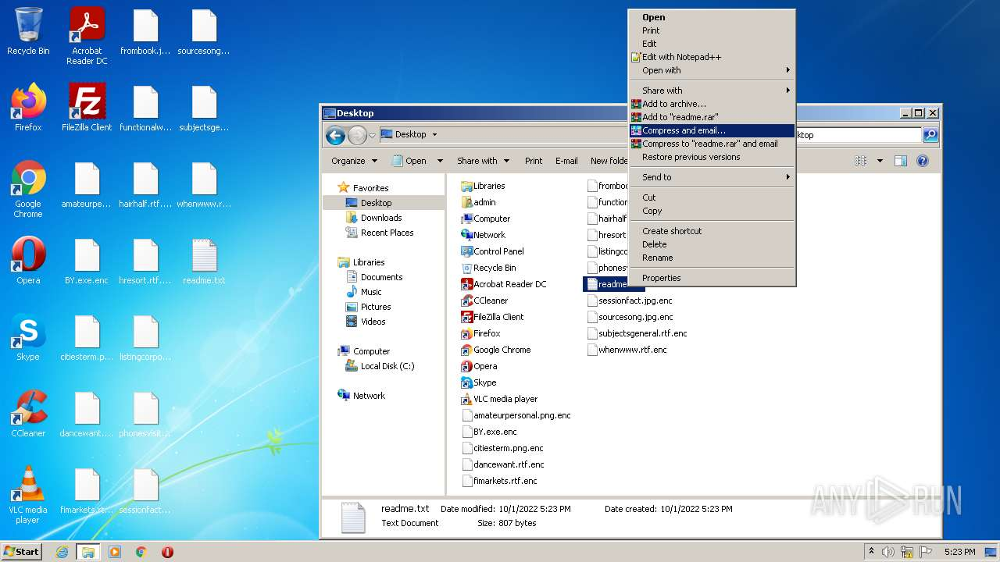
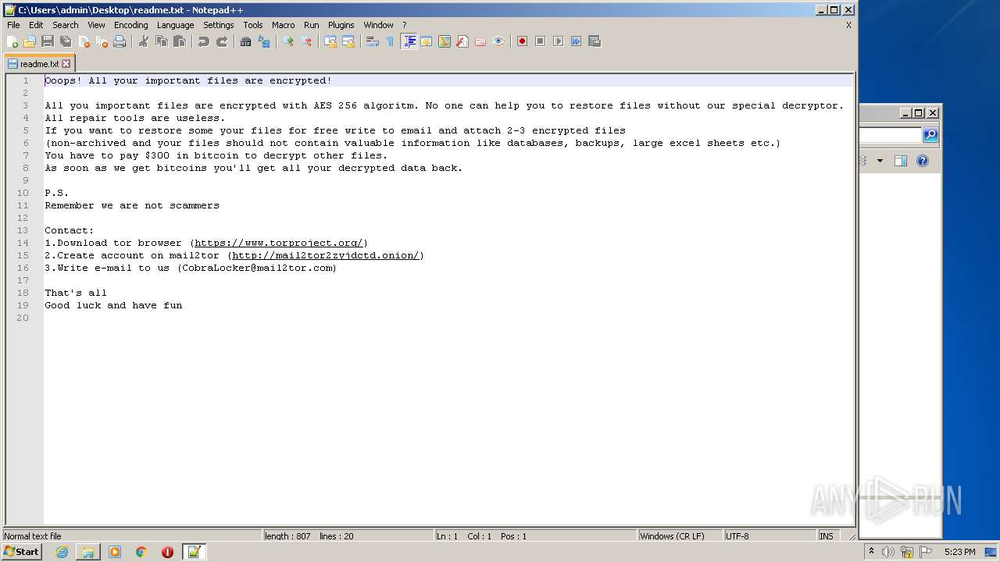
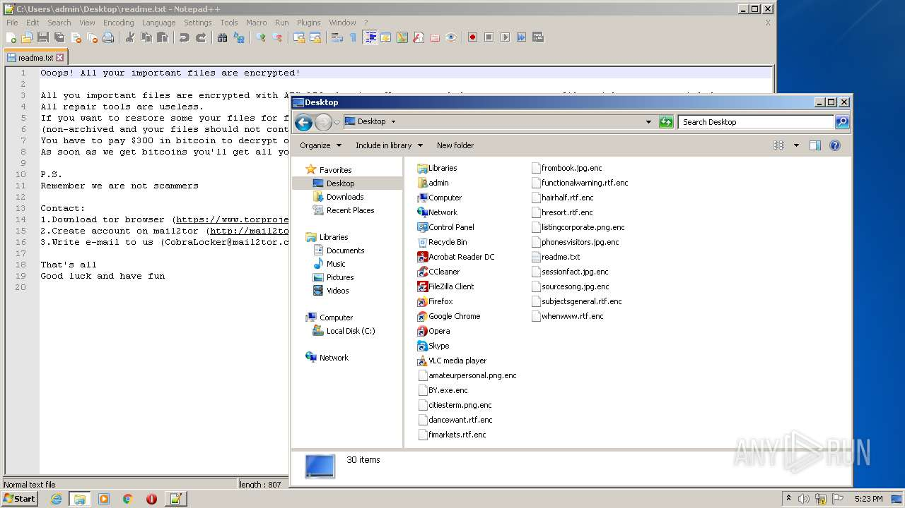
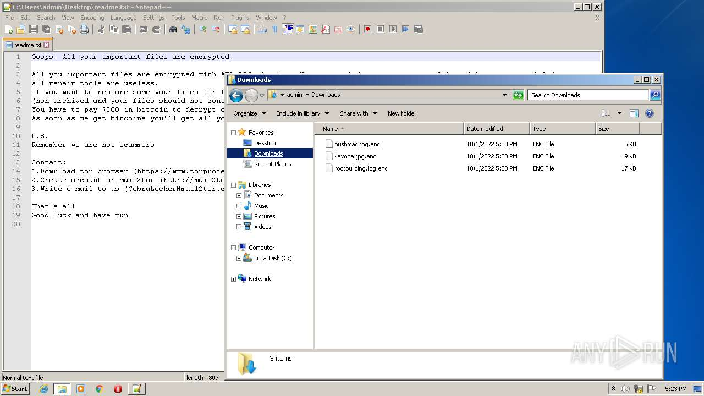
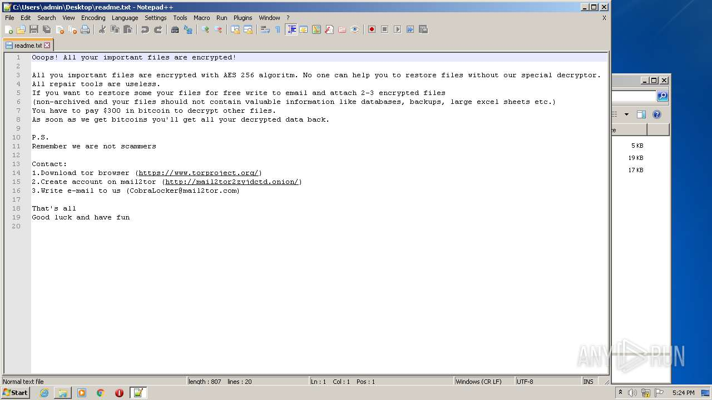

# HEUR-Trojan-Ransom.MSIL.Encoder.gen-ea11409054942608f0547aabd0840a4575d117dcafca4e27666cc9857667fbb0

```
- _id: "ea11409054942608f0547aabd0840a4575d117dcafca4e27666cc9857667fbb0"
  creation_date: 3778223487  # 2089-09-22 12:31:27 +0200 CEST
  crowdsourced_yara_results: 
  - author: "Florian Roth"
    description: "Detects ransomware distributed in COVID-19 theme"
    rule_name: "MAL_RANSOM_COVID19_Apr20_1"
    ruleset_id: "000f8b51a1"
    ruleset_name: "crime_covid_ransom"
    source: "https://github.com/Neo23x0/signature-base"
  first_submission_date: 1611382338  # 2021-01-23 07:12:18 +0100 CET
  last_analysis_date: 1611641280  # 2021-01-26 07:08:00 +0100 CET
  last_analysis_results: 
    Kaspersky: 
      result: "HEUR:Trojan-Ransom.MSIL.Encoder.gen"
  magic: "PE32 executable for MS Windows (GUI) Intel 80386 Mono/.Net assembly"
  packers: 
    PEiD: ".NET executable"
  size: 134144
  trid: 
  - file_type: "Generic CIL Executable (.NET, Mono, etc.)"
    probability: 72.5
  - file_type: "Win64 Executable (generic)"
    probability: 10.4
  - file_type: "Win32 Dynamic Link Library (generic)"
    probability: 6.5
  - file_type: "Win32 Executable (generic)"
    probability: 4.4
  - file_type: "OS/2 Executable (generic)"
    probability: 2.0
```









