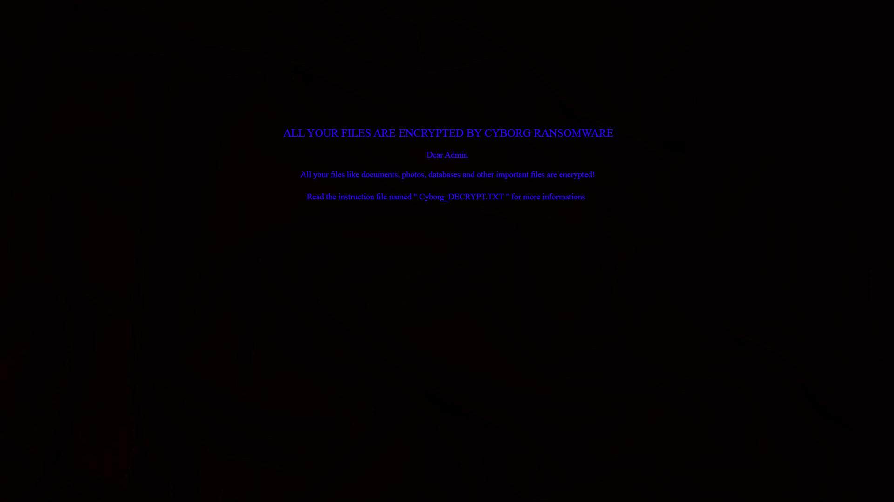
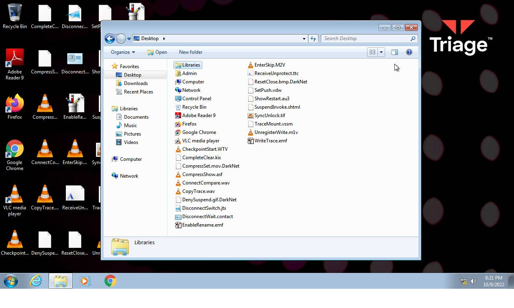
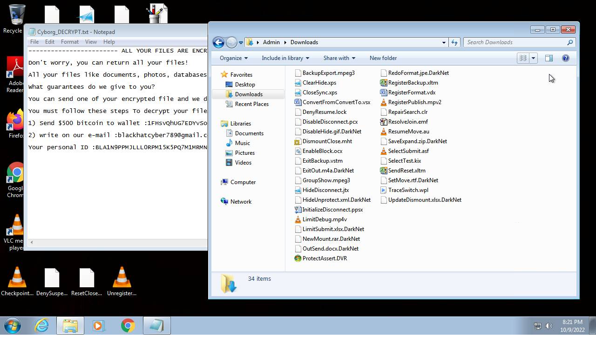
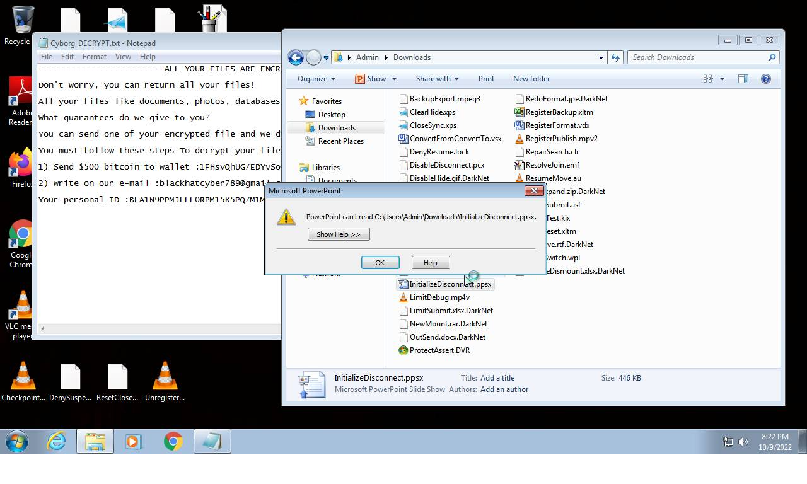
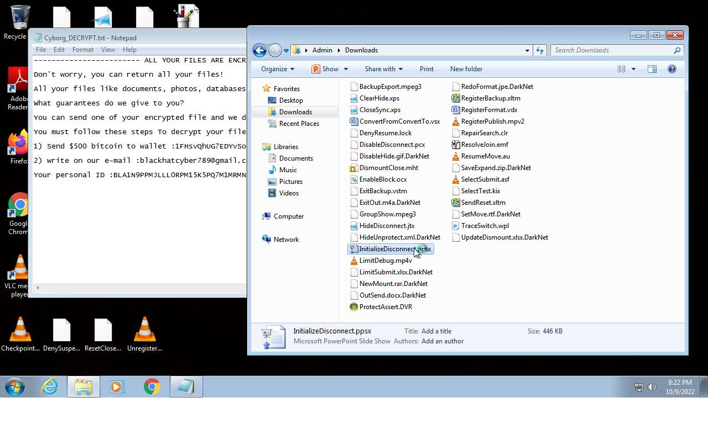
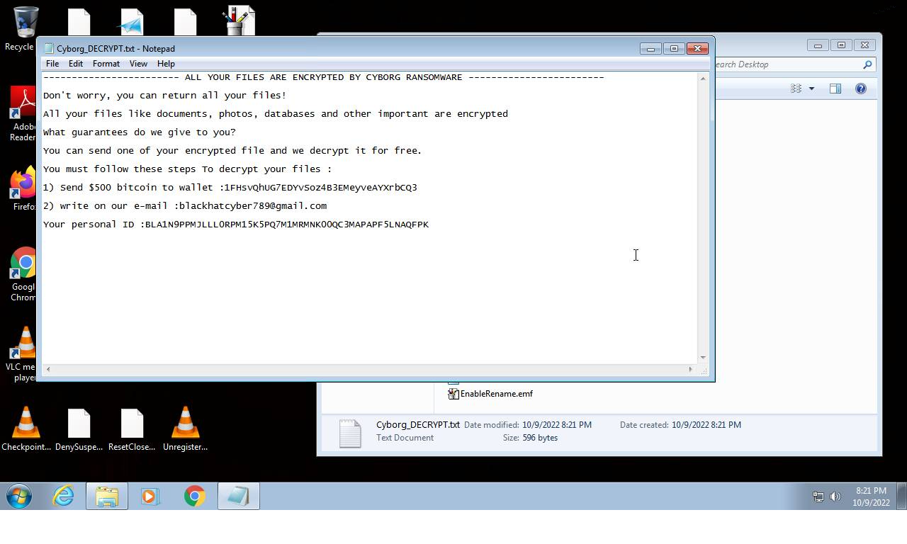
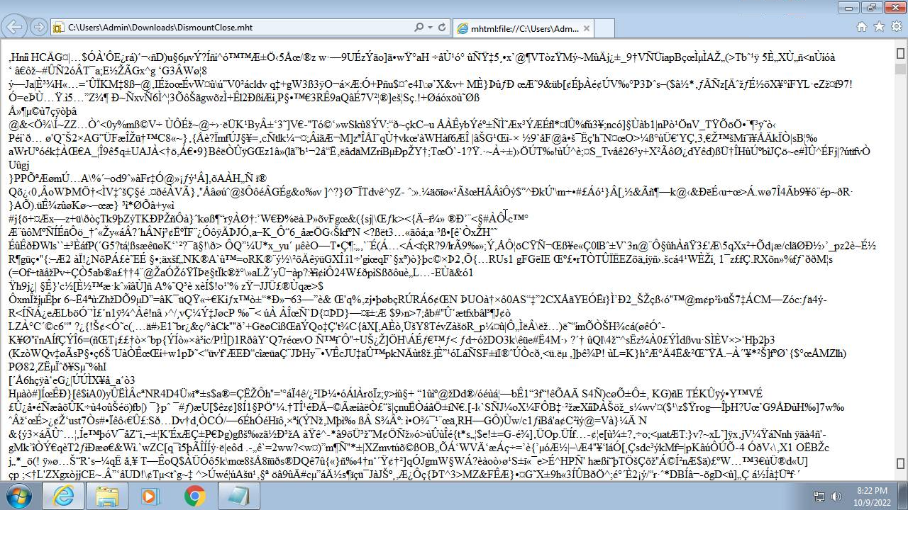

# HEUR-Trojan-Ransom.MSIL.Gen.gen-cd548a83dce50ef1647700ea7f45d57baa2decf0cb0d3f7692715bf7388eecda

- https://tria.ge/221009-wy9kyahefq/behavioral1

```
- _id: "cd548a83dce50ef1647700ea7f45d57baa2decf0cb0d3f7692715bf7388eecda"
  creation_date: 1572429898  # 2019-10-30 11:04:58 +0100 CET
  crowdsourced_yara_results: 
  - author: "ditekSHen"
    description: "Detects executables packed with Babel"
    rule_name: "INDICATOR_EXE_Packed_Babel"
    ruleset_id: "00c291ca7f"
    ruleset_name: "indicator_packed"
    source: "https://github.com/ditekshen/detection"
  first_submission_date: 1581998855  # 2020-02-18 05:07:35 +0100 CET
  last_analysis_date: 1663660922  # 2022-09-20 10:02:02 +0200 CEST
  last_analysis_results: 
    Kaspersky: 
      result: "HEUR:Trojan-Ransom.MSIL.Gen.gen"
  magic: "PE32 executable for MS Windows (GUI) Intel 80386 32-bit Mono/.Net assembly"
  size: 1063579
  trid: 
  - file_type: "Win32 Executable MS Visual C++ (generic)"
    probability: 41.0
  - file_type: "Win64 Executable (generic)"
    probability: 13.8
  - file_type: "DOS Borland compiled Executable (generic)"
    probability: 13.1
  - file_type: "Win32 Dynamic Link Library (generic)"
    probability: 8.6
  - file_type: "Win16 NE executable (generic)"
    probability: 6.6
```








