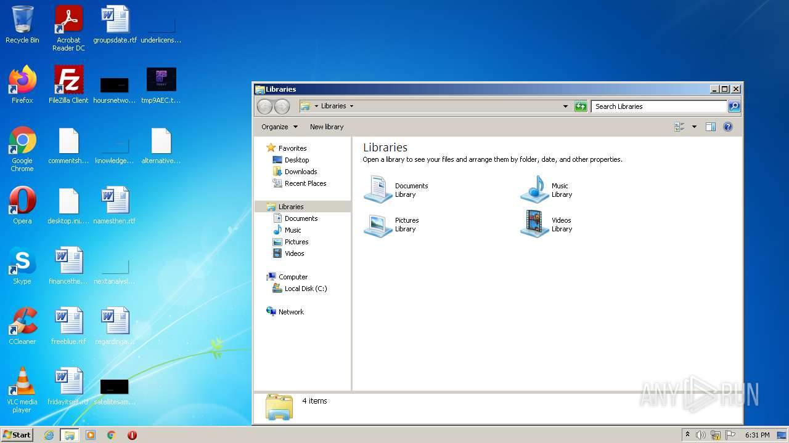
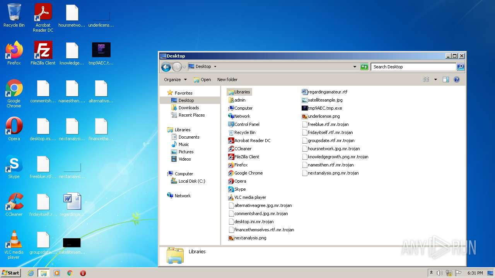
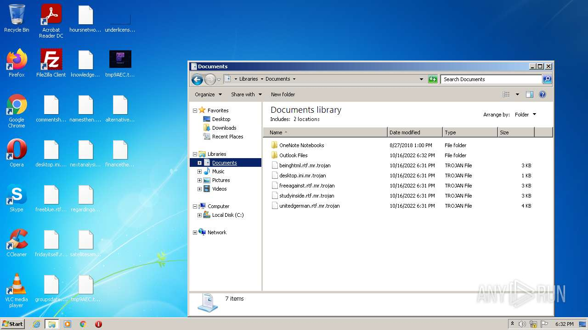
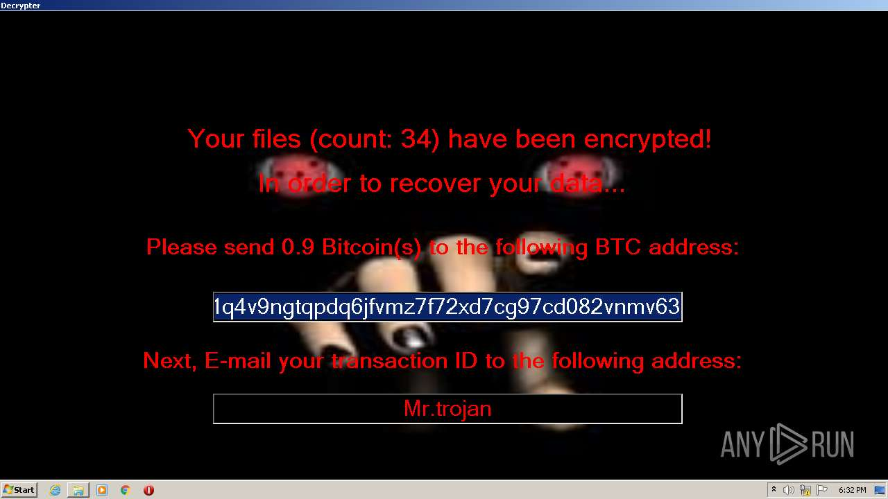

# HEUR-Trojan-Ransom.MSIL.Gen.gen-d6fc6ebef39b6bf316912de44a7610966f738b4866b117240923d1a65ea6a3f0

- https://any.run/report/d6fc6ebef39b6bf316912de44a7610966f738b4866b117240923d1a65ea6a3f0/b97ee4d8-20e8-4800-8c42-9609421c6e08

```
- _id: "d6fc6ebef39b6bf316912de44a7610966f738b4866b117240923d1a65ea6a3f0"
  creation_date: 3690102608  # 2086-12-07 13:30:08 +0100 CET
  first_submission_date: 1665941733  # 2022-10-16 19:35:33 +0200 CEST
  last_analysis_date: 1666435848  # 2022-10-22 12:50:48 +0200 CEST
  last_analysis_results: 
    Kaspersky: 
      result: "HEUR:Trojan-Ransom.MSIL.Gen.gen"
  magic: "PE32 executable for MS Windows (GUI) Intel 80386 Mono/.Net assembly"
  packers: 
    PEiD: ".NET executable"
  size: 503296
  trid: 
  - file_type: "Generic CIL Executable (.NET, Mono, etc.)"
    probability: 72.5
  - file_type: "Win64 Executable (generic)"
    probability: 10.4
  - file_type: "Win32 Dynamic Link Library (generic)"
    probability: 6.5
  - file_type: "Win32 Executable (generic)"
    probability: 4.4
  - file_type: "OS/2 Executable (generic)"
    probability: 2.0
```









