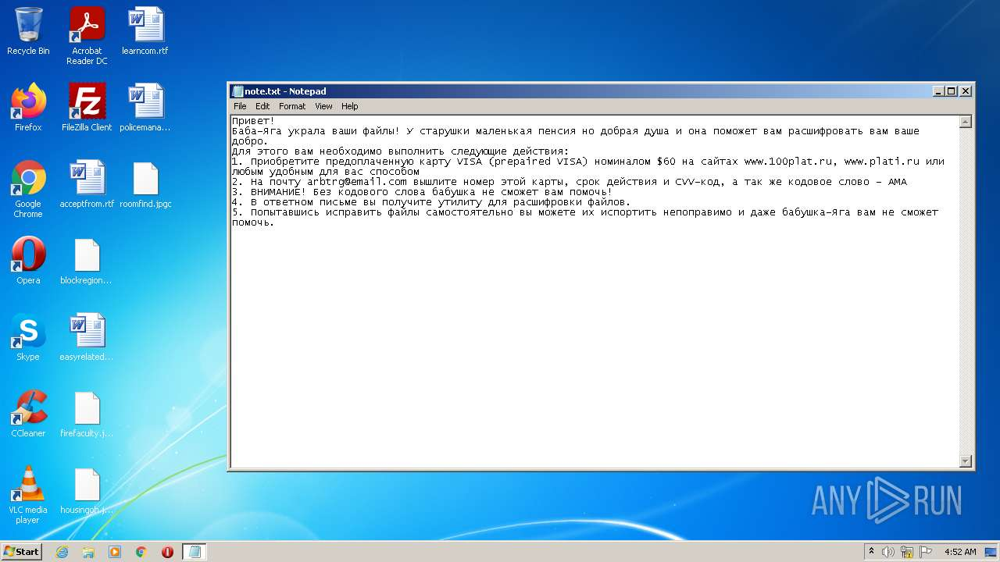
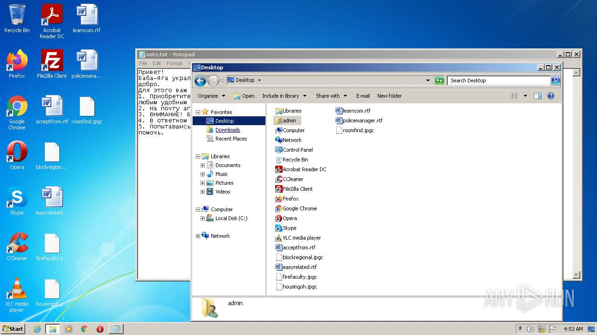
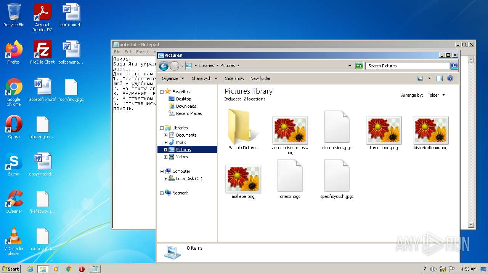
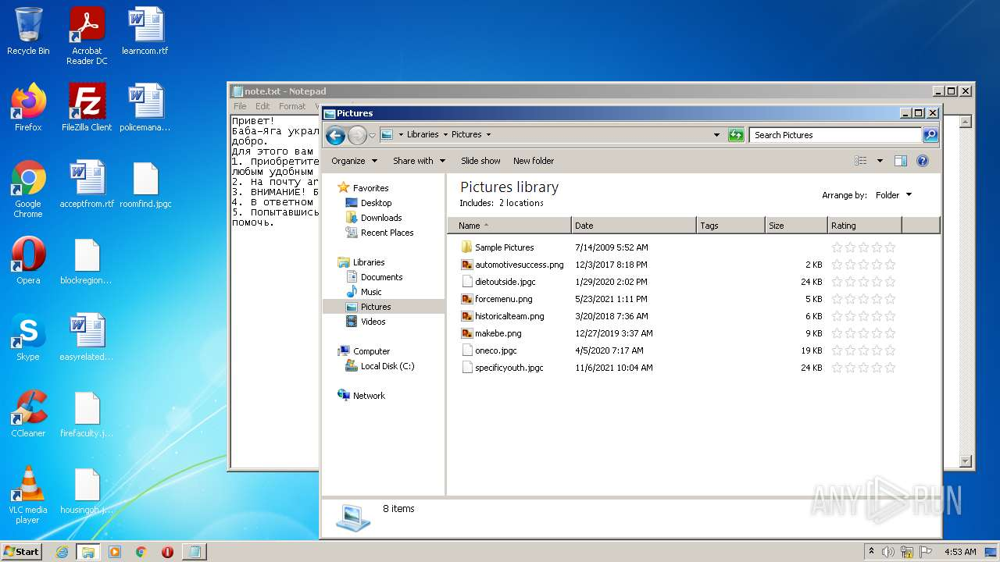

# HEUR-Trojan-Ransom.MSIL.Rsarist.a-781e0bb377ca07092cf248204e90053a1e32c208eba4e8bdb2efa1f2fad3fb23

- https://any.run/report/781e0bb377ca07092cf248204e90053a1e32c208eba4e8bdb2efa1f2fad3fb23/02859b38-0dc4-401e-a0fe-6fd2c160752a

```
- _id: "781e0bb377ca07092cf248204e90053a1e32c208eba4e8bdb2efa1f2fad3fb23"
  creation_date: 1383695540  # 2013-11-06 00:52:20 +0100 CET
  first_submission_date: 1383831738  # 2013-11-07 14:42:18 +0100 CET
  last_analysis_date: 1425525239  # 2015-03-05 04:13:59 +0100 CET
  last_analysis_results: 
    Kaspersky: 
      result: "HEUR:Trojan-Ransom.MSIL.Rsarist.a"
  magic: "PE32 executable for MS Windows (GUI) Intel 80386 32-bit Mono/.Net assembly"
  size: 18944
  trid: 
  - file_type: "Generic CIL Executable (.NET, Mono, etc.)"
    probability: 82.9
  - file_type: "Win32 Dynamic Link Library (generic)"
    probability: 7.4
  - file_type: "Win32 Executable (generic)"
    probability: 5.1
  - file_type: "Generic Win/DOS Executable"
    probability: 2.2
  - file_type: "DOS Executable Generic"
    probability: 2.2
```






