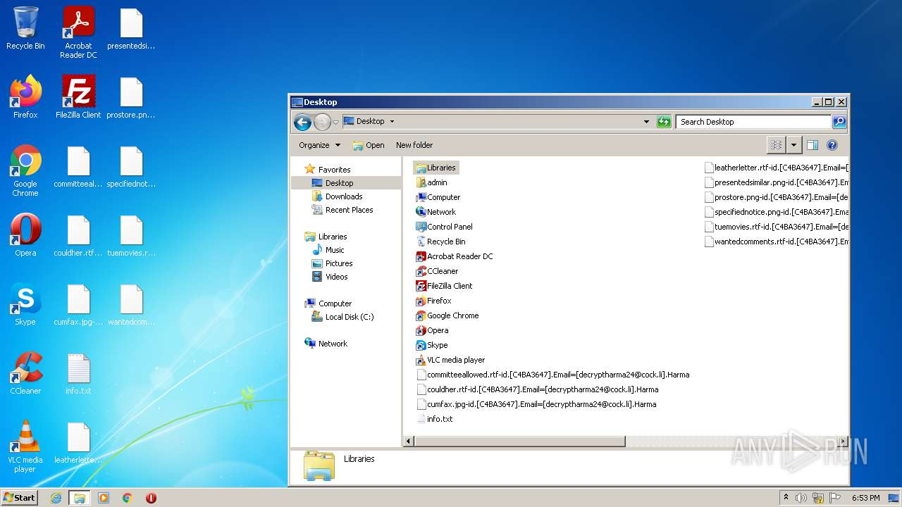
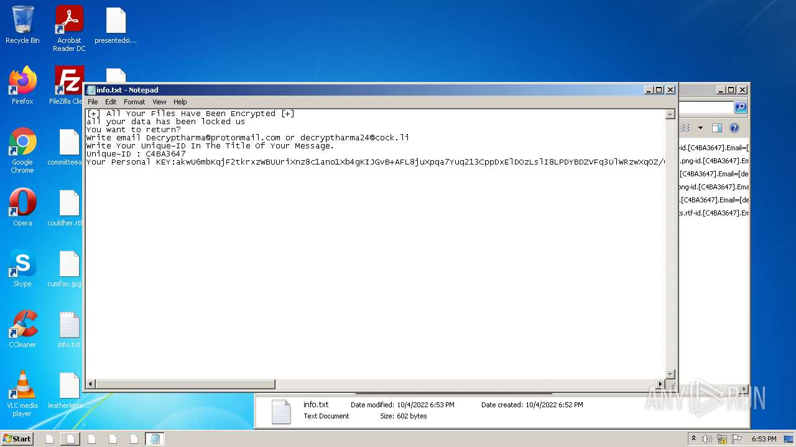
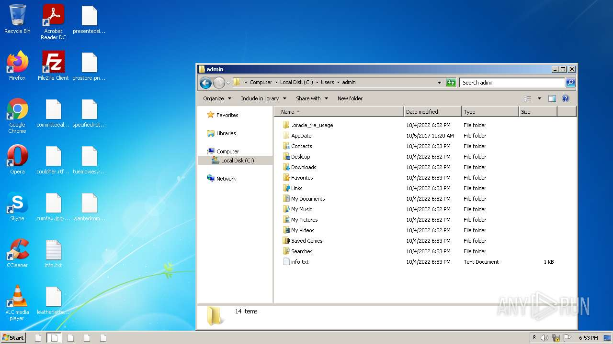
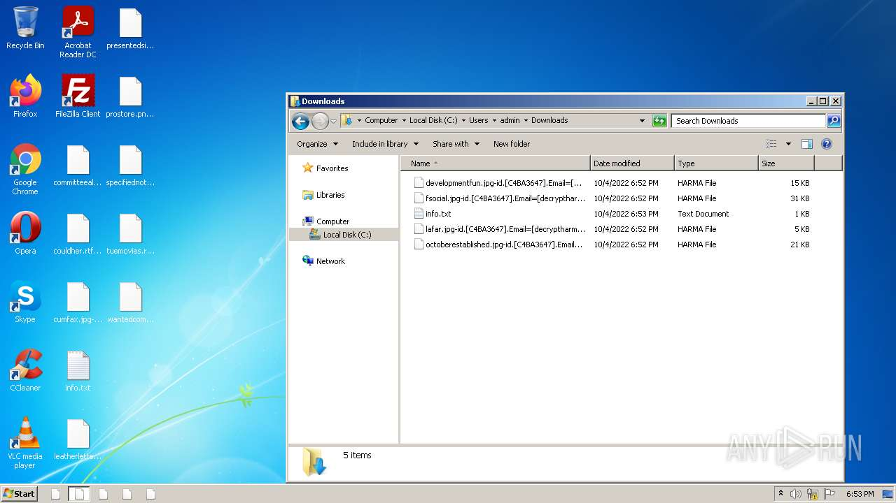
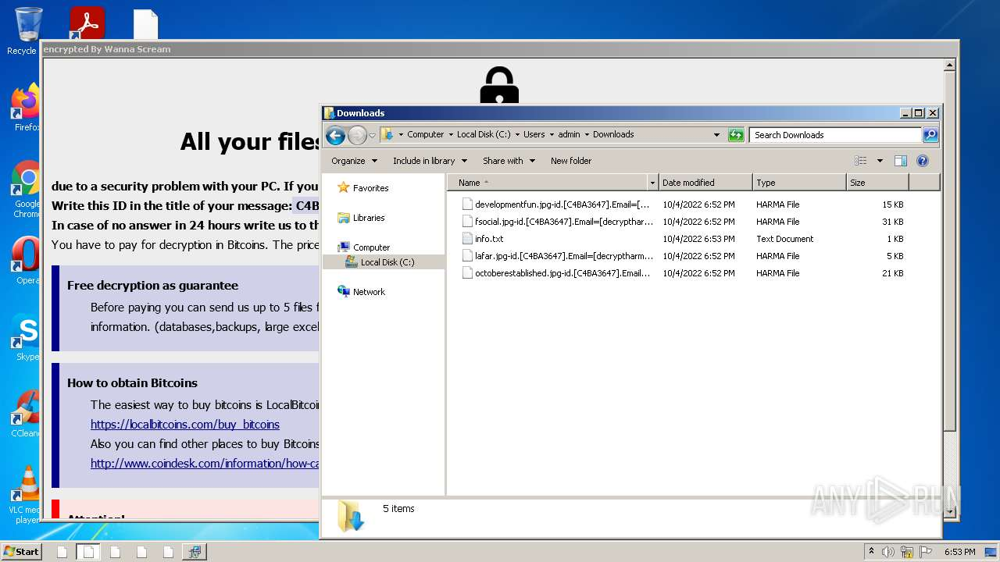
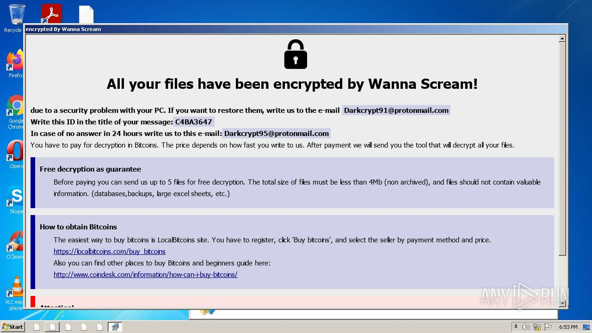
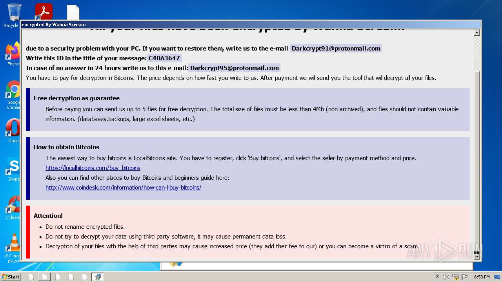

# HEUR-Trojan-Ransom.MSIL.Spora.gen-78b12ae14b74887180242a5fedc2b17115419fc26e62283256d859adf2c7e023

- https://any.run/report/78b12ae14b74887180242a5fedc2b17115419fc26e62283256d859adf2c7e023/10b2faf5-07b5-457f-9c95-648329162852

```
- _id: "78b12ae14b74887180242a5fedc2b17115419fc26e62283256d859adf2c7e023"
  creation_date: 1580601867  # 2020-02-02 01:04:27 +0100 CET
  crowdsourced_yara_results: 
  - author: "Florian Roth"
    description: "Detects destructive malware"
    rule_name: "Destructive_Ransomware_Gen1"
    ruleset_id: "0002573660"
    ruleset_name: "apt_olympic_destroyer"
    source: "https://github.com/Neo23x0/signature-base"
  first_submission_date: 1580707008  # 2020-02-03 06:16:48 +0100 CET
  last_analysis_date: 1624944422  # 2021-06-29 07:27:02 +0200 CEST
  last_analysis_results: 
    Kaspersky: 
      result: "HEUR:Trojan-Ransom.MSIL.Spora.gen"
  magic: "PE32 executable for MS Windows (GUI) Intel 80386 Mono/.Net assembly"
  packers: 
    PEiD: ".NET executable"
  size: 28672
  trid: 
  - file_type: "Generic CIL Executable (.NET, Mono, etc.)"
    probability: 64.2
  - file_type: "Windows screen saver"
    probability: 11.5
  - file_type: "Win64 Executable (generic)"
    probability: 9.2
  - file_type: "Win32 Dynamic Link Library (generic)"
    probability: 5.7
  - file_type: "Win32 Executable (generic)"
    probability: 3.9
```









