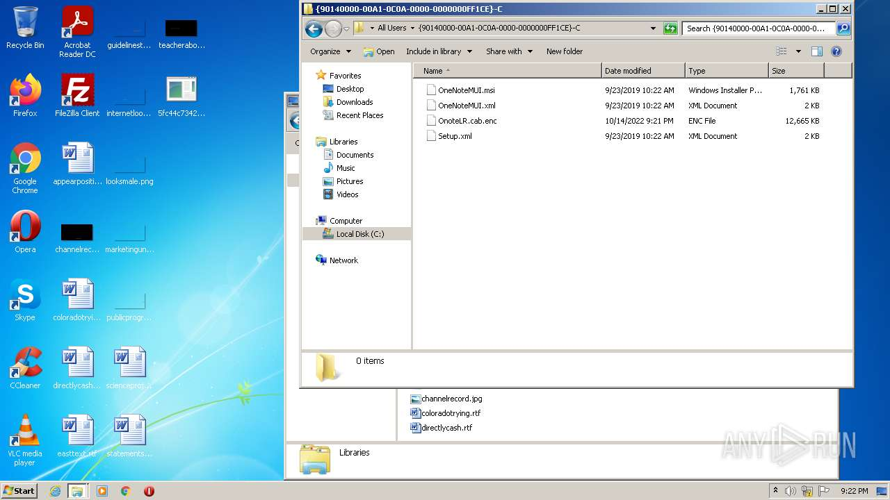
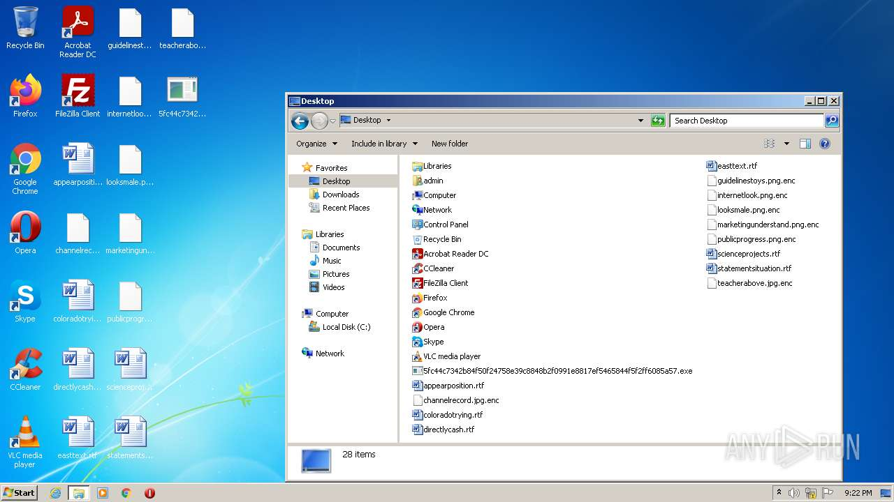
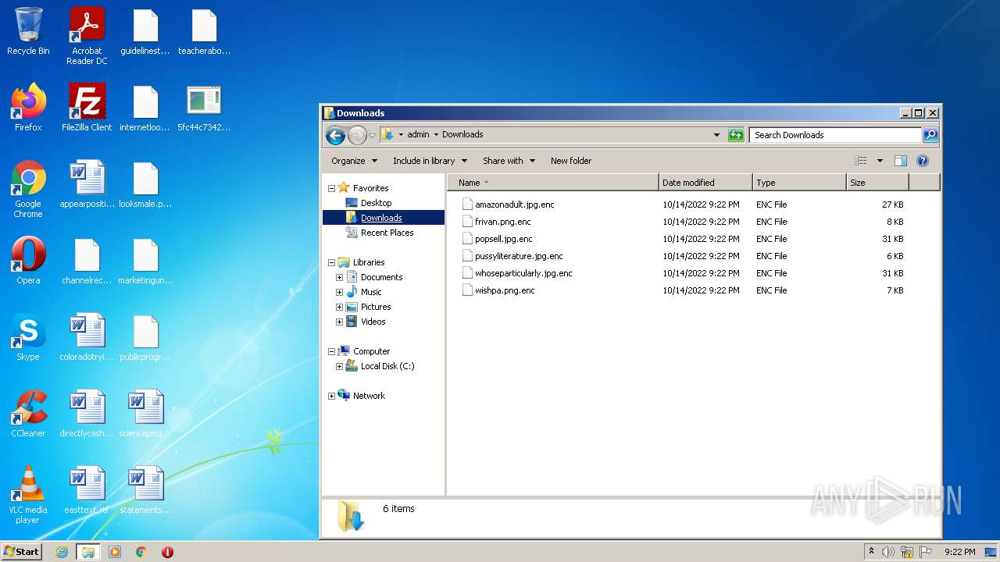
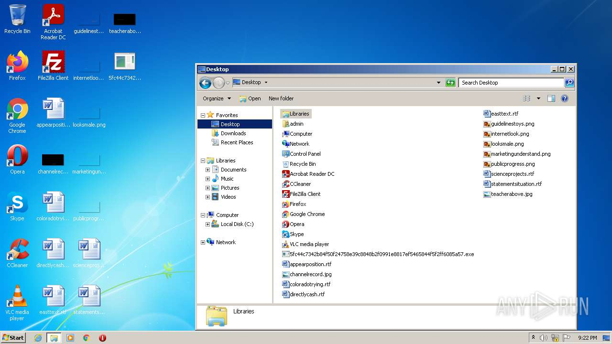

# HEUR-Trojan-Ransom.Win32.Agent.gen-5fc44c7342b84f50f24758e39c8848b2f0991e8817ef5465844f5f2ff6085a57

- https://any.run/report/5fc44c7342b84f50f24758e39c8848b2f0991e8817ef5465844f5f2ff6085a57/7629a008-791d-4938-b6a1-397bebd9b4c2

```
- _id: "5fc44c7342b84f50f24758e39c8848b2f0991e8817ef5465844f5f2ff6085a57"
  creation_date: 1665179186  # 2022-10-07 23:46:26 +0200 CEST
  crowdsourced_yara_results: 
  - author: "ditekSHen"
    description: "detects command variations typically used by ransomware"
    rule_name: "INDICATOR_SUSPICIOUS_GENRansomware"
    ruleset_id: "00c3b8eb5d"
    ruleset_name: "indicator_suspicious"
    source: "https://github.com/ditekshen/detection"
  first_submission_date: 1665562560  # 2022-10-12 10:16:00 +0200 CEST
  last_analysis_date: 1665776613  # 2022-10-14 21:43:33 +0200 CEST
  last_analysis_results: 
    Kaspersky: 
      result: "HEUR:Trojan-Ransom.Win32.Agent.gen"
  magic: "PE32 executable for MS Windows (GUI) Intel 80386 32-bit"
  size: 734720
  trid: 
  - file_type: "Win64 Executable (generic)"
    probability: 32.2
  - file_type: "Win32 Dynamic Link Library (generic)"
    probability: 20.1
  - file_type: "Win16 NE executable (generic)"
    probability: 15.4
  - file_type: "Win32 Executable (generic)"
    probability: 13.7
  - file_type: "OS/2 Executable (generic)"
    probability: 6.2
```







