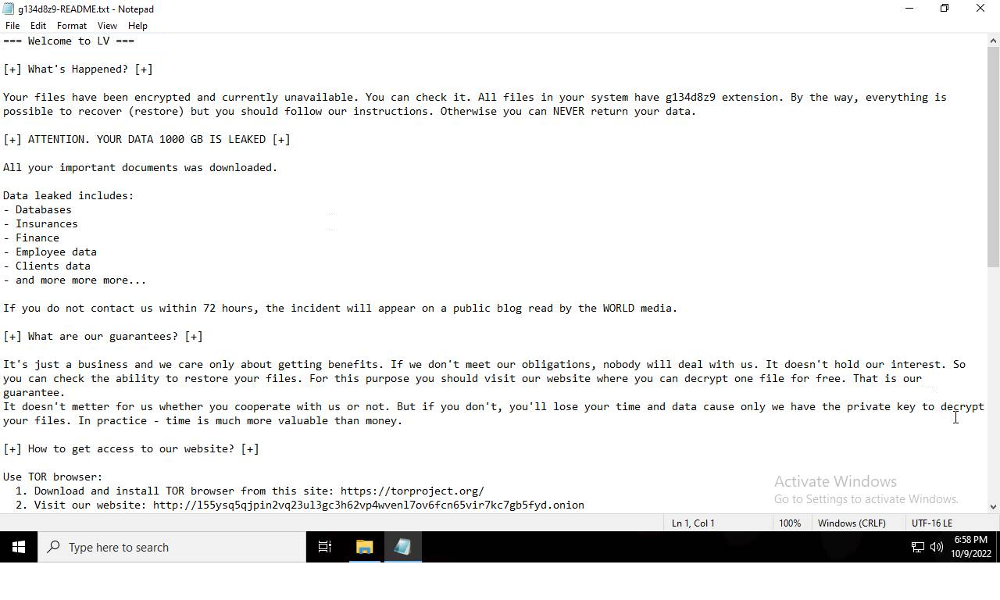
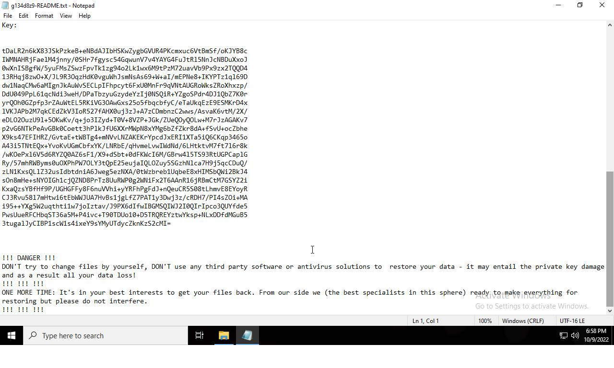
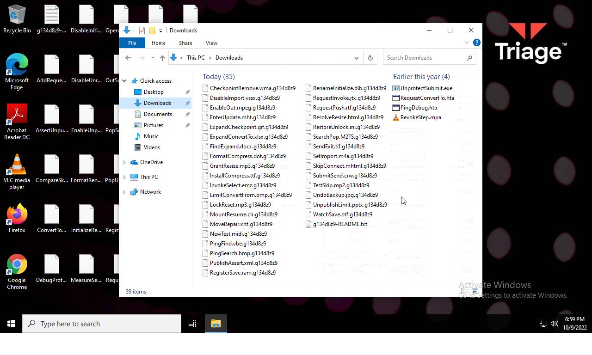
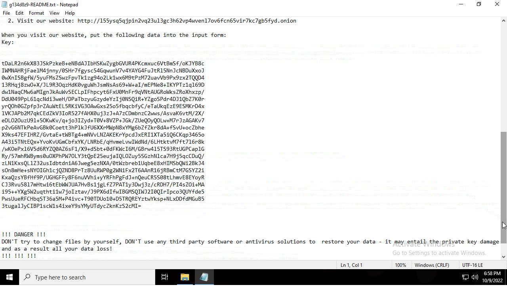
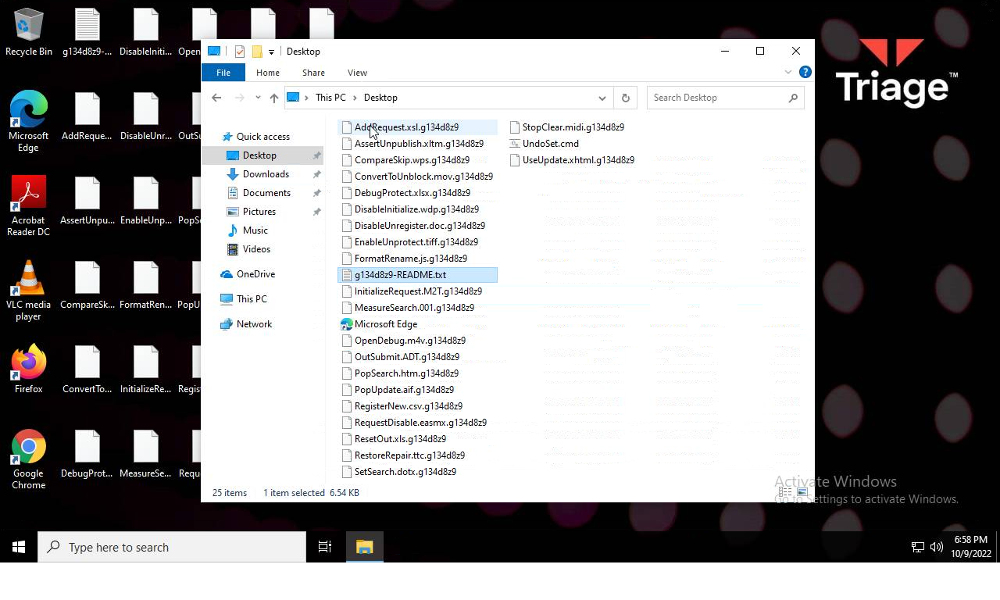

# HEUR-Trojan-Ransom.Win32.Convagent.gen-5e9730afe5cd839e717f130be156c12ae2d7dd4d91116963eefc48b04eb83663

- https://tria.ge/221009-vgqwtshdgk/behavioral2

```
- _id: "5e9730afe5cd839e717f130be156c12ae2d7dd4d91116963eefc48b04eb83663"
  creation_date: 1604534024  # 2020-11-05 00:53:44 +0100 CET
  first_submission_date: 1659144219  # 2022-07-30 03:23:39 +0200 CEST
  last_analysis_date: 1660068261  # 2022-08-09 20:04:21 +0200 CEST
  last_analysis_results: 
    Kaspersky: 
      result: "HEUR:Trojan-Ransom.Win32.Convagent.gen"
  magic: "PE32 executable for MS Windows (GUI) Intel 80386 32-bit"
  size: 124416
  trid: 
  - file_type: "Win32 Dynamic Link Library (generic)"
    probability: 29.6
  - file_type: "Win16 NE executable (generic)"
    probability: 22.7
  - file_type: "Win32 Executable (generic)"
    probability: 20.3
  - file_type: "OS/2 Executable (generic)"
    probability: 9.1
  - file_type: "Generic Win/DOS Executable"
    probability: 9.0
```







