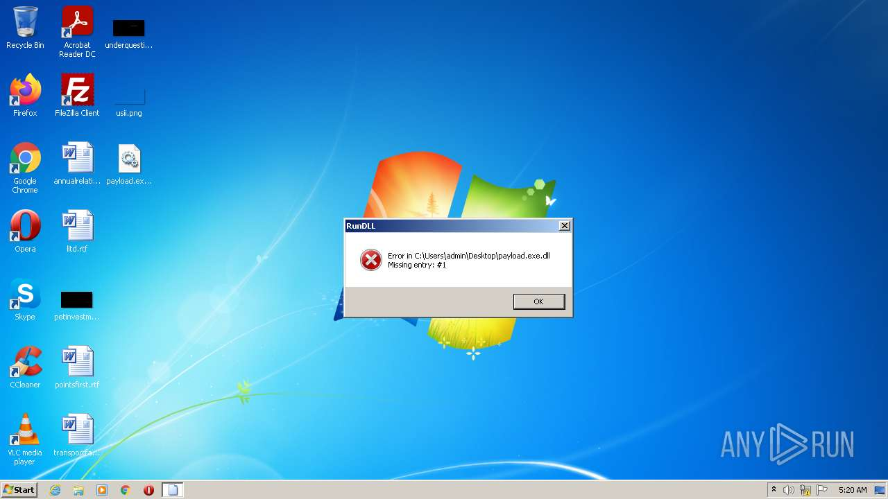
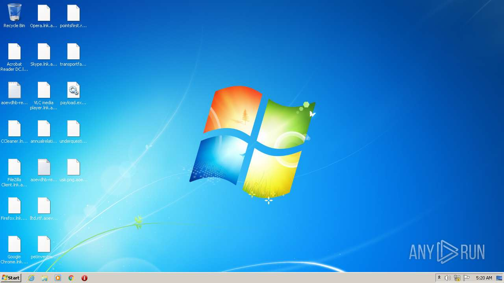
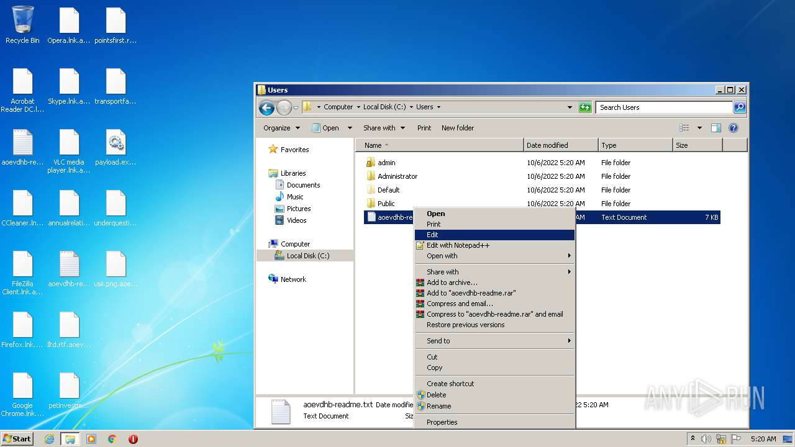
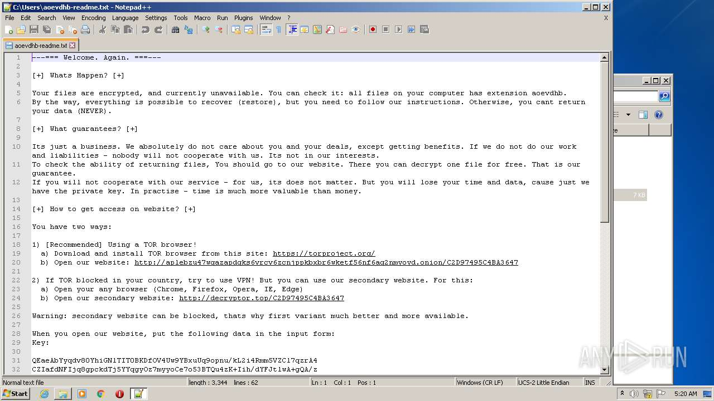
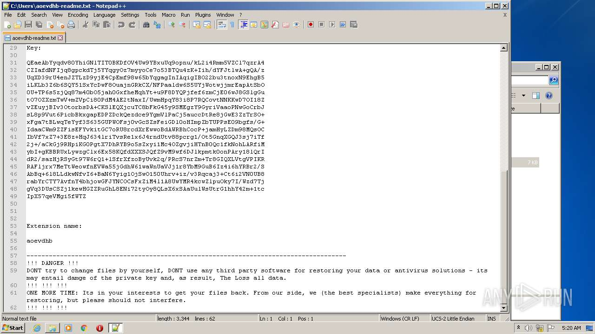
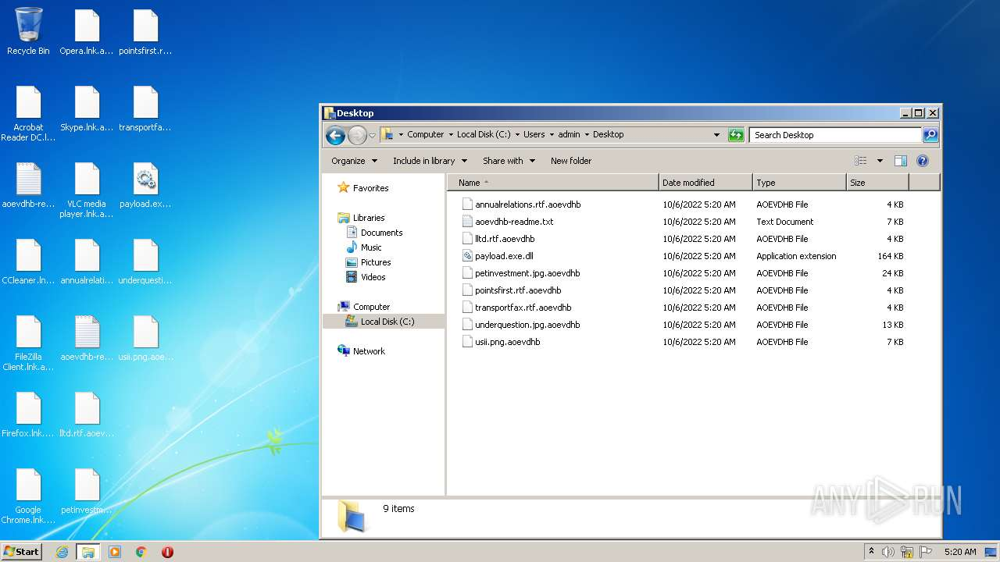
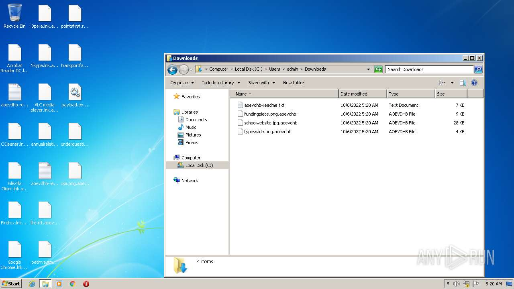

# HEUR-Trojan-Ransom.Win32.Crypmod.vho-af7a14a249990479f187b3d2d0897118eeca857482ccb0215dc3c77bc908213f

- https://any.run/report/af7a14a249990479f187b3d2d0897118eeca857482ccb0215dc3c77bc908213f/484b3c5b-38fa-4684-97a0-6dbf68d8ba87

```
- _id: "af7a14a249990479f187b3d2d0897118eeca857482ccb0215dc3c77bc908213f"
  creation_date: 1577916997  # 2020-01-01 23:16:37 +0100 CET
  first_submission_date: 1578734223  # 2020-01-11 10:17:03 +0100 CET
  last_analysis_date: 1598660811  # 2020-08-29 02:26:51 +0200 CEST
  last_analysis_results: 
    Kaspersky: 
      result: "HEUR:Trojan-Ransom.Win32.Crypmod.vho"
  magic: "PE32 executable for MS Windows (DLL) (GUI) Intel 80386 32-bit"
  size: 167936
  trid: 
  - file_type: "Win32 Dynamic Link Library (generic)"
    probability: 38.4
  - file_type: "Win32 Executable (generic)"
    probability: 26.3
  - file_type: "OS/2 Executable (generic)"
    probability: 11.8
  - file_type: "Generic Win/DOS Executable"
    probability: 11.6
  - file_type: "DOS Executable Generic"
    probability: 11.6
```








