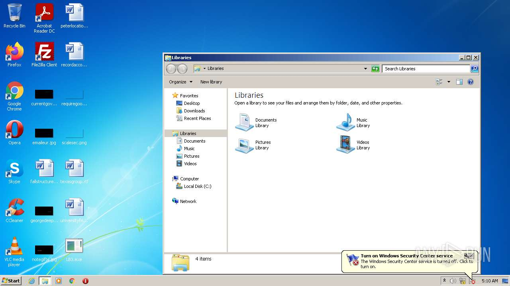

# HEUR-Trojan-Ransom.Win32.Crypmodng.gen-f0c28f1bdb04716d12a2b05fa087bc51737343136b6673a010c5275383aeb686

- https://any.run/report/f0c28f1bdb04716d12a2b05fa087bc51737343136b6673a010c5275383aeb686/9473edc6-372c-464c-8a9d-a9257f1663cc

```
- _id: "f0c28f1bdb04716d12a2b05fa087bc51737343136b6673a010c5275383aeb686"
  creation_date: 1662686821  # 2022-09-09 03:27:01 +0200 CEST
  crowdsourced_yara_results: 
  - author: "@bartblaze"
    description: "Identifies Darkside ransomware."
    rule_name: "Darkside"
    ruleset_id: "0022c78e42"
    ruleset_name: "Darkside"
    source: "https://github.com/bartblaze/Yara-rules"
  - author: "Elastic Security"
    rule_name: "Windows_Ransomware_Lockbit_369e1e94"
    ruleset_id: "015e7930ee"
    ruleset_name: "Windows_Ransomware_Lockbit"
    source: "https://github.com/elastic/protections-artifacts"
  - author: "Felix Bilstein - yara-signator at cocacoding dot com"
    description: "Detects win.blackmatter."
    rule_name: "win_blackmatter_auto"
    ruleset_id: "008dd729cd"
    ruleset_name: "win.blackmatter_auto"
    source: "https://malpedia.caad.fkie.fraunhofer.de/"
  first_submission_date: 1664128964  # 2022-09-25 20:02:44 +0200 CEST
  last_analysis_date: 1664578562  # 2022-10-01 00:56:02 +0200 CEST
  last_analysis_results: 
    Kaspersky: 
      result: "HEUR:Trojan-Ransom.Win32.Crypmodng.gen"
  magic: "PE32 executable for MS Windows (GUI) Intel 80386 32-bit"
  size: 149504
  trid: 
  - file_type: "Win32 Dynamic Link Library (generic)"
    probability: 27.1
  - file_type: "Win16 NE executable (generic)"
    probability: 20.7
  - file_type: "Win32 Executable (generic)"
    probability: 18.5
  - file_type: "Win16/32 Executable Delphi generic"
    probability: 8.5
  - file_type: "OS/2 Executable (generic)"
    probability: 8.3
```





