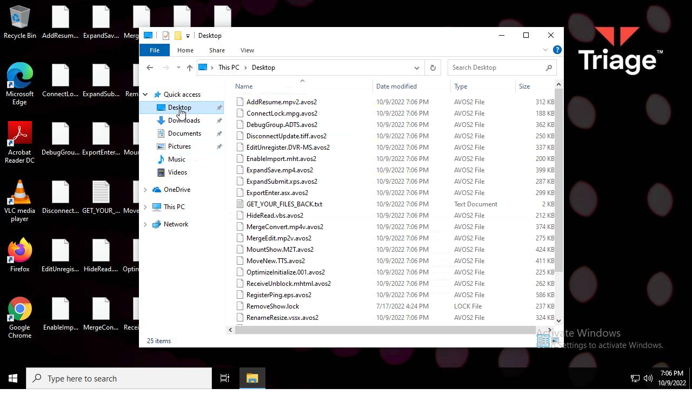
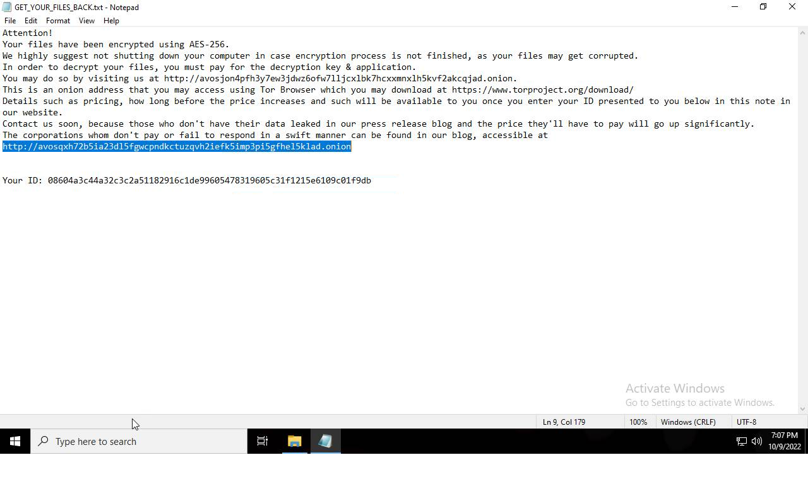

# HEUR-Trojan-Ransom.Win32.Cryptor.gen-6cc510a772d7718c95216eb56a84a96201241b264755f28875e685f06e95e1a2

- https://tria.ge/221009-vmk8jahcg4/behavioral1

```
- _id: "6cc510a772d7718c95216eb56a84a96201241b264755f28875e685f06e95e1a2"
  creation_date: 1630053763  # 2021-08-27 10:42:43 +0200 CEST
  first_submission_date: 1637595519  # 2021-11-22 16:38:39 +0100 CET
  last_analysis_date: 1662357422  # 2022-09-05 07:57:02 +0200 CEST
  last_analysis_results: 
    Kaspersky: 
      result: "HEUR:Trojan-Ransom.Win32.Cryptor.gen"
  magic: "PE32 executable for MS Windows (console) Intel 80386 32-bit"
  size: 941056
  trid: 
  - file_type: "Win64 Executable (generic)"
    probability: 32.2
  - file_type: "Win32 Dynamic Link Library (generic)"
    probability: 20.1
  - file_type: "Win16 NE executable (generic)"
    probability: 15.4
  - file_type: "Win32 Executable (generic)"
    probability: 13.7
  - file_type: "OS/2 Executable (generic)"
    probability: 6.2
```




