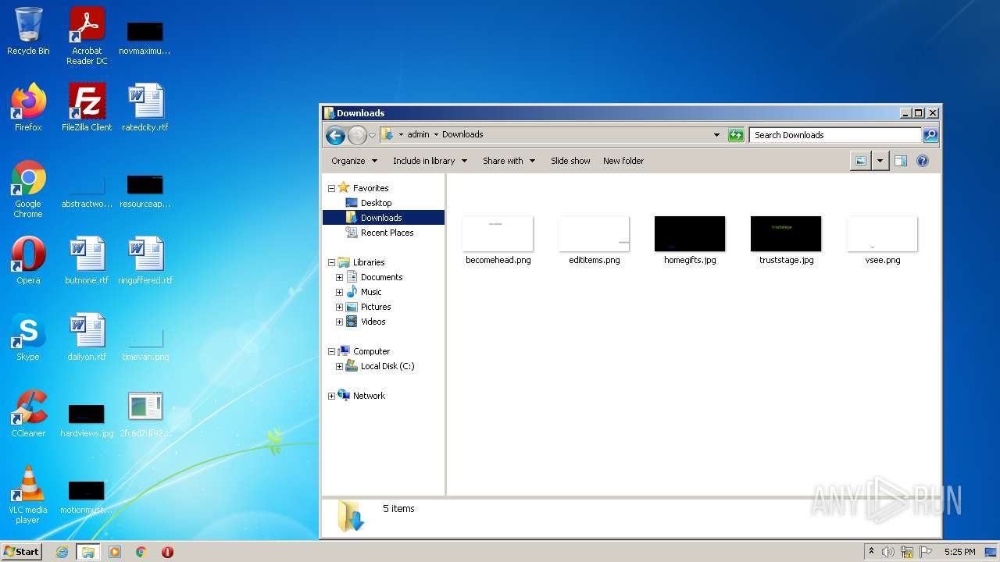
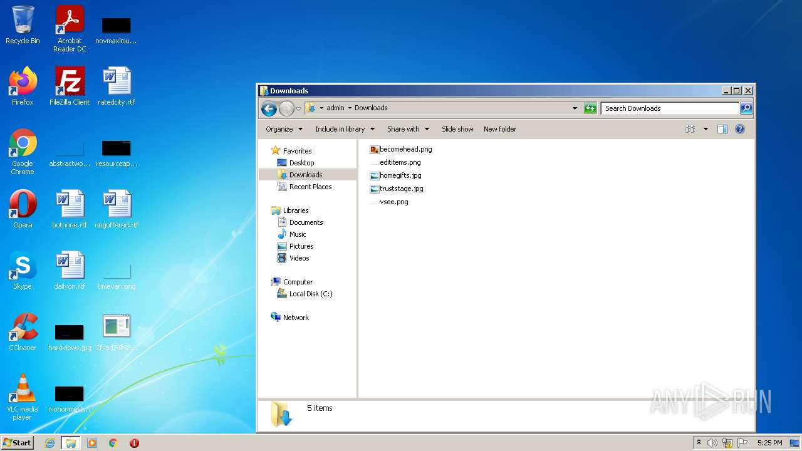
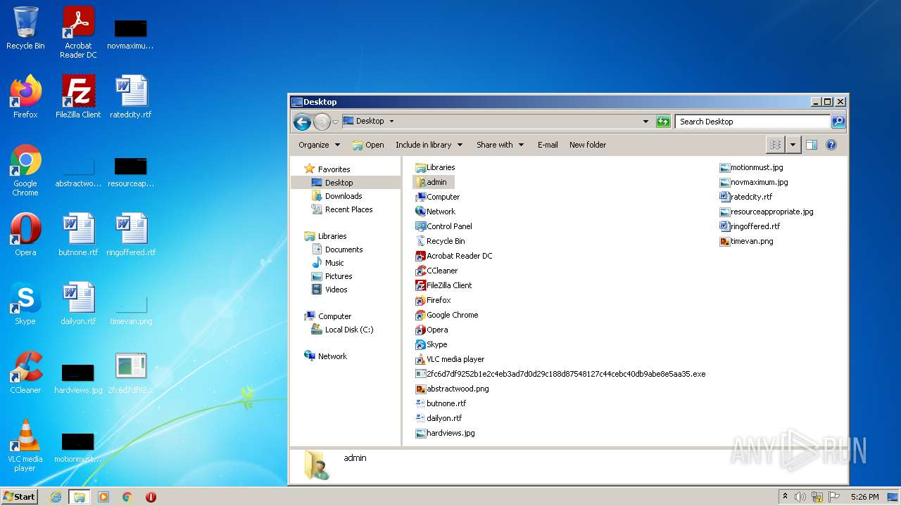
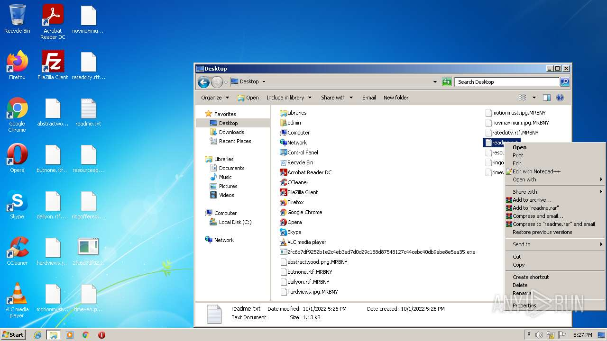
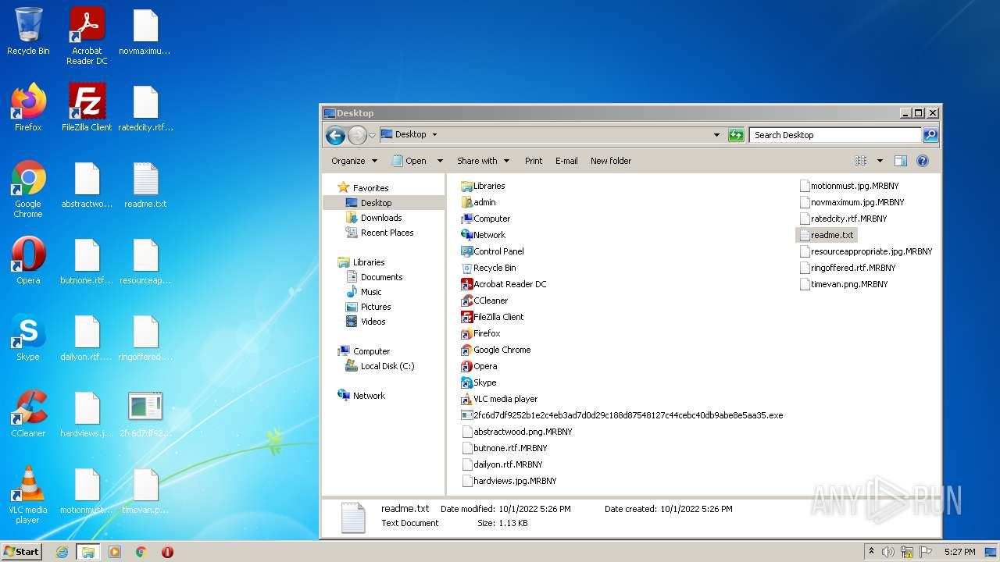
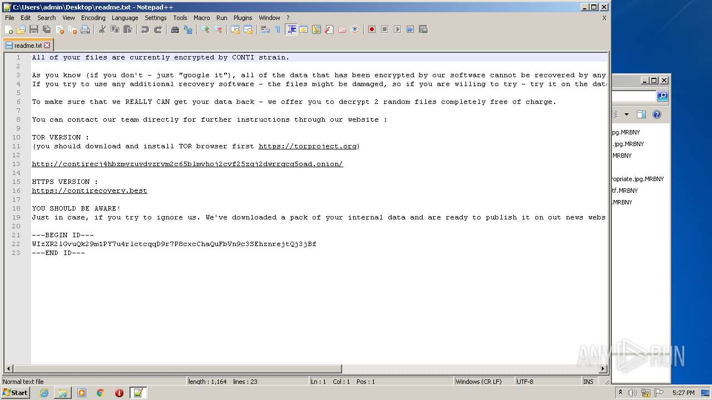

# HEUR-Trojan-Ransom.Win32.Encoder.gen-2fc6d7df9252b1e2c4eb3ad7d0d29c188d87548127c44cebc40db9abe8e5aa35

```
- _id: "2fc6d7df9252b1e2c4eb3ad7d0d29c188d87548127c44cebc40db9abe8e5aa35"
  creation_date: 1608740770  # 2020-12-23 17:26:10 +0100 CET
  crowdsourced_yara_results: 
  - rule_name: "Windows_Ransomware_Conti_89f3f6fa"
    ruleset_id: "01598e8db9"
    ruleset_name: "Windows_Ransomware_Conti"
    source: "https://github.com/elastic/protections-artifacts"
  - author: "kevoreilly"
    description: "Conti Ransomware"
    rule_name: "Conti"
    ruleset_id: "00bcdd5f00"
    ruleset_name: "Conti"
    source: "https://github.com/kevoreilly/CAPEv2"
  - author: "Felix Bilstein - yara-signator at cocacoding dot com"
    description: "Detects win.conti."
    rule_name: "win_conti_auto"
    ruleset_id: "0080053bc1"
    ruleset_name: "win.conti_auto"
    source: "https://malpedia.caad.fkie.fraunhofer.de/"
  first_submission_date: 1611351916  # 2021-01-22 22:45:16 +0100 CET
  last_analysis_date: 1661791422  # 2022-08-29 18:43:42 +0200 CEST
  last_analysis_results: 
    Kaspersky: 
      result: "HEUR:Trojan-Ransom.Win32.Encoder.gen"
  magic: "PE32 executable for MS Windows (GUI) Intel 80386 32-bit"
  size: 196096
  trid: 
  - file_type: "Win64 Executable (generic)"
    probability: 32.2
  - file_type: "Win32 Dynamic Link Library (generic)"
    probability: 20.1
  - file_type: "Win16 NE executable (generic)"
    probability: 15.4
  - file_type: "Win32 Executable (generic)"
    probability: 13.7
  - file_type: "OS/2 Executable (generic)"
    probability: 6.2
```








