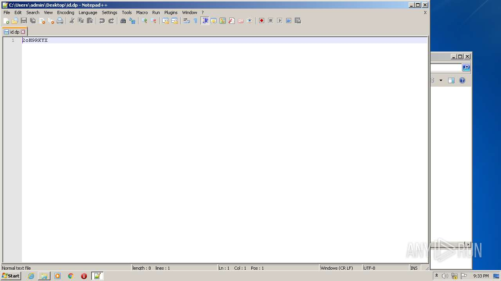
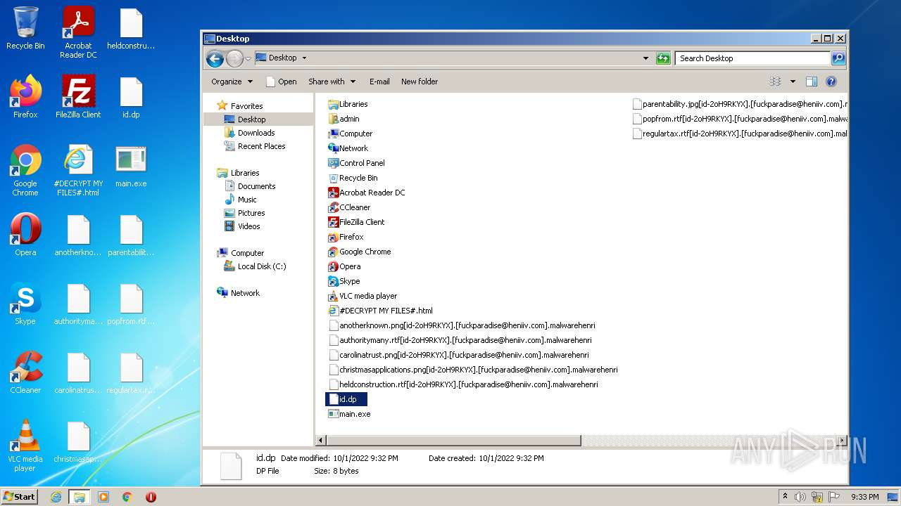
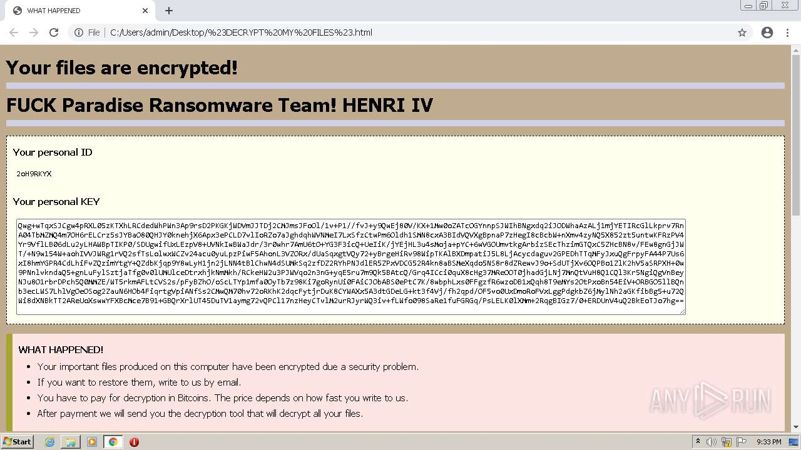
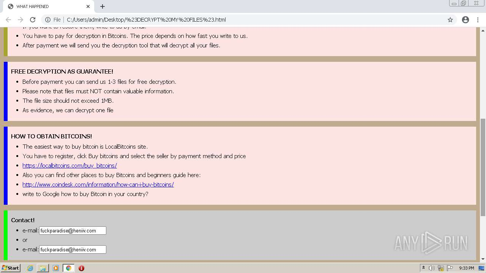
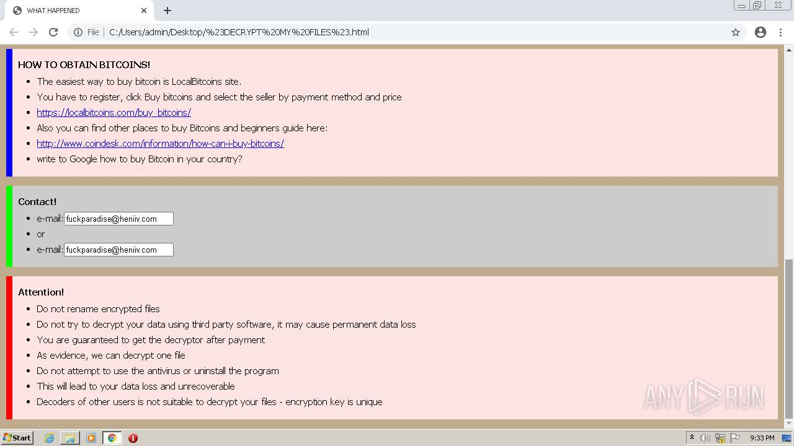

# HEUR-Trojan-Ransom.Win32.Generic-0445ed81104c1189b3118b4eaf21aa9e1c4df489788e56a88b2e44e2bcd0971d

- https://any.run/report/0445ed81104c1189b3118b4eaf21aa9e1c4df489788e56a88b2e44e2bcd0971d/3617ebc5-666b-4573-9a50-b558b0d4d8f3

```
- _id: "0445ed81104c1189b3118b4eaf21aa9e1c4df489788e56a88b2e44e2bcd0971d"
  creation_date: 1616504858  # 2021-03-23 14:07:38 +0100 CET
  crowdsourced_yara_results: 
  - author: "Florian Roth"
    description: "Detects ransomware indicator"
    rule_name: "SUSP_RANSOMWARE_Indicator_Jul20"
    ruleset_id: "000a7d3924"
    ruleset_name: "crime_ransom_generic"
    source: "https://github.com/Neo23x0/signature-base"
  first_submission_date: 1616510522  # 2021-03-23 15:42:02 +0100 CET
  last_analysis_date: 1616510522  # 2021-03-23 15:42:02 +0100 CET
  last_analysis_results: 
    Kaspersky: 
      result: "HEUR:Trojan-Ransom.Win32.Generic"
  magic: "PE32 executable for MS Windows (console) Intel 80386 32-bit Mono/.Net assembly"
  packers: 
    PEiD: ".NET executable"
  size: 36864
  trid: 
  - file_type: "Generic CIL Executable (.NET, Mono, etc.)"
    probability: 60.4
  - file_type: "Windows screen saver"
    probability: 10.8
  - file_type: "Win64 Executable (generic)"
    probability: 8.7
  - file_type: "Win32 Dynamic Link Library (generic)"
    probability: 5.4
  - file_type: "Win16 NE executable (generic)"
    probability: 4.1
```







