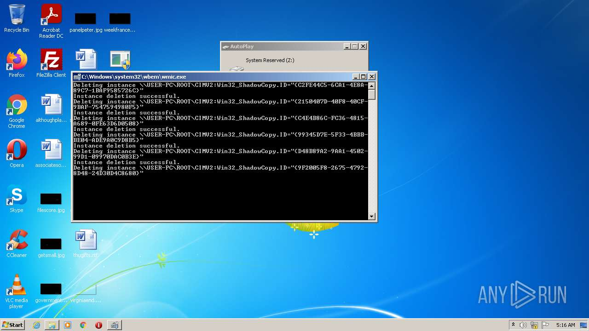
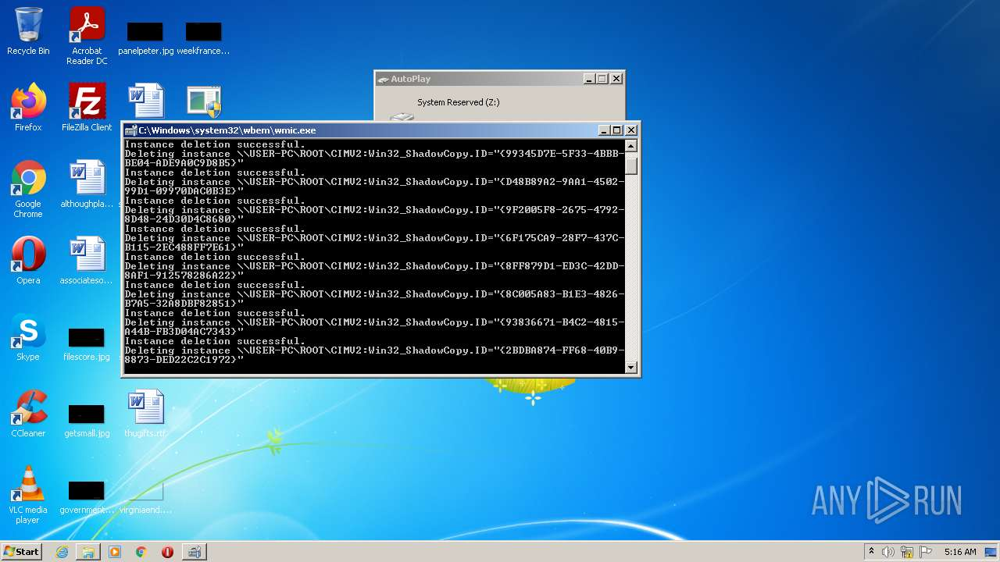
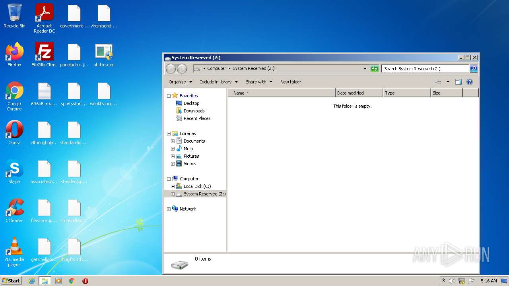
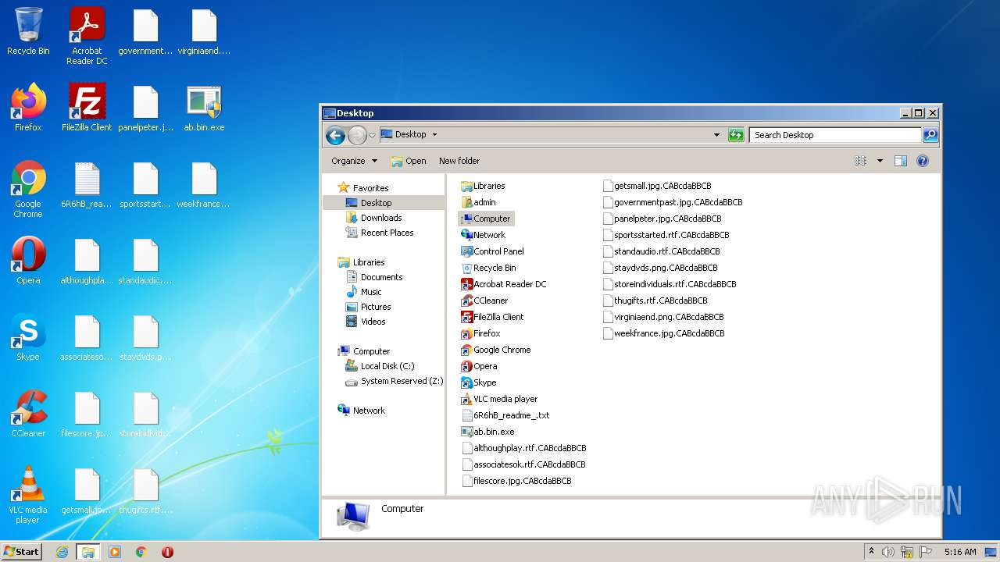
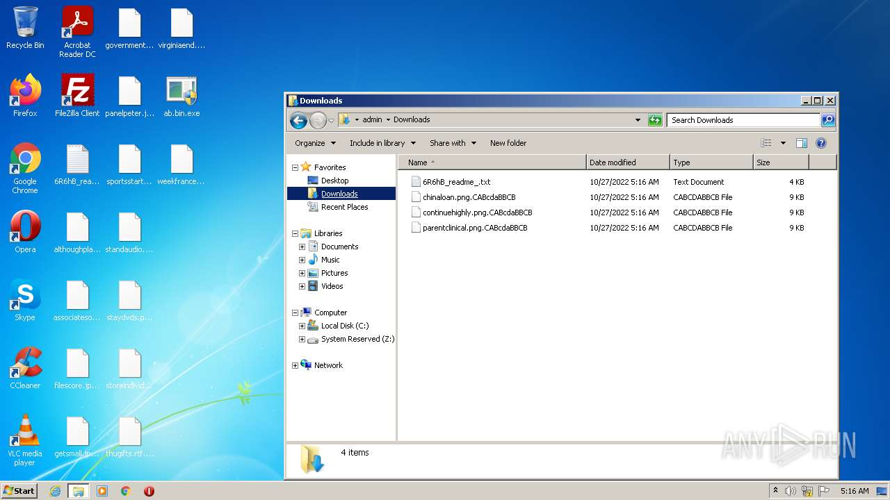
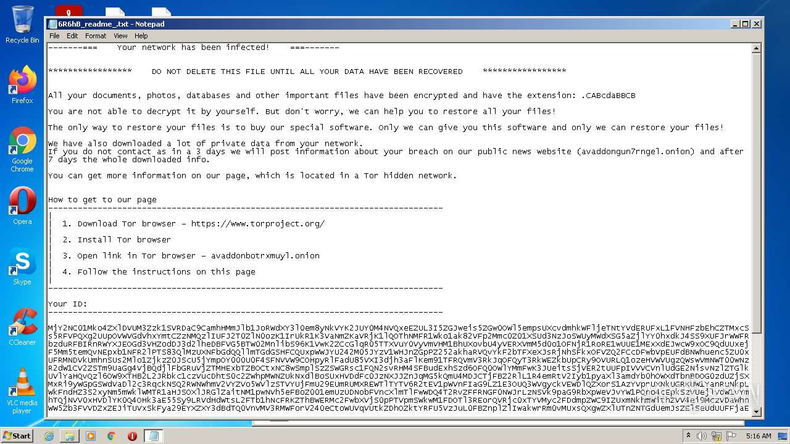
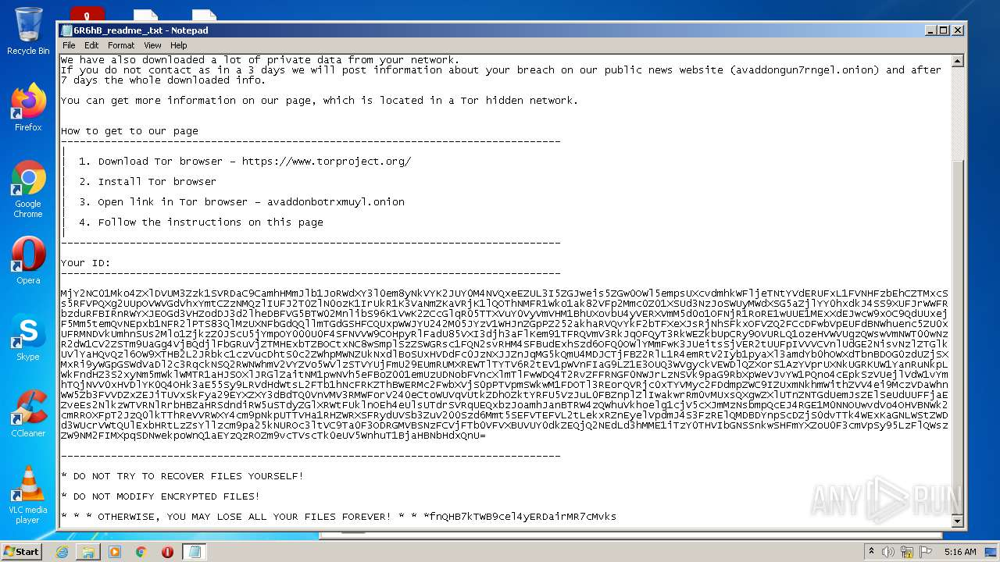
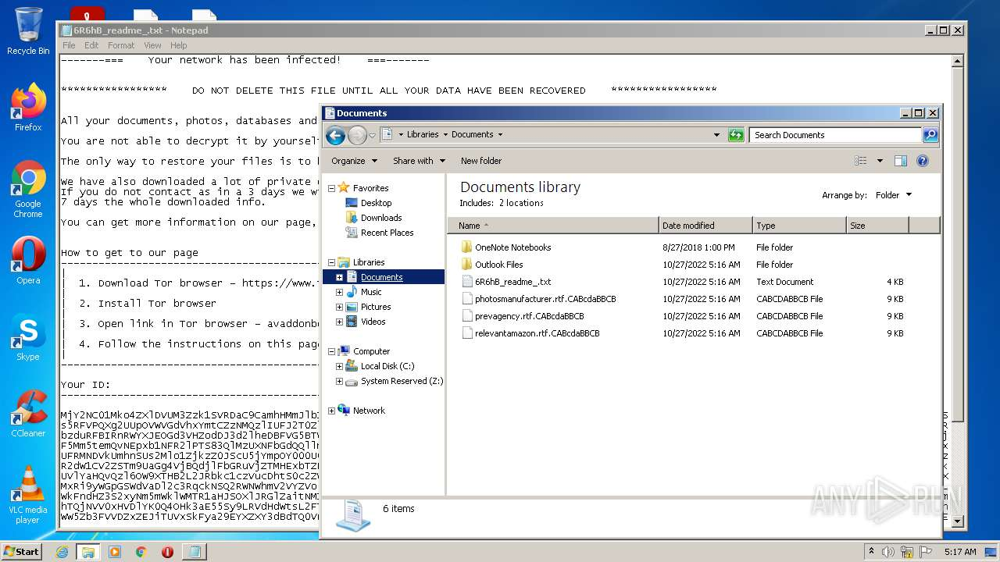

# HEUR-Trojan-Ransom.Win32.Generic-1228d0f04f0ba82569fc1c0609f9fd6c377a91b9ea44c1e7f9f84b2b90552da2

- https://any.run/report/1228d0f04f0ba82569fc1c0609f9fd6c377a91b9ea44c1e7f9f84b2b90552da2/eda304f7-5b8d-4e9a-a4f3-d795286f2e2c

```
- _id: "1228d0f04f0ba82569fc1c0609f9fd6c377a91b9ea44c1e7f9f84b2b90552da2"
  creation_date: 1617467719  # 2021-04-03 18:35:19 +0200 CEST
  crowdsourced_yara_results: 
  - author: "@bartblaze"
    description: "Identifies Avaddon ransomware."
    rule_name: "Avaddon"
    ruleset_id: "0022263614"
    ruleset_name: "Avaddon"
    source: "https://github.com/bartblaze/Yara-rules"
  first_submission_date: 1621265339  # 2021-05-17 17:28:59 +0200 CEST
  last_analysis_date: 1665577733  # 2022-10-12 14:28:53 +0200 CEST
  last_analysis_results: 
    Kaspersky: 
      result: "HEUR:Trojan-Ransom.Win32.Generic"
  magic: "PE32 executable for MS Windows (GUI) Intel 80386 32-bit"
  size: 794112
  trid: 
  - file_type: "Win64 Executable (generic)"
    probability: 32.2
  - file_type: "Win32 Dynamic Link Library (generic)"
    probability: 20.1
  - file_type: "Win16 NE executable (generic)"
    probability: 15.4
  - file_type: "Win32 Executable (generic)"
    probability: 13.7
  - file_type: "OS/2 Executable (generic)"
    probability: 6.2
```









