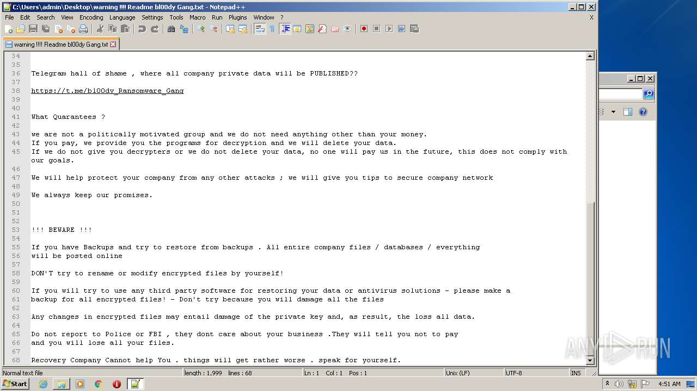

# HEUR-Trojan-Ransom.Win32.Generic-139a8bb2c5537190e747d2f651b423147018fd9a9a21bb36281d4ce1c61727c1

- https://any.run/report/139a8bb2c5537190e747d2f651b423147018fd9a9a21bb36281d4ce1c61727c1/26fcc8be-6470-4f75-8156-89a43494ac69

```
- _id: "139a8bb2c5537190e747d2f651b423147018fd9a9a21bb36281d4ce1c61727c1"
  creation_date: 1664098903  # 2022-09-25 11:41:43 +0200 CEST
  crowdsourced_yara_results: 
  - author: "Elastic Security"
    rule_name: "Windows_Ransomware_Conti_89f3f6fa"
    ruleset_id: "01598e8db9"
    ruleset_name: "Windows_Ransomware_Conti"
    source: "https://github.com/elastic/protections-artifacts"
  - author: "kevoreilly"
    description: "Conti Ransomware"
    rule_name: "Conti"
    ruleset_id: "00bcdd5f00"
    ruleset_name: "Conti"
    source: "https://github.com/kevoreilly/CAPEv2"
  first_submission_date: 1664120009  # 2022-09-25 17:33:29 +0200 CEST
  last_analysis_date: 1665177088  # 2022-10-07 23:11:28 +0200 CEST
  last_analysis_results: 
    Kaspersky: 
      result: "HEUR:Trojan-Ransom.Win32.Generic"
  magic: "PE32 executable for MS Windows (GUI) Intel 80386 32-bit"
  size: 182272
  trid: 
  - file_type: "Win64 Executable (generic)"
    probability: 32.2
  - file_type: "Win32 Dynamic Link Library (generic)"
    probability: 20.1
  - file_type: "Win16 NE executable (generic)"
    probability: 15.4
  - file_type: "Win32 Executable (generic)"
    probability: 13.7
  - file_type: "OS/2 Executable (generic)"
    probability: 6.2
```





