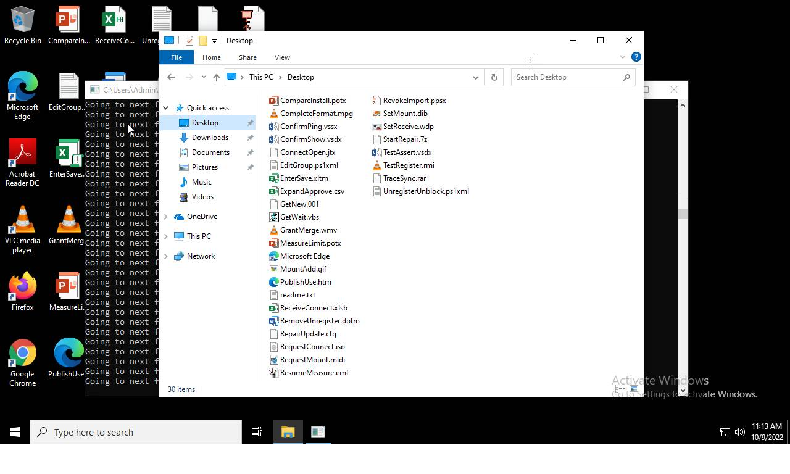

# HEUR-Trojan-Ransom.Win32.Generic-17205c43189c22dfcb278f5cc45c2562f622b0b6280dcd43cc1d3c274095eb90

- https://tria.ge/221009-nbkpashadn/behavioral2

```
- _id: "17205c43189c22dfcb278f5cc45c2562f622b0b6280dcd43cc1d3c274095eb90"
  creation_date: 1645058771  # 2022-02-17 01:46:11 +0100 CET
  crowdsourced_yara_results: 
  - rule_name: "Windows_Ransomware_BlackBasta_494d3c54"
    ruleset_id: "0157897c12"
    ruleset_name: "Windows_Ransomware_BlackBasta"
    source: "https://github.com/elastic/protections-artifacts"
  first_submission_date: 1650042256  # 2022-04-15 19:04:16 +0200 CEST
  last_analysis_date: 1663113838  # 2022-09-14 02:03:58 +0200 CEST
  last_analysis_results: 
    Kaspersky: 
      result: "HEUR:Trojan-Ransom.Win32.Generic"
  magic: "PE32 executable for MS Windows (console) Intel 80386 32-bit"
  size: 651776
  trid: 
  - file_type: "Win64 Executable (generic)"
    probability: 32.2
  - file_type: "Win32 Dynamic Link Library (generic)"
    probability: 20.1
  - file_type: "Win16 NE executable (generic)"
    probability: 15.4
  - file_type: "Win32 Executable (generic)"
    probability: 13.7
  - file_type: "OS/2 Executable (generic)"
    probability: 6.2
```




