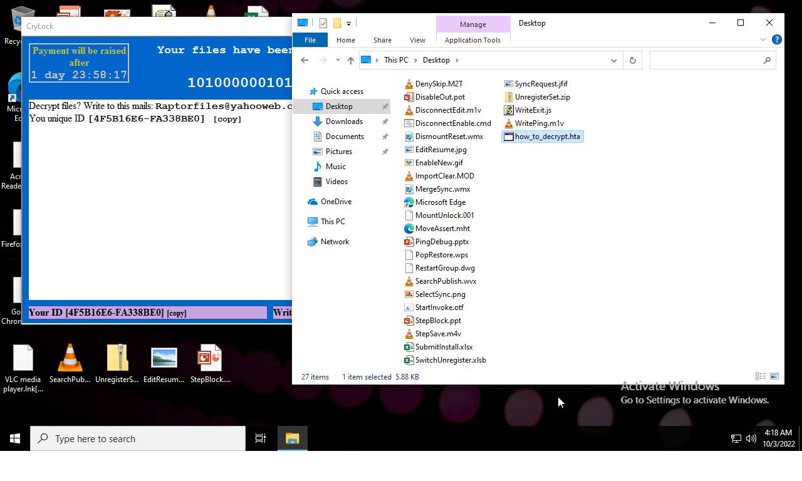
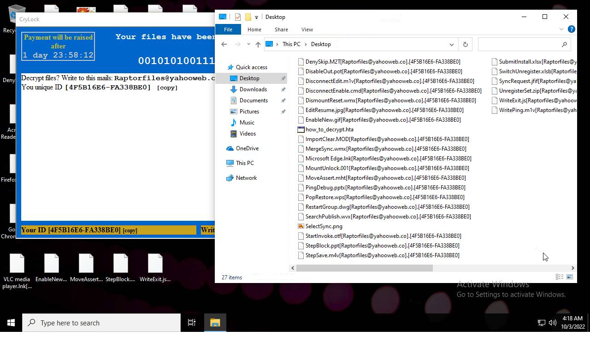

# HEUR-Trojan-Ransom.Win32.Generic-1e8bafd699de6d5987cfb2fdc138ae15422d8377614107348b905dd0f1bf7d77

- https://tria.ge/221003-evv5pshaen/behavioral1

```
- _id: "1e8bafd699de6d5987cfb2fdc138ae15422d8377614107348b905dd0f1bf7d77"
  creation_date: 708992537  # 1992-06-20 00:22:17 +0200 CEST
  crowdsourced_yara_results: 
  - author: "@bartblaze"
    description: "Identifies CryLock aka Cryakl ransomware."
    rule_name: "CryLock"
    ruleset_id: "002ba82f26"
    ruleset_name: "CryLock"
    source: "https://github.com/bartblaze/Yara-rules"
  - author: "ditekSHen"
    description: "Detects CryLock ransomware"
    rule_name: "MALWARE_Win_CryLock"
    ruleset_id: "00cc803bdc"
    ruleset_name: "malware"
    source: "https://github.com/ditekshen/detection"
  first_submission_date: 1664450472  # 2022-09-29 13:21:12 +0200 CEST
  last_analysis_date: 1665248849  # 2022-10-08 19:07:29 +0200 CEST
  last_analysis_results: 
    Kaspersky: 
      result: "HEUR:Trojan-Ransom.Win32.Generic"
  magic: "PE32 executable for MS Windows (GUI) Intel 80386 32-bit"
  size: 205312
  trid: 
  - file_type: "Win32 Executable Delphi generic"
    probability: 38.9
  - file_type: "Win32 Dynamic Link Library (generic)"
    probability: 18.0
  - file_type: "Win32 Executable (generic)"
    probability: 12.3
  - file_type: "WinArchiver Mountable compressed Archive"
    probability: 8.2
  - file_type: "Win16/32 Executable Delphi generic"
    probability: 5.6
```




