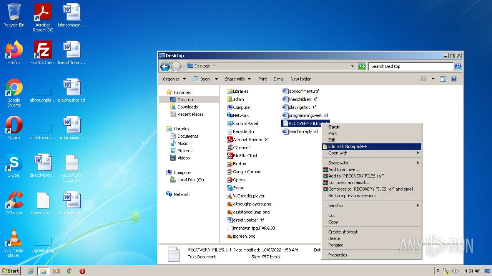
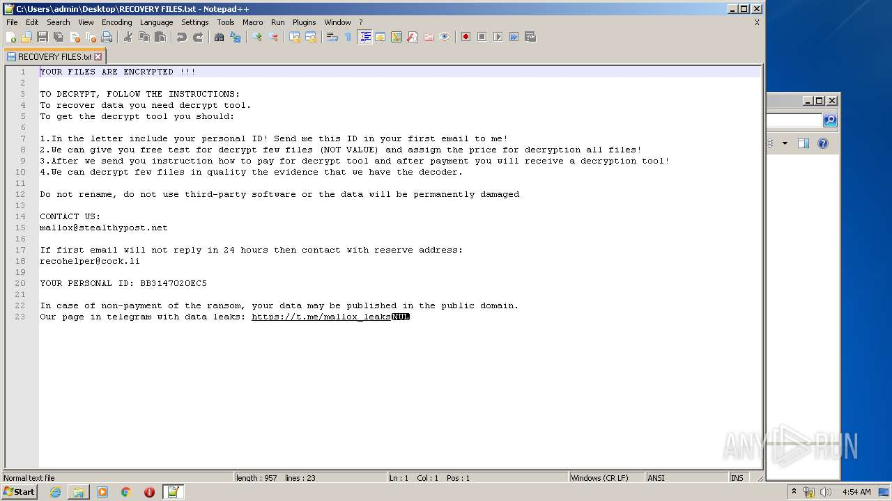
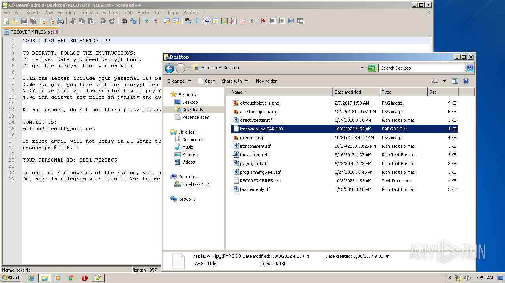
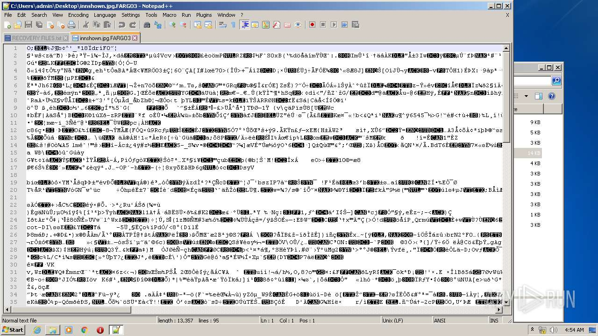
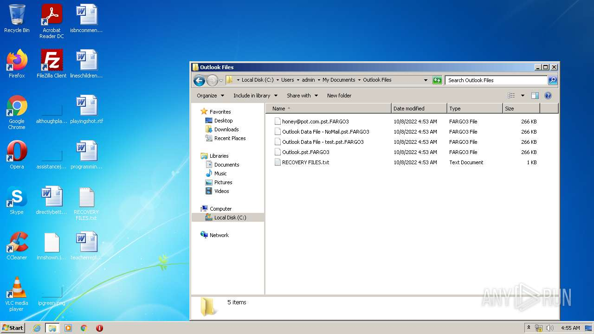
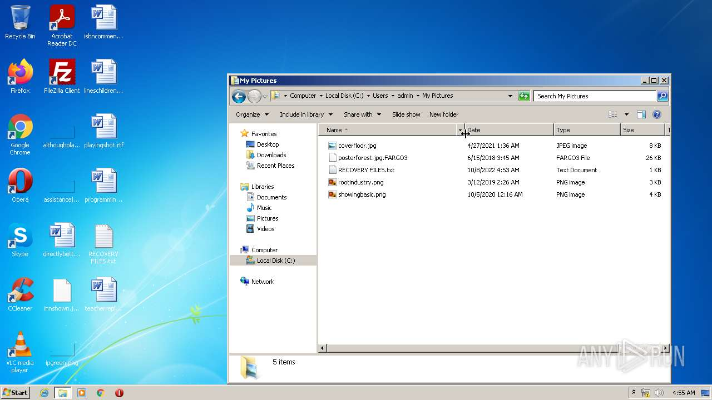
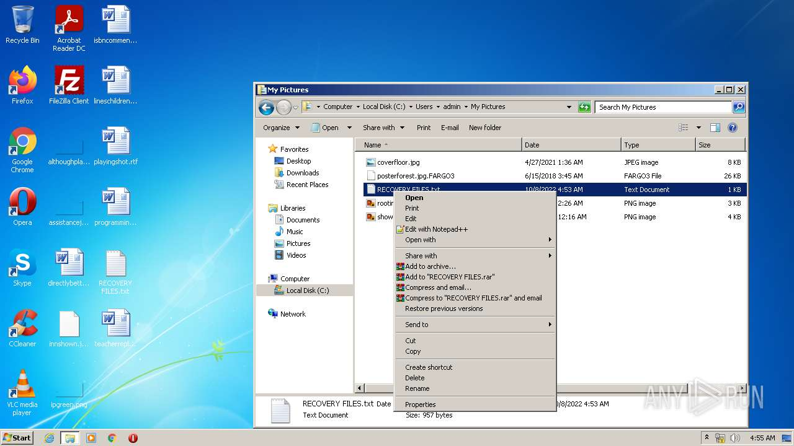
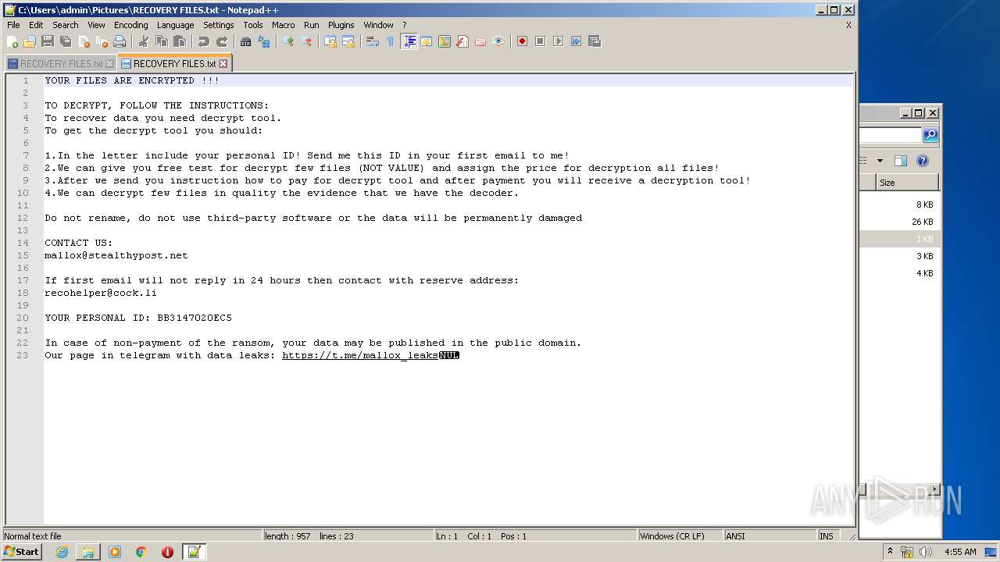

# HEUR-Trojan-Ransom.Win32.Generic-2a549489e2455a2d84295604e29c727dd20d65f5a874209840ce187c35d9a439

- https://any.run/report/2a549489e2455a2d84295604e29c727dd20d65f5a874209840ce187c35d9a439/e1bc0182-9adf-4408-aa28-75964706724f

```
- _id: "2a549489e2455a2d84295604e29c727dd20d65f5a874209840ce187c35d9a439"
  creation_date: 1660399817  # 2022-08-13 16:10:17 +0200 CEST
  crowdsourced_yara_results: 
  - author: "ditekSHen"
    description: "detects command variations typically used by ransomware"
    rule_name: "INDICATOR_SUSPICIOUS_GENRansomware"
    ruleset_id: "00c3b8eb5d"
    ruleset_name: "indicator_suspicious"
    source: "https://github.com/ditekshen/detection"
  first_submission_date: 1663420225  # 2022-09-17 15:10:25 +0200 CEST
  last_analysis_date: 1664826841  # 2022-10-03 21:54:01 +0200 CEST
  last_analysis_results: 
    Kaspersky: 
      result: "HEUR:Trojan-Ransom.Win32.Generic"
  magic: "PE32 executable for MS Windows (GUI) Intel 80386 32-bit"
  size: 163328
  trid: 
  - file_type: "Win64 Executable (generic)"
    probability: 32.2
  - file_type: "Win32 Dynamic Link Library (generic)"
    probability: 20.1
  - file_type: "Win16 NE executable (generic)"
    probability: 15.4
  - file_type: "Win32 Executable (generic)"
    probability: 13.7
  - file_type: "OS/2 Executable (generic)"
    probability: 6.2
```









