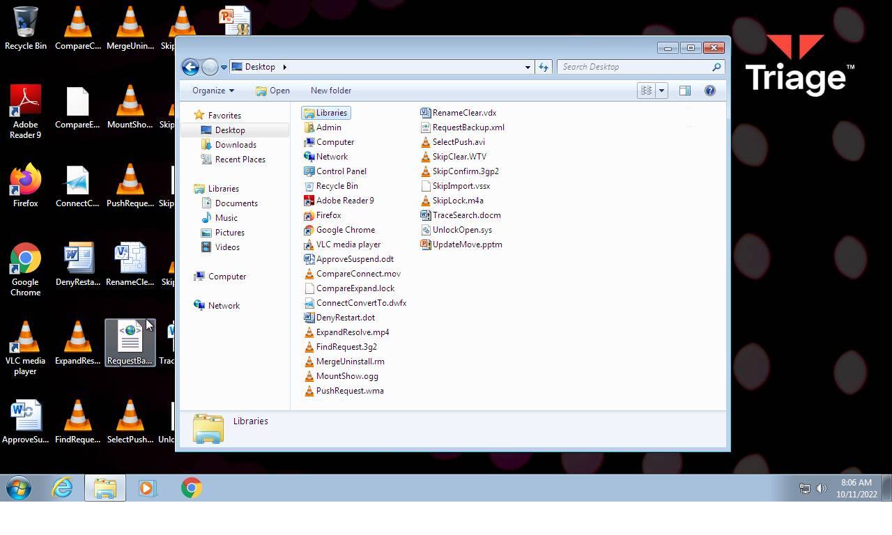
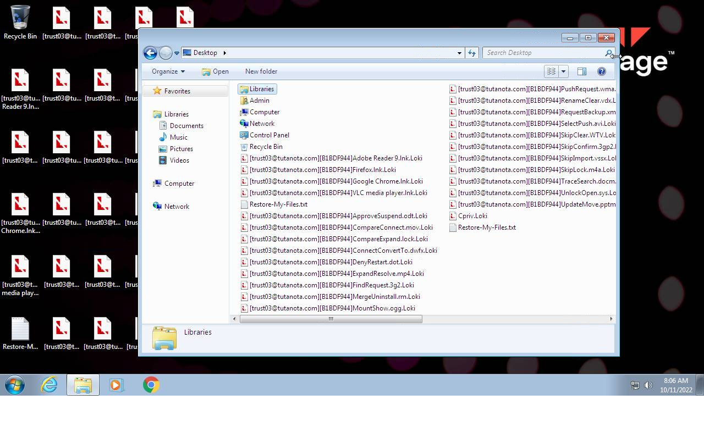
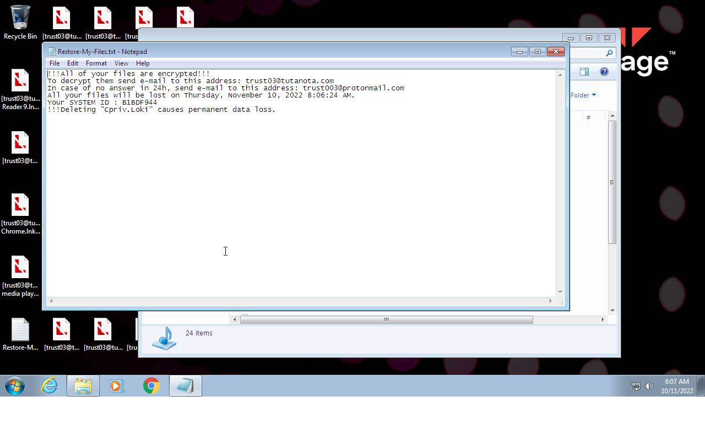
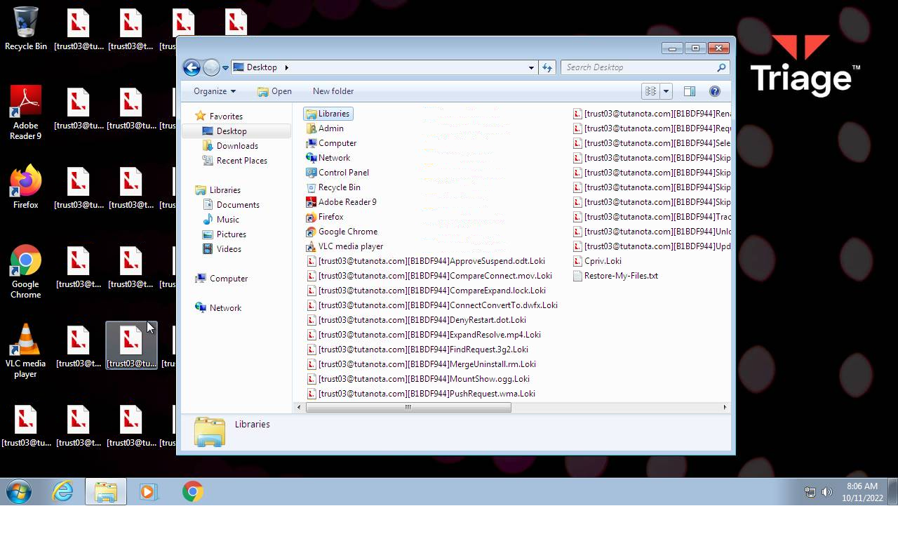
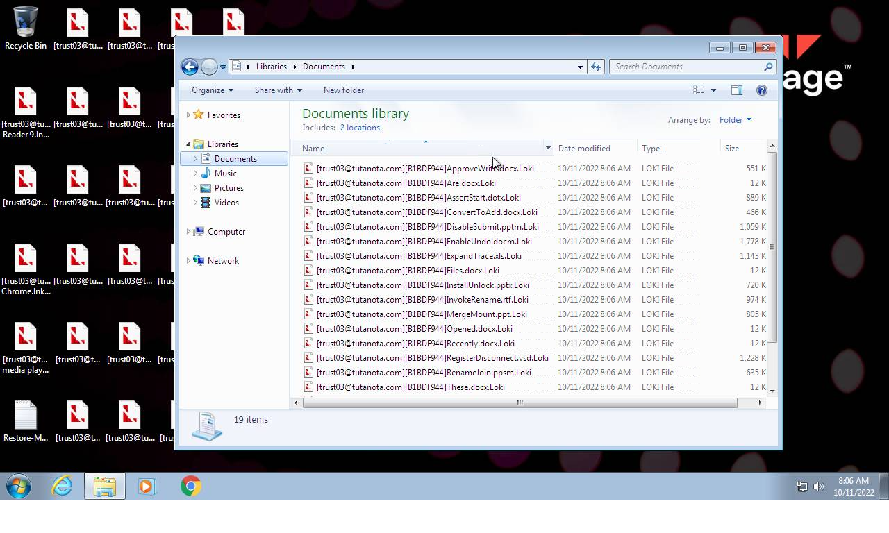

# HEUR-Trojan-Ransom.Win32.Generic-478c116d9bb318b4621c7839c81be36261c38e748a593249f8c9c67789f71064

- https://tria.ge/221011-jy1a2sdebm/behavioral1

```
- _id: "478c116d9bb318b4621c7839c81be36261c38e748a593249f8c9c67789f71064"
  creation_date: 2645394181  # 2053-10-30 00:43:01 +0100 CET
  crowdsourced_yara_results: 
  - author: "ditekSHen"
    description: "Detects executables packed with ConfuserEx Mod Beds Protector"
    rule_name: "INDICATOR_EXE_Packed_ConfuserExMod_BedsProtector"
    ruleset_id: "00c291ca7f"
    ruleset_name: "indicator_packed"
    source: "https://github.com/ditekshen/detection"
  - author: "ditekSHen"
    description: "Detects executables packed with or use KoiVM"
    rule_name: "INDICATOR_EXE_Packed_KoiVM"
    ruleset_id: "00c291ca7f"
    ruleset_name: "indicator_packed"
    source: "https://github.com/ditekshen/detection"
  - author: "ditekSHen"
    description: "detects command variations typically used by ransomware"
    rule_name: "INDICATOR_SUSPICIOUS_GENRansomware"
    ruleset_id: "00c3b8eb5d"
    ruleset_name: "indicator_suspicious"
    source: "https://github.com/ditekshen/detection"
  - author: "ditekSHen"
    description: "Detects executables embedding registry key / value combination indicative of disabling Windows Defedner features"
    rule_name: "INDICATOR_SUSPICIOUS_EXE_RegKeyComb_DisableWinDefender"
    ruleset_id: "00c3b8eb5d"
    ruleset_name: "indicator_suspicious"
    source: "https://github.com/ditekshen/detection"
  - author: "ditekSHen"
    description: "Detects LokiLocker ransomware"
    rule_name: "MALWARE_Win_LokiLocker"
    ruleset_id: "00cc803bdc"
    ruleset_name: "malware"
    source: "https://github.com/ditekshen/detection"
  - author: "Lucas Acha (http://www.lukeacha.com)"
    description: "Generic Detection for multiple RAT families, PUPs, Packers and suspicious executables"
    rule_name: "Multifamily_RAT_Detection"
    ruleset_id: "00f69a1b91"
    ruleset_name: "rat_detection"
    source: "https://github.com/securitymagic/yara"
  first_submission_date: 1665448405  # 2022-10-11 02:33:25 +0200 CEST
  last_analysis_date: 1665448405  # 2022-10-11 02:33:25 +0200 CEST
  last_analysis_results: 
    Kaspersky: 
      result: "HEUR:Trojan-Ransom.Win32.Generic"
  magic: "PE32 executable for MS Windows (GUI) Intel 80386 32-bit Mono/.Net assembly"
  size: 675840
  trid: 
  - file_type: "Generic CIL Executable (.NET, Mono, etc.)"
    probability: 46.9
  - file_type: "Win32 Executable MS Visual C++ (generic)"
    probability: 20.0
  - file_type: "Microsoft Visual C++ compiled executable (generic)"
    probability: 10.6
  - file_type: "Win64 Executable (generic)"
    probability: 6.7
  - file_type: "Win32 Dynamic Link Library (generic)"
    probability: 4.2
```






