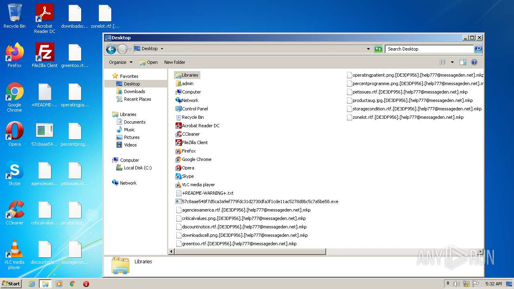
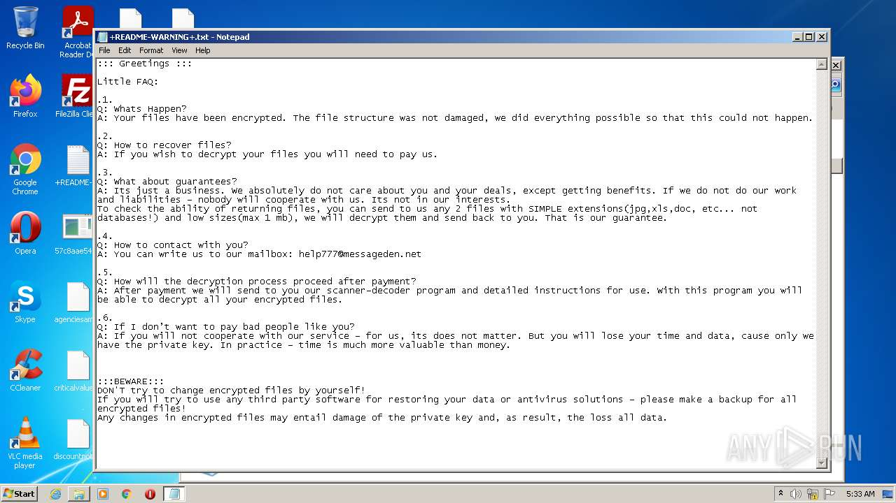
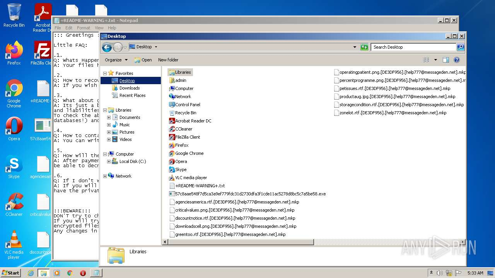
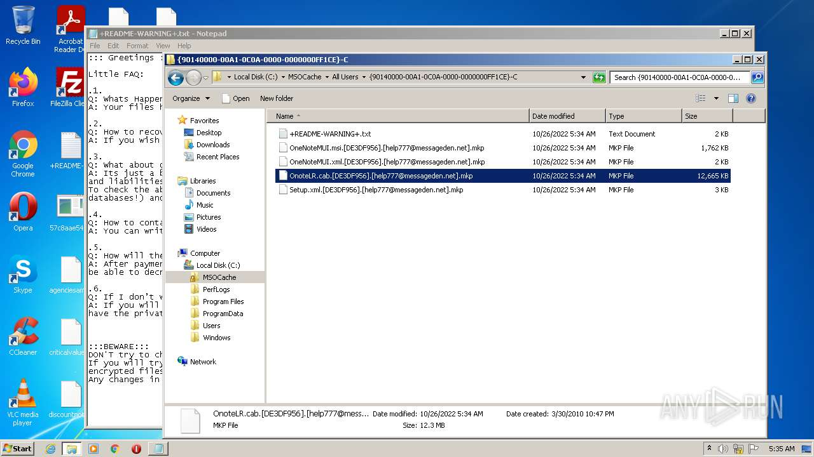

# HEUR-Trojan-Ransom.Win32.Generic-57c8aae548f7d5ca3a9ef779fdc31d2730dfa3f1cde11ac5278d8bc5c7a5be58

- https://any.run/report/57c8aae548f7d5ca3a9ef779fdc31d2730dfa3f1cde11ac5278d8bc5c7a5be58/16db640b-11c5-4567-b722-03b61a9ac506

```
- _id: "57c8aae548f7d5ca3a9ef779fdc31d2730dfa3f1cde11ac5278d8bc5c7a5be58"
  creation_date: 1653653197  # 2022-05-27 14:06:37 +0200 CEST
  crowdsourced_yara_results: 
  - author: "Marc Rivero | McAfee ATR Team"
    description: "Rule to detect the unpacked Makop ransomware samples"
    rule_name: "RANSOM_makop"
    ruleset_id: "00189e242f"
    ruleset_name: "RANSOM_makop"
    source: "https://github.com/advanced-threat-research/Yara-Rules"
  - author: "Elastic Security"
    rule_name: "Windows_Ransomware_Makop_3ac2c13c"
    ruleset_id: "0151d8d4d3"
    ruleset_name: "Windows_Ransomware_Makop"
    source: "https://github.com/elastic/protections-artifacts"
  first_submission_date: 1666695611  # 2022-10-25 13:00:11 +0200 CEST
  last_analysis_date: 1666750428  # 2022-10-26 04:13:48 +0200 CEST
  last_analysis_results: 
    Kaspersky: 
      result: "HEUR:Trojan-Ransom.Win32.Generic"
  magic: "PE32 executable for MS Windows (GUI) Intel 80386 32-bit"
  size: 43008
  trid: 
  - file_type: "Win32 Executable MS Visual C++ (generic)"
    probability: 58.4
  - file_type: "Win32 Dynamic Link Library (generic)"
    probability: 12.3
  - file_type: "Win16 NE executable (generic)"
    probability: 9.4
  - file_type: "Win32 Executable (generic)"
    probability: 8.4
  - file_type: "OS/2 Executable (generic)"
    probability: 3.8
```






