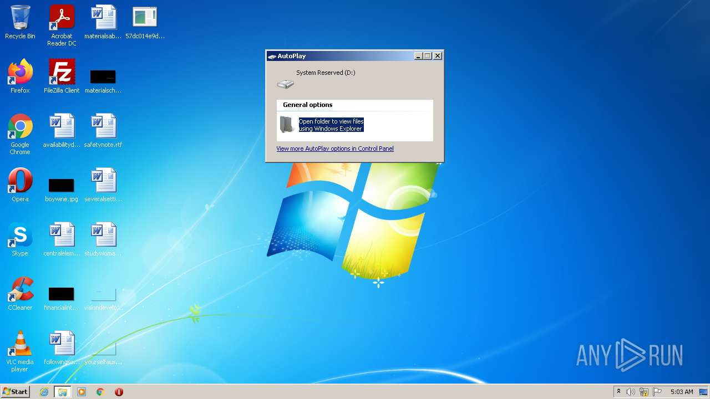
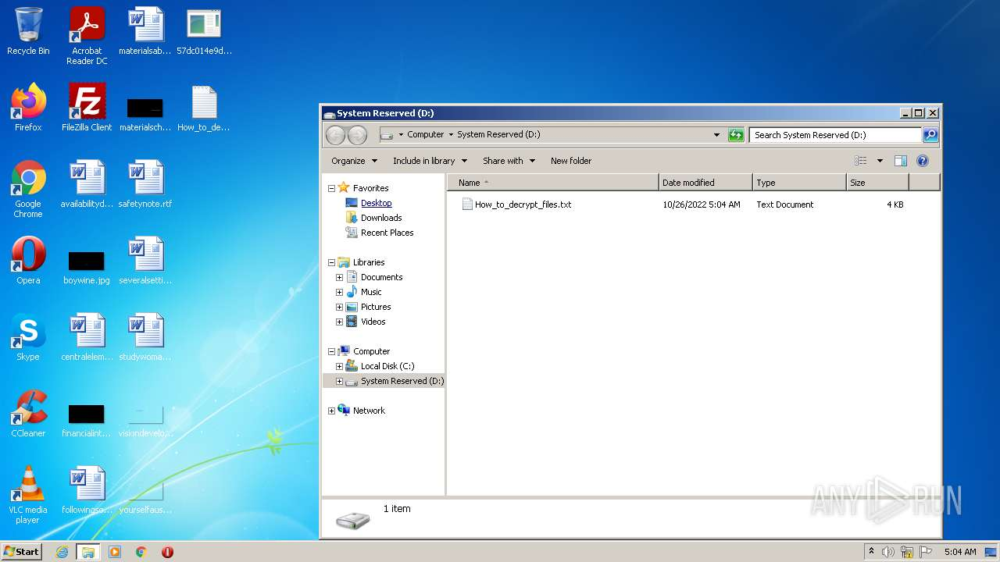
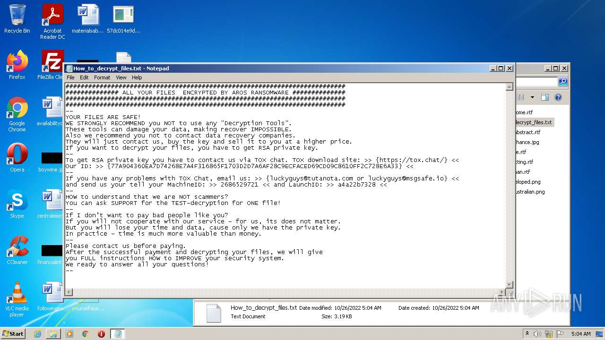
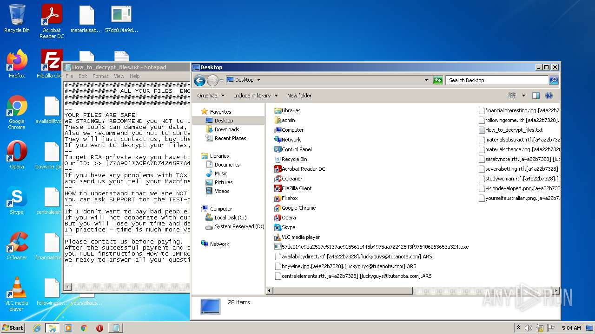
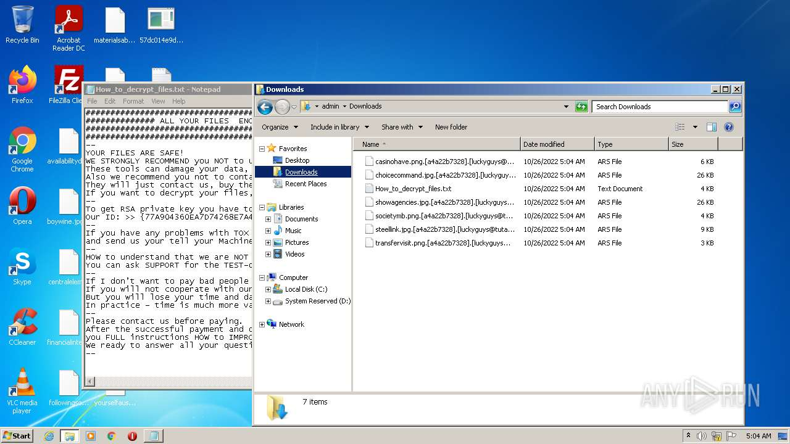
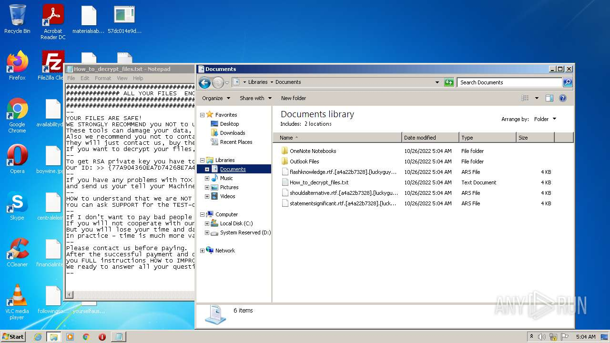
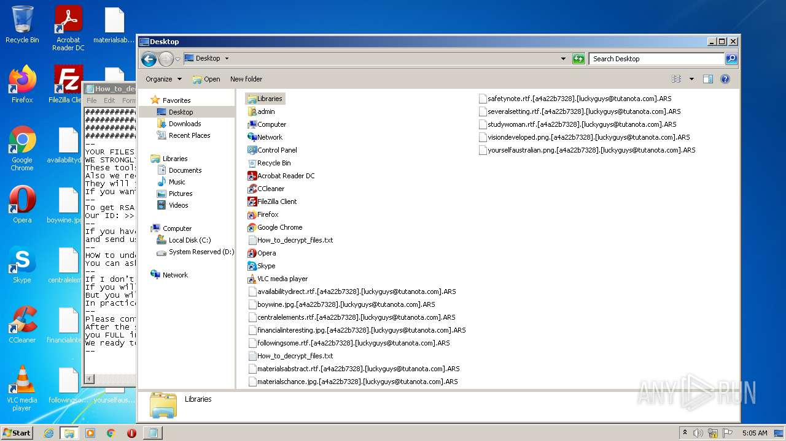
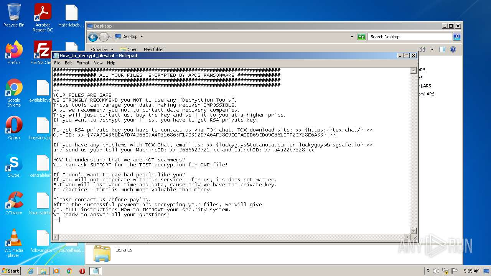
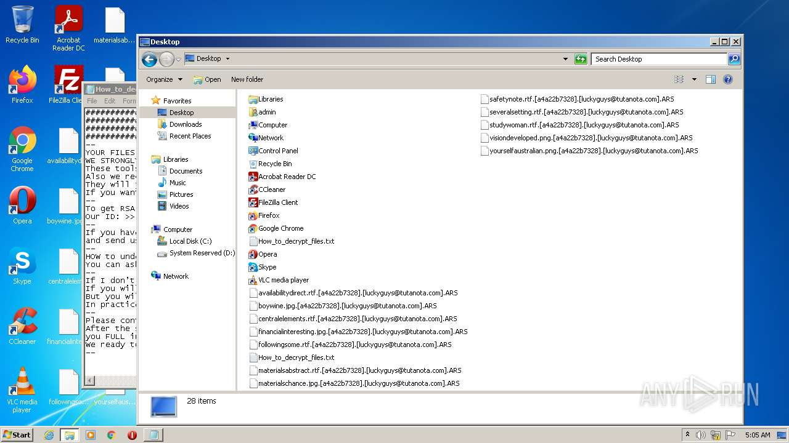

# HEUR-Trojan-Ransom.Win32.Generic-57dc014e9da2517e5137ae915561c445b4975aa72242543f976406063653a324

- https://any.run/report/57dc014e9da2517e5137ae915561c445b4975aa72242543f976406063653a324/5cd99219-7f68-47bc-981a-5150823fbc13

```
- _id: "57dc014e9da2517e5137ae915561c445b4975aa72242543f976406063653a324"
  creation_date: 1659002509  # 2022-07-28 12:01:49 +0200 CEST
  crowdsourced_yara_results: 
  - author: "ditekSHen"
    description: "Detects executables packed with ASPack"
    rule_name: "INDICATOR_EXE_Packed_ASPack"
    ruleset_id: "00c291ca7f"
    ruleset_name: "indicator_packed"
    source: "https://github.com/ditekshen/detection"
  - author: "Felix Bilstein - yara-signator at cocacoding dot com"
    description: "Describes win.konni."
    rule_name: "win_konni_auto"
    ruleset_id: "008d0d6858"
    ruleset_name: "win.konni_auto"
    source: "https://malpedia.caad.fkie.fraunhofer.de/"
  - author: "ditekSHen"
    description: "Detects executables packed with ASPack"
    match_in_subfile: true
    rule_name: "INDICATOR_EXE_Packed_ASPack"
    ruleset_id: "00c291ca7f"
    ruleset_name: "indicator_packed"
    source: "https://github.com/ditekshen/detection"
  - author: "ditekSHen"
    description: "detects command variations typically used by ransomware"
    match_in_subfile: true
    rule_name: "INDICATOR_SUSPICIOUS_GENRansomware"
    ruleset_id: "00c3b8eb5d"
    ruleset_name: "indicator_suspicious"
    source: "https://github.com/ditekshen/detection"
  - author: "ditekshen"
    description: "Detects MedusaLocker ransomware"
    match_in_subfile: true
    rule_name: "MALWARE_Win_MedusaLocker"
    ruleset_id: "00cc803bdc"
    ruleset_name: "malware"
    source: "https://github.com/ditekshen/detection"
  first_submission_date: 1666742708  # 2022-10-26 02:05:08 +0200 CEST
  last_analysis_date: 1666742708  # 2022-10-26 02:05:08 +0200 CEST
  last_analysis_results: 
    Kaspersky: 
      result: "HEUR:Trojan-Ransom.Win32.Generic"
  magic: "PE32 executable for MS Windows (GUI) Intel 80386 32-bit"
  packers: 
    PEiD: "ASPack v2.12"
  size: 233473
  trid: 
  - file_type: "Win32 Dynamic Link Library (generic)"
    probability: 29.6
  - file_type: "Win16 NE executable (generic)"
    probability: 22.7
  - file_type: "Win32 Executable (generic)"
    probability: 20.3
  - file_type: "OS/2 Executable (generic)"
    probability: 9.1
  - file_type: "Generic Win/DOS Executable"
    probability: 9.0
```










