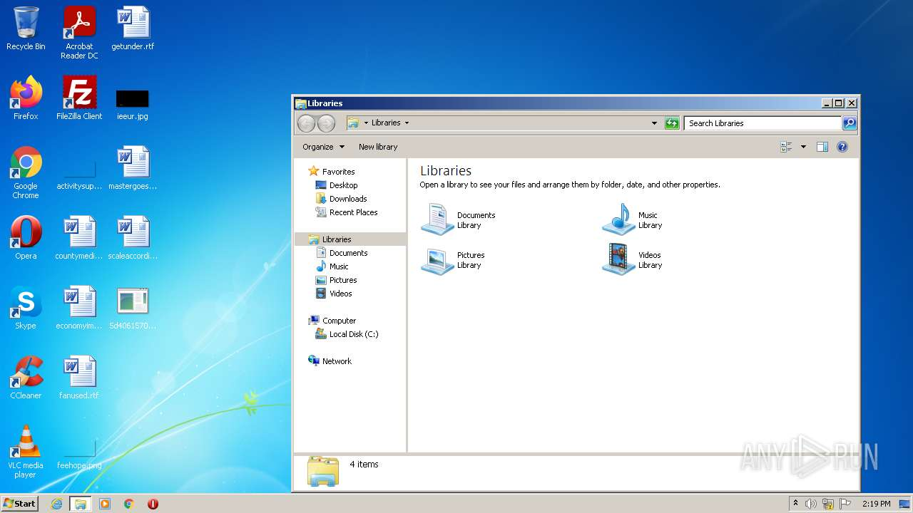
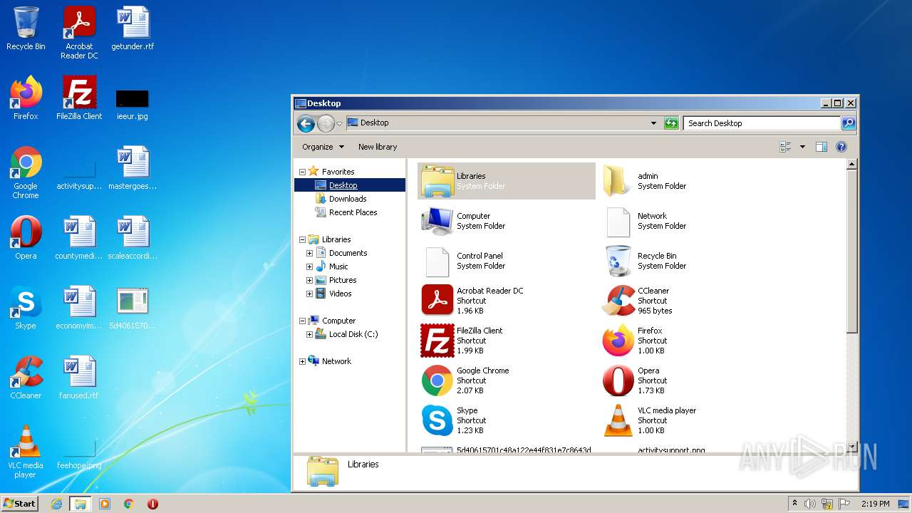
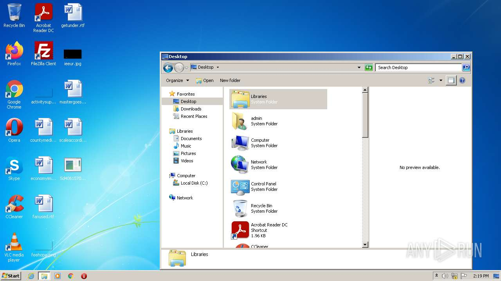
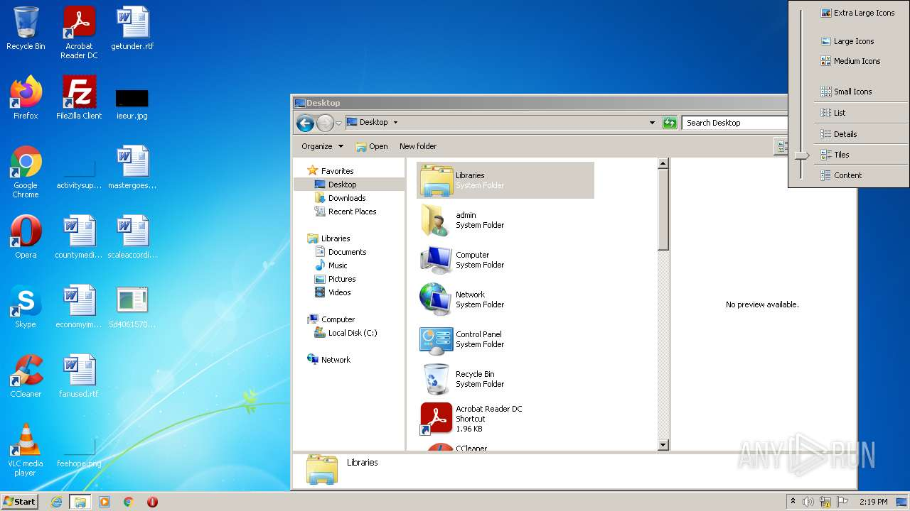
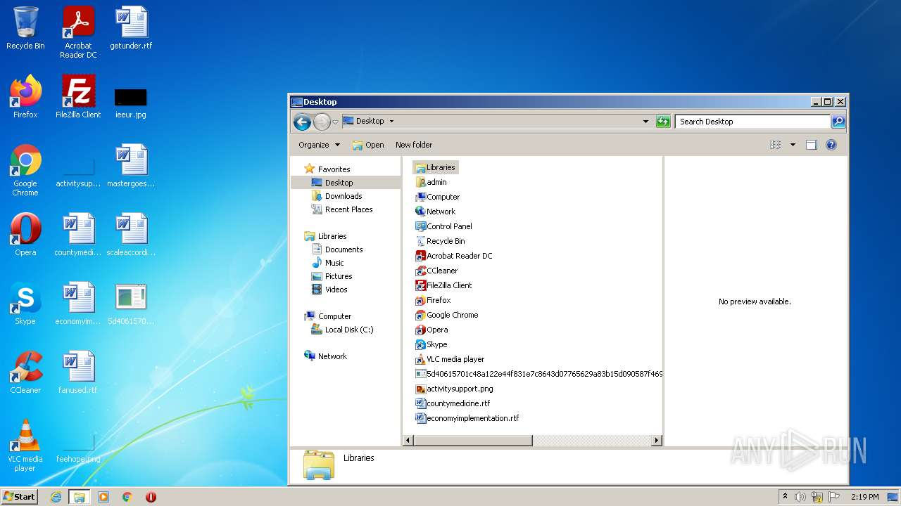
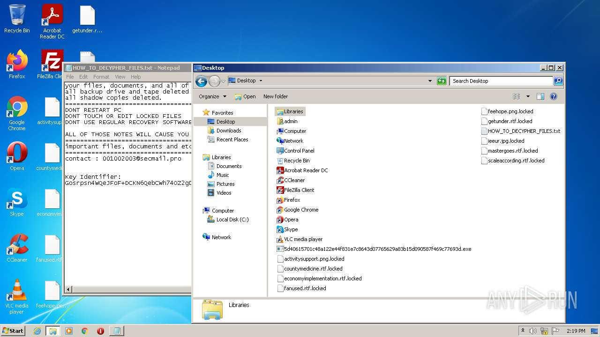
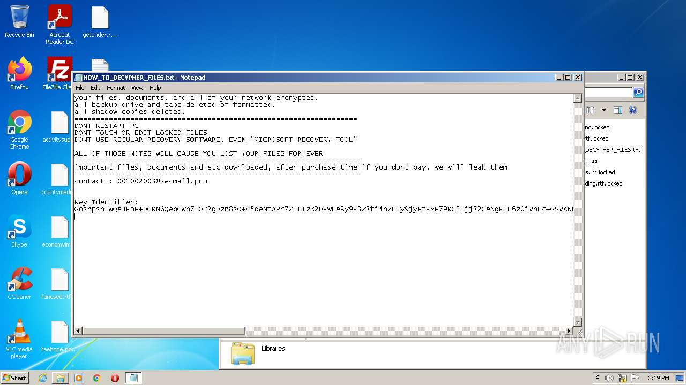
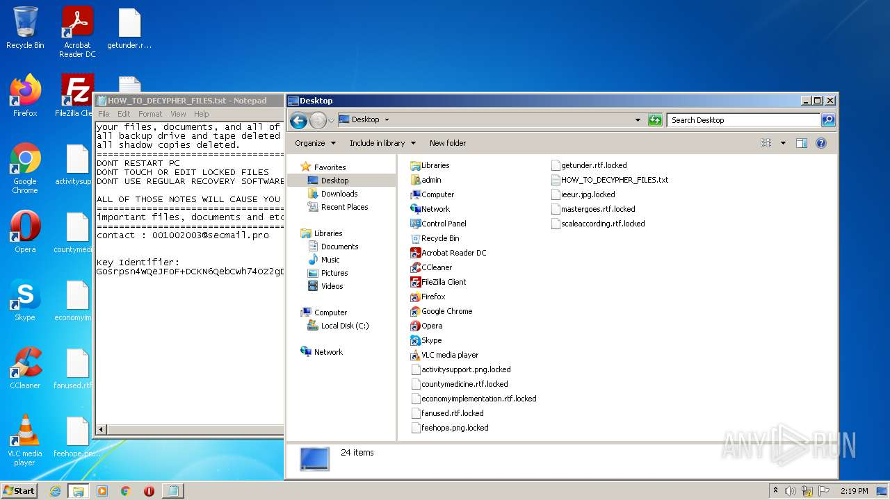
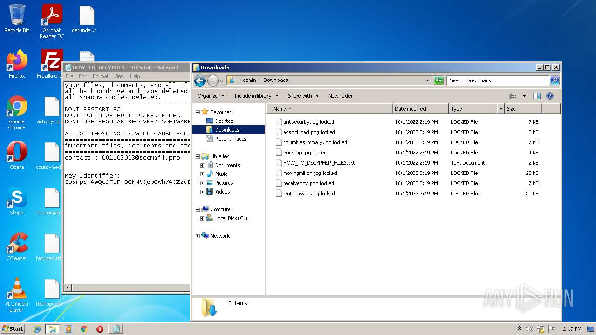
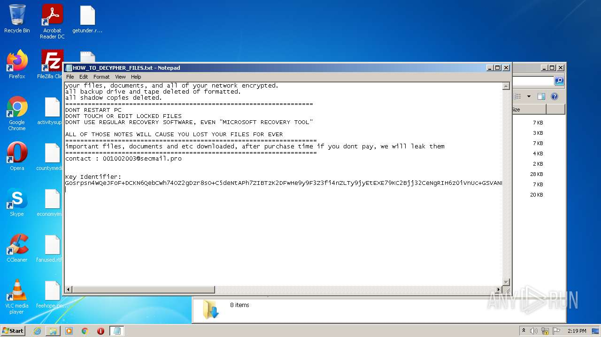

# HEUR-Trojan-Ransom.Win32.Generic-5d40615701c48a122e44f831e7c8643d07765629a83b15d090587f469c77693d

```
- _id: "5d40615701c48a122e44f831e7c8643d07765629a83b15d090587f469c77693d"
  creation_date: 1594243452  # 2020-07-08 23:24:12 +0200 CEST
  crowdsourced_yara_results: 
  - author: "AlienVault Labs"
    description: "Sandbox detection tricks"
    rule_name: "sandboxdetect_misc"
    ruleset_id: "009cfa8ad5"
    ruleset_name: "sandboxdetect"
    source: "https://github.com/AlienVault-Labs/AlienVaultLabs"
  - author: "ditekSHen"
    description: "Detects executables referencing many base64-encoded IR and analysis tools names"
    rule_name: "INDICATOR_SUSPICIOUS_References_SecTools_B64Encoded"
    ruleset_id: "00c3b8eb5d"
    ruleset_name: "indicator_suspicious"
    source: "https://github.com/ditekshen/detection"
  - author: "ditekSHen"
    description: "Detects Thanos / Prometheus / Spook ransomware"
    rule_name: "MALWARE_Win_Thanos"
    ruleset_id: "00cc803bdc"
    ruleset_name: "malware"
    source: "https://github.com/ditekshen/detection"
  - description: "Identifies THANOS (Hakbit) ransomware"
    rule_name: "Windows_Ransomware_Thanos_c3522fd0"
    ruleset_id: "015bb815e3"
    ruleset_name: "Windows_Ransomware_Thanos"
    source: "https://github.com/elastic/protections-artifacts"
  - description: "Identifies THANOS (Hakbit) ransomware"
    rule_name: "Windows_Ransomware_Thanos_e19feca1"
    ruleset_id: "015bb815e3"
    ruleset_name: "Windows_Ransomware_Thanos"
    source: "https://github.com/elastic/protections-artifacts"
  first_submission_date: 1594554007  # 2020-07-12 13:40:07 +0200 CEST
  last_analysis_date: 1662391498  # 2022-09-05 17:24:58 +0200 CEST
  last_analysis_results: 
    Kaspersky: 
      result: "HEUR:Trojan-Ransom.Win32.Generic"
  magic: "PE32 executable for MS Windows (GUI) Intel 80386 32-bit Mono/.Net assembly"
  packers: 
    PEiD: ".NET executable"
  size: 93184
  trid: 
  - file_type: "Generic CIL Executable (.NET, Mono, etc.)"
    probability: 61.5
  - file_type: "Windows screen saver"
    probability: 11.0
  - file_type: "Win64 Executable (generic)"
    probability: 8.8
  - file_type: "Win32 Dynamic Link Library (generic)"
    probability: 5.5
  - file_type: "Win16 NE executable (generic)"
    probability: 4.2
```












