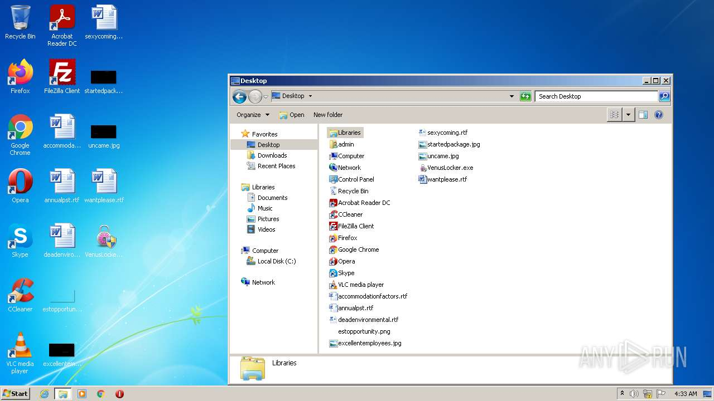
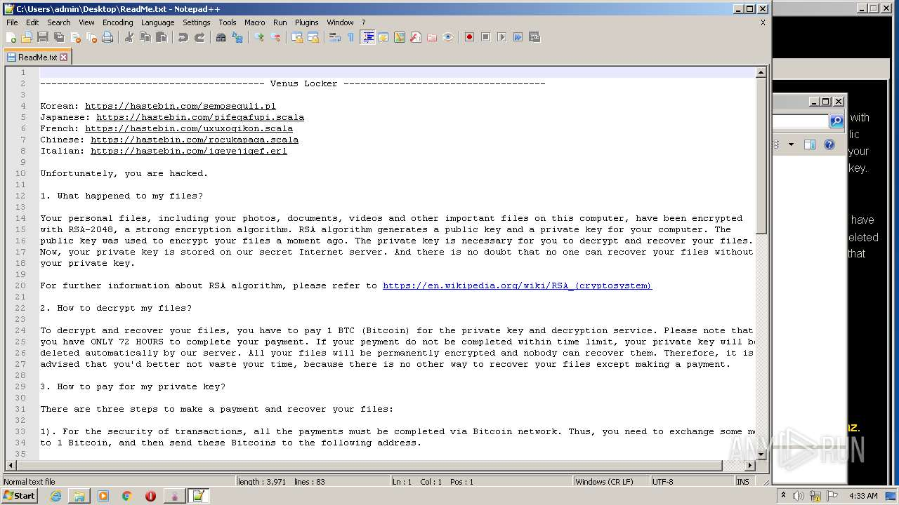
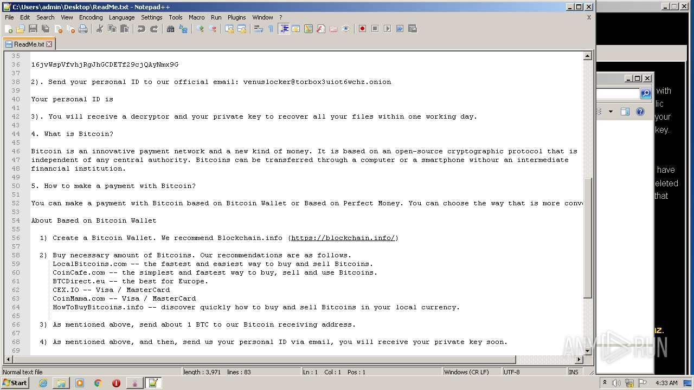
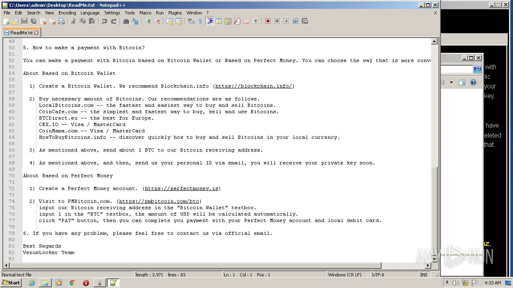

# HEUR-Trojan-Ransom.Win32.Generic-6a52b9cd66ae94e8d27eb0bc3a63e6bd2c3ba6903637533a554d786e00af2404

- https://any.run/report/6a52b9cd66ae94e8d27eb0bc3a63e6bd2c3ba6903637533a554d786e00af2404/f53ad9a9-d141-46d9-9372-434bbf26eed3

```
- _id: "6a52b9cd66ae94e8d27eb0bc3a63e6bd2c3ba6903637533a554d786e00af2404"
  creation_date: 1482238159  # 2016-12-20 13:49:19 +0100 CET
  first_submission_date: 1482492921  # 2016-12-23 12:35:21 +0100 CET
  last_analysis_date: 1664196592  # 2022-09-26 14:49:52 +0200 CEST
  last_analysis_results: 
    Kaspersky: 
      result: "HEUR:Trojan-Ransom.Win32.Generic"
  magic: "PE32 executable for MS Windows (GUI) Intel 80386 32-bit Mono/.Net assembly"
  packers: 
    PEiD: ".NET executable"
  size: 443904
  trid: 
  - file_type: "Generic CIL Executable (.NET, Mono, etc.)"
    probability: 64.2
  - file_type: "Windows screen saver"
    probability: 11.5
  - file_type: "Win64 Executable (generic)"
    probability: 9.2
  - file_type: "Win32 Dynamic Link Library (generic)"
    probability: 5.7
  - file_type: "Win32 Executable (generic)"
    probability: 3.9
```










