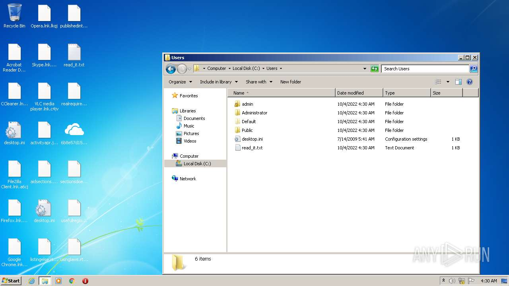
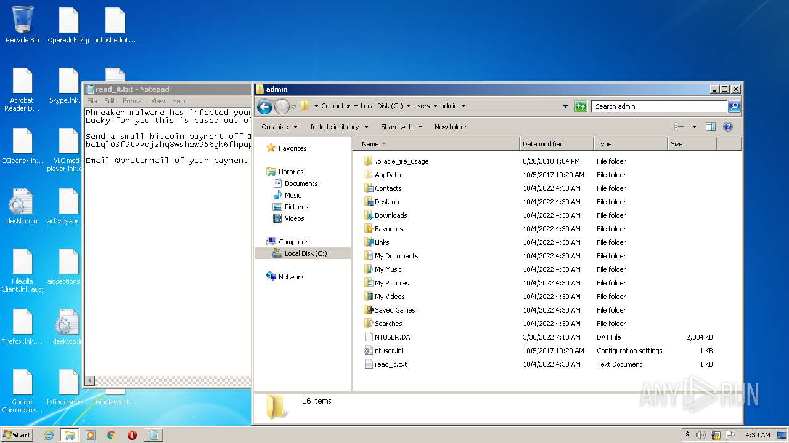
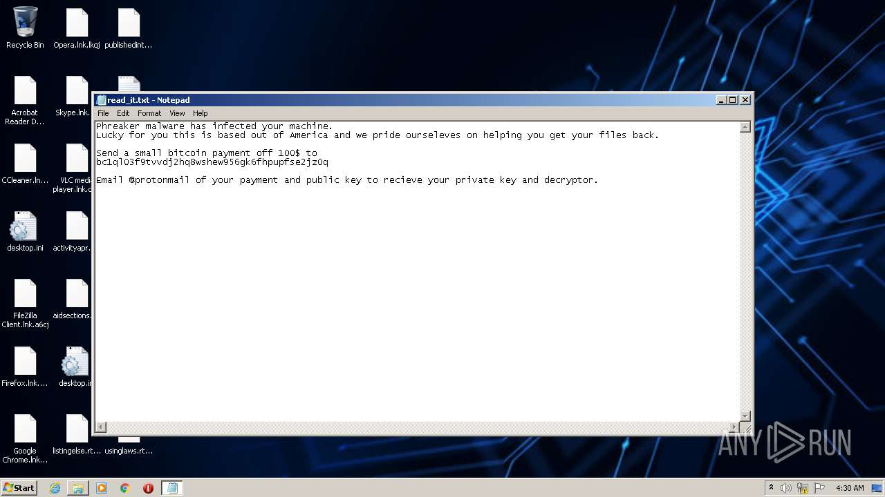
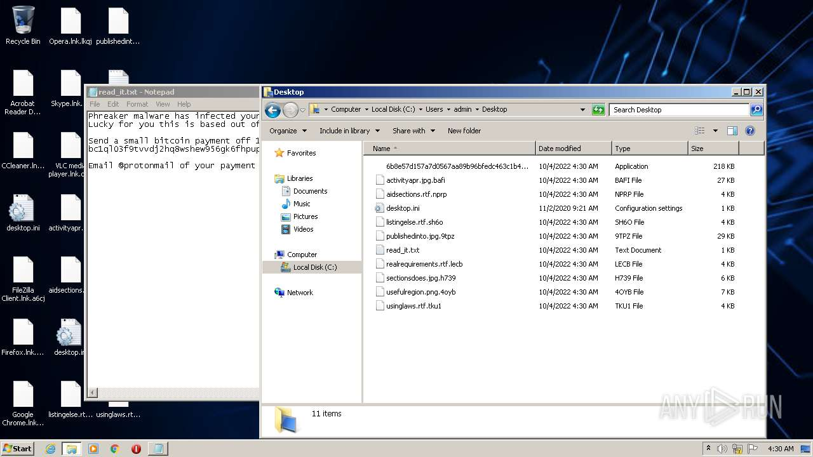
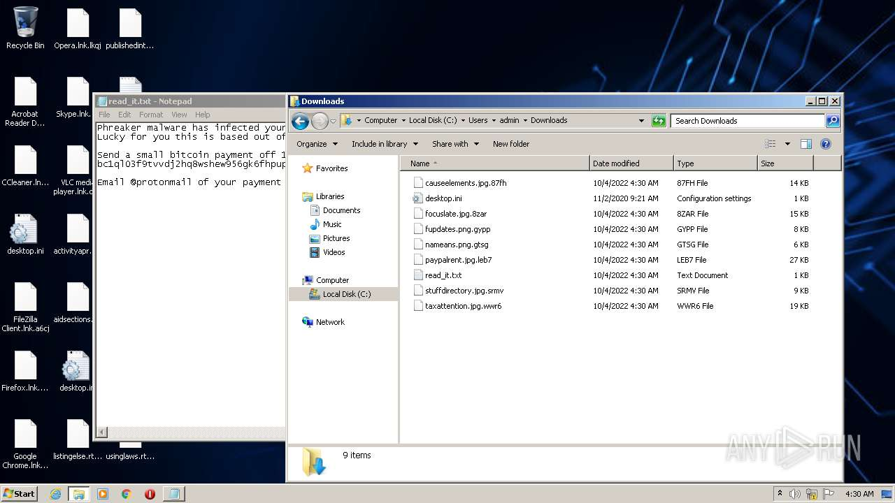
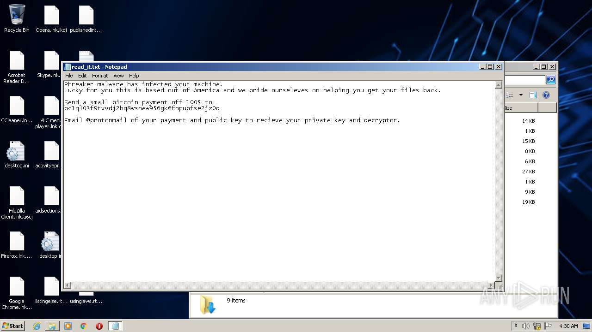
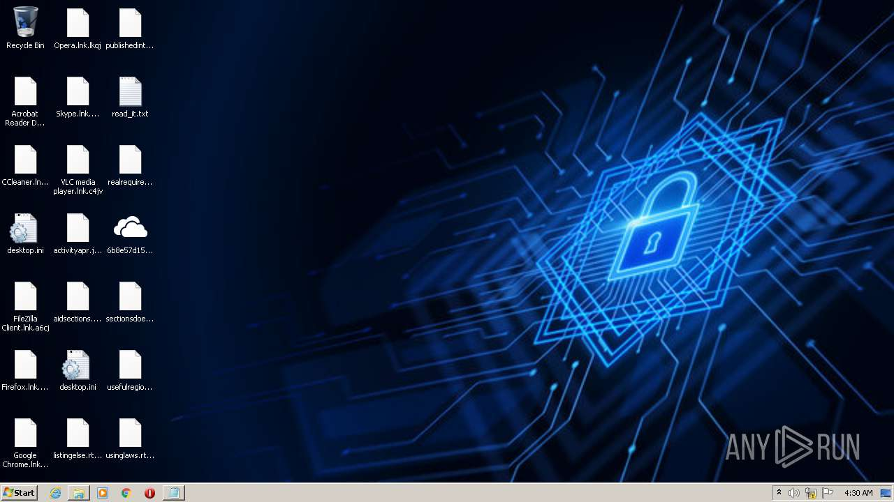

# HEUR-Trojan-Ransom.Win32.Generic-6b8e57d157a7d0567aa89b96bfedc463c1b46b6c2536dcdcd57a24c84cc45d3b

- https://any.run/report/6b8e57d157a7d0567aa89b96bfedc463c1b46b6c2536dcdcd57a24c84cc45d3b/fdd2d4c3-8692-490c-bfe8-a852e52e5bcb

```
- _id: "6b8e57d157a7d0567aa89b96bfedc463c1b46b6c2536dcdcd57a24c84cc45d3b"
  creation_date: 1664809709  # 2022-10-03 17:08:29 +0200 CEST
  crowdsourced_yara_results: 
  - author: "ditekSHen"
    description: "detects command variations typically used by ransomware"
    rule_name: "INDICATOR_SUSPICIOUS_GENRansomware"
    ruleset_id: "00c3b8eb5d"
    ruleset_name: "indicator_suspicious"
    source: "https://github.com/ditekshen/detection"
  - author: "ditekSHen"
    description: "Detects executables containing many references to VEEAM. Observed in ransomware"
    rule_name: "INDICATOR_SUSPICOUS_EXE_References_VEEAM"
    ruleset_id: "00c3b8eb5d"
    ruleset_name: "indicator_suspicious"
    source: "https://github.com/ditekshen/detection"
  - author: "ditekSHen"
    description: "Detects Chaos ransomware"
    rule_name: "MALWARE_Win_Chaos"
    ruleset_id: "00cc803bdc"
    ruleset_name: "malware"
    source: "https://github.com/ditekshen/detection"
  first_submission_date: 1664813492  # 2022-10-03 18:11:32 +0200 CEST
  last_analysis_date: 1664823617  # 2022-10-03 21:00:17 +0200 CEST
  last_analysis_results: 
    Kaspersky: 
      result: "HEUR:Trojan-Ransom.Win32.Generic"
  magic: "PE32 executable for MS Windows (GUI) Intel 80386 32-bit Mono/.Net assembly"
  packers: 
    PEiD: ".NET executable"
  size: 222720
  trid: 
  - file_type: "Generic CIL Executable (.NET, Mono, etc.)"
    probability: 72.5
  - file_type: "Win64 Executable (generic)"
    probability: 10.4
  - file_type: "Win32 Dynamic Link Library (generic)"
    probability: 6.5
  - file_type: "Win32 Executable (generic)"
    probability: 4.4
  - file_type: "OS/2 Executable (generic)"
    probability: 2.0
```










