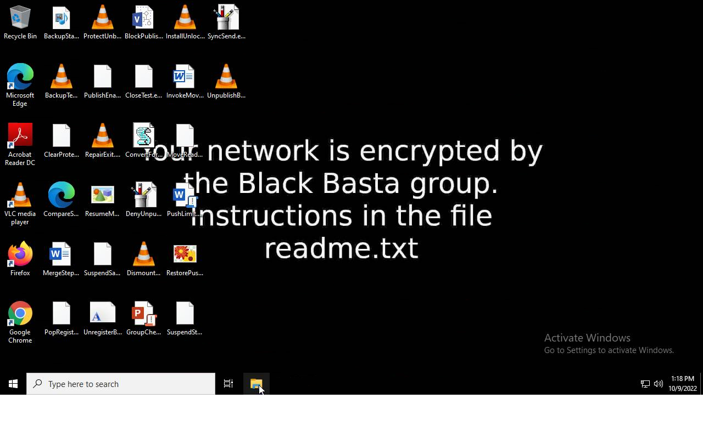
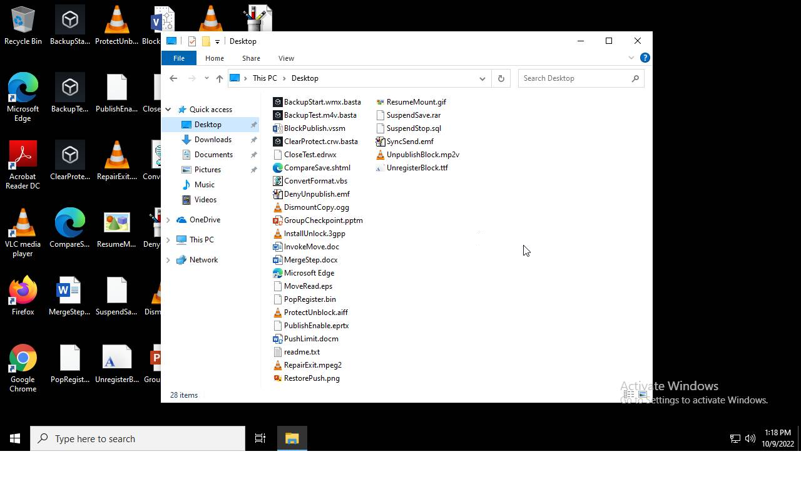
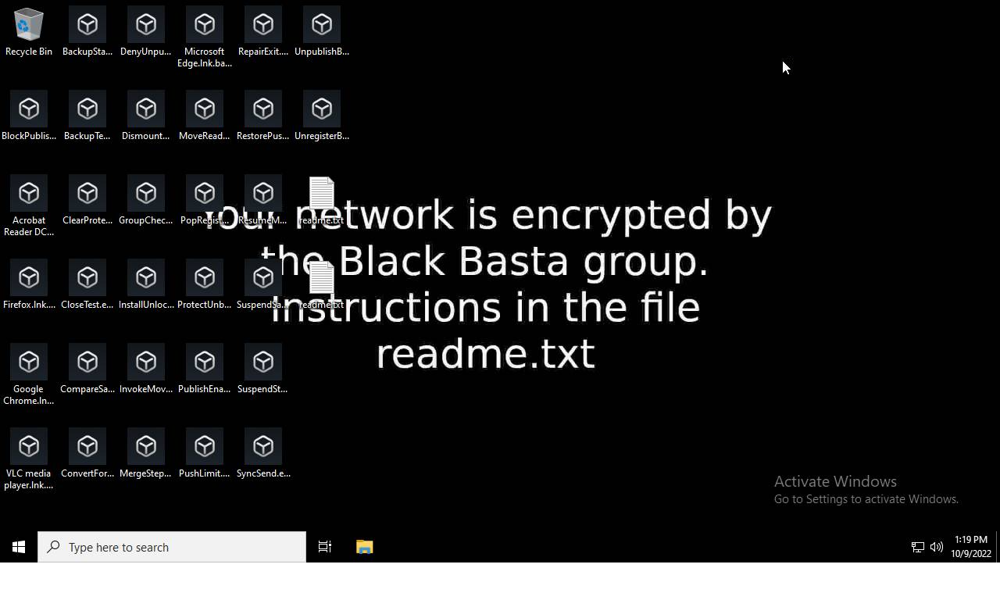
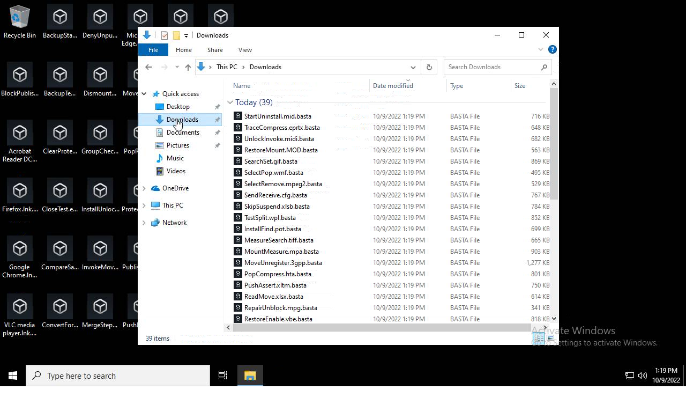
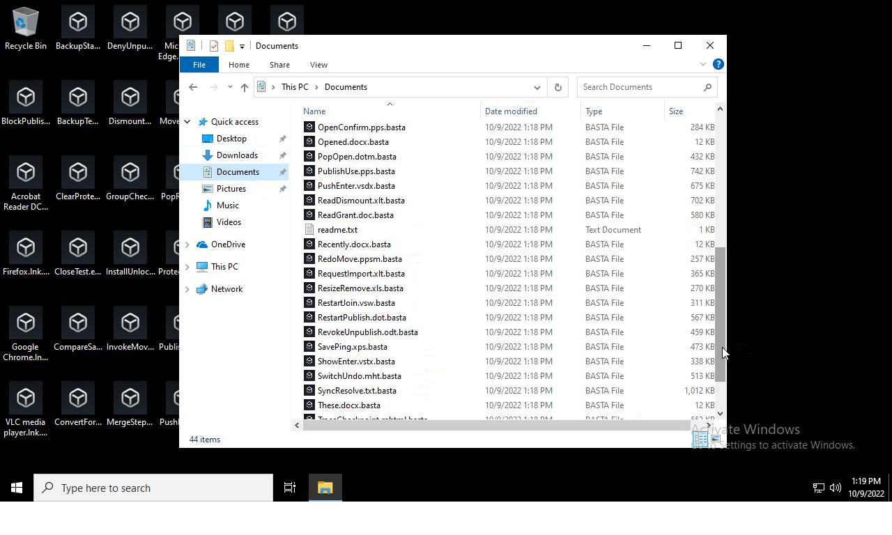
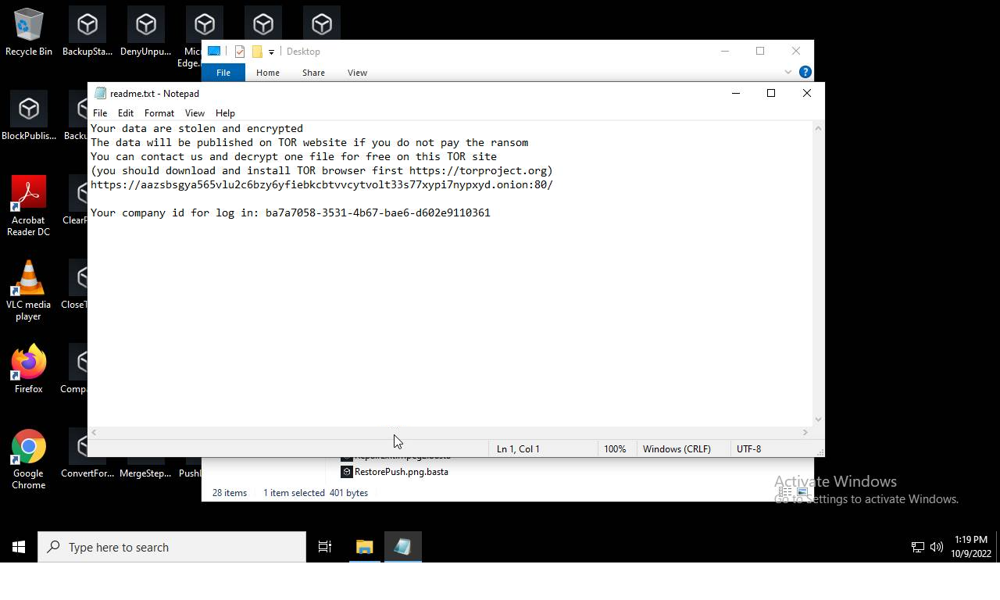
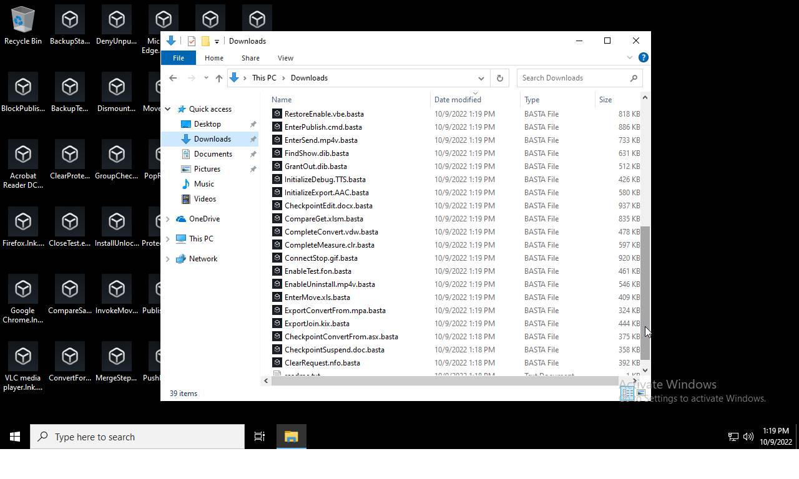
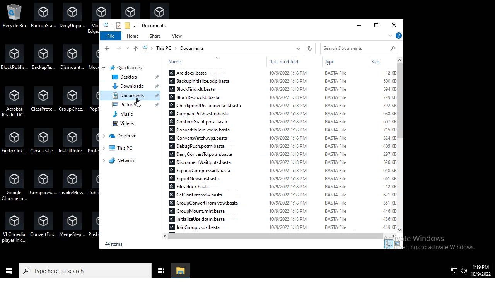
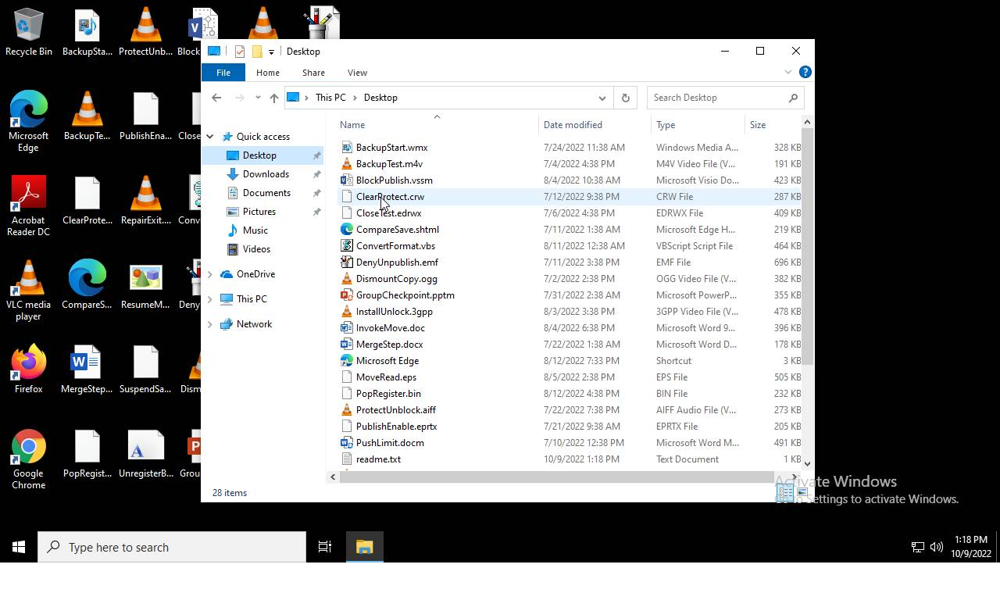

# HEUR-Trojan-Ransom.Win32.Generic-7883f01096db9bcf090c2317749b6873036c27ba92451b212b8645770e1f0b8a

- https://tria.ge/221009-neebpahaep/behavioral1

```
- _id: "7883f01096db9bcf090c2317749b6873036c27ba92451b212b8645770e1f0b8a"
  creation_date: 1650090598  # 2022-04-16 08:29:58 +0200 CEST
  crowdsourced_yara_results: 
  - author: "ditekSHen"
    description: "detects command variations typically used by ransomware"
    rule_name: "INDICATOR_SUSPICIOUS_GENRansomware"
    ruleset_id: "00c3b8eb5d"
    ruleset_name: "indicator_suspicious"
    source: "https://github.com/ditekshen/detection"
  - rule_name: "Windows_Ransomware_BlackBasta_494d3c54"
    ruleset_id: "0157897c12"
    ruleset_name: "Windows_Ransomware_BlackBasta"
    source: "https://github.com/elastic/protections-artifacts"
  first_submission_date: 1650551855  # 2022-04-21 16:37:35 +0200 CEST
  last_analysis_date: 1662107275  # 2022-09-02 10:27:55 +0200 CEST
  last_analysis_results: 
    Kaspersky: 
      result: "HEUR:Trojan-Ransom.Win32.Generic"
  magic: "PE32 executable for MS Windows (console) Intel 80386 32-bit"
  size: 556544
  trid: 
  - file_type: "Win64 Executable (generic)"
    probability: 32.2
  - file_type: "Win32 Dynamic Link Library (generic)"
    probability: 20.1
  - file_type: "Win16 NE executable (generic)"
    probability: 15.4
  - file_type: "Win32 Executable (generic)"
    probability: 13.7
  - file_type: "OS/2 Executable (generic)"
    probability: 6.2
```











